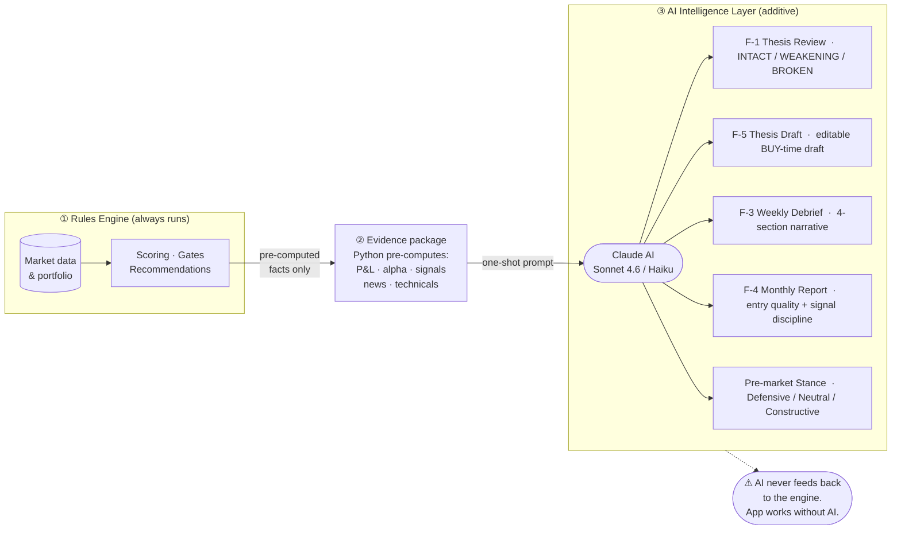

# Architecture Document
## DRISHTA — Beyond Noise
*Personal Portfolio Intelligence App*

**Version:** 2.0  
**Date:** June 2026  
**Status:** Active Development  
**Operating Posture:** Decides, not informs (see §4.0)

---

## 1. Technology Stack

| Layer | Technology | Version | Purpose |
|-------|-----------|---------|---------|
| Runtime | Python | 3.12 | Application language |
| UI Framework | Streamlit | 1.57.0 | Web app rendering and state management |
| UI Framework (serialization) | pyarrow | 24.0.0 | Arrow serialization for Streamlit's `st.dataframe` / `st.data_editor` rendering — pinned (2026-07-12) after an unbounded transitive pyarrow version caused a production SIGSEGV (streamlit's own dependency spec leaves pyarrow unbounded by design) |
| Market Data (primary, history/bundle) | yfinance | 1.3.0 | OHLCV history, company info, news, analyst data |
| Market Data (real-time quotes) | Finnhub (REST, free tier) | — | Real-time US live prices — **primary for the live-price field**; price cross-check |
| Market Data (failover) | FMP / Financial Modeling Prep (REST, free tier) | `/stable/` | Failover for live prices, history, and the full analysis bundle |
| HTTP client | requests | ≥2.28.0 | Keyed REST calls to Finnhub / FMP / FRED |
| Data Processing | pandas | ≥2.0.0 | DataFrames, time series, portfolio calculations |
| Charting | Plotly | ≥5.20.0 | Interactive charts (candlestick, bar, pie) |
| Sentiment | vaderSentiment | 3.3.2 | News headline sentiment scoring |
| Database | Supabase (PostgreSQL) | client 2.29.0 | Holdings, watchlist, and trade persistence |
| AI / LLM | Anthropic / OpenAI / Google | Latest | AI Snapshot generation (Home section) + AI Insights (Anthropic-only) |
| Timezone | pytz | ≥2024.1 | All time comparisons use America/New_York (ET) |
| Deployment | Streamlit Community Cloud | — | Hosting; secrets injected via dashboard |

---

## 2. High-Level Architecture

```
┌─────────────────────────────────────────────────────────────┐
│                    User (Browser)                            │
└────────────────────────┬────────────────────────────────────┘
                         │ HTTPS
┌────────────────────────▼────────────────────────────────────┐
│              Streamlit Community Cloud                        │
│  ┌───────────────────────────────────────────────────────┐  │
│  │                      app.py                            │  │
│  │  - Page routing (session_state nav_page)               │  │
│  │  - UI rendering for all pages and tabs                 │  │
│  │  - Orchestrates calls to stock_analyzer package        │  │
│  │  - Caches expensive calls with @st.cache_data          │  │
│  └──────────┬───────────────────────────┬─────────────────┘  │
│             │                           │                     │
│  ┌──────────▼───────────┐   ┌──────────▼───────────────┐    │
│  │  stock_analyzer/     │   │  External APIs            │    │
│  │  Python package      │   │                           │    │
│  │  (domain logic)      │   │  Yahoo Finance (yfinance) │    │
│  └──────────────────────┘   │  Supabase (PostgreSQL)    │    │
│                             │  Anthropic / OpenAI /     │    │
│                             │  Google (LLM)             │    │
│                             └───────────────────────────┘    │
└─────────────────────────────────────────────────────────────┘
```

---

## 3. Module Structure

```
python-lab/
├── app.py                          Main application (UI + orchestration)
├── main.py                         Entry point alias
├── cron_runner.py                  Headless cron entry point (GitHub Actions) — dispatch modes: auto / scan / thesis / debrief / monthly / eod
├── requirements.txt                Python dependencies
├── runtime.txt                     Python version (3.12)
├── docs/
│   ├── requirements.md             Functional and non-functional requirements
│   └── architecture.md             This document
└── stock_analyzer/                 Domain logic package
    ├── __init__.py
    ├── constants.py                Single source of truth for all decision thresholds (Phase 2)
    ├── data.py                     Public market-data API (fetch_* + crosscheck_*); routes through the
    │                               provider layer when DATA_MULTISOURCE_ENABLED, else single-source yfinance
    ├── providers/                  Multi-source market-data layer (failover + price cross-check)
    │   ├── base.py                 DataProvider abstraction, capability flags, canonical schemas
    │   ├── yfinance_provider.py    yfinance adapter (history/bundle/indices/risk-free; live-price failover)
    │   ├── finnhub_provider.py     Finnhub adapter — real-time live prices (live-price PRIMARY) + fetch_news_sentiment (F-74 news-sentiment read)
    │   ├── fmp_provider.py         FMP adapter — live prices + history + full bundle (failover)
    │   ├── orchestrator.py         Failover chains (per data type) + price cross-check; PROVIDER_REGISTRY consumer
    │   ├── _util.py                Secret reader (st.secrets→env, section-nesting tolerant) + http helper
    │   └── selftest.py             Offline provider smoke-test (env-var keys)
    ├── indicators.py               Pure technical indicator calculations
    ├── technicals.py               Technical scoring from indicator output
    ├── fundamentals.py             Fundamental scoring — sector-relative benchmarks
    ├── catalyst_watch.py           Catalyst Watch — forward earnings awareness (pure logic)
    ├── sentiment.py                VADER-based news sentiment scoring
    ├── news_sentiment.py           Finnhub news-sentiment awareness — bullish%/buzz/vs-sector → label + held-position shift alert (pure wrapper over FinnhubProvider.fetch_news_sentiment; F-74)
    ├── scoring.py                  Composite score weights and recommendation tiers
    ├── signal_reconciliation.py    Central authority resolving scanner vs. composite vs. context into one buy/skip verdict (reconcile_signals) — every recommendation surface calls it
    ├── portfolio.py                Portfolio DataFrame construction; stop integrity gate
    ├── account.py                  Account-level pure calc (net contributed capital, growth, money-weighted/Modified-Dietz return); signed net cash nets margin
    ├── daily_pnl.py                Positions-scope day-over-day P&L (Tier B): broker-style equity-delta vs persisted daily_snapshots baseline + the day's trades
    ├── risk.py                     ATR stop loss, position sizing, risk metrics
    ├── targets.py                  Price targets, support/resistance, entry zones
    ├── ranking.py                  Cross-portfolio stock ranking (composite score sort)
    ├── comparison.py               2-ticker side-by-side comparison engine + one-line verdict (Compare page)
    ├── scanner.py                  Market scanner (curated ~73-ticker universe + Watchlist extension); scan_movers() 1-day-gainer pass
    ├── discovery_universe.py       Broad ~200-name discovery universe (by sector) for movers; discovery_tickers() flatten/dedup
    ├── daily_briefing.py           Daily briefing engine (Act Today / Grow Today + Movers / Buy Candidates / Review); structured directives + per-ticker consolidation
    ├── decision_bucket.py          Brief defensive-item bucketing: Act Today vs Monitoring/Awareness split (calm-advisor, pure)
    ├── position_lifecycle.py       Held-position state (settling → established → winning; at_risk/exit override) — calm-advisor nudge-cadence gate
    ├── signal_hysteresis.py        Calm-advisor "steady vs yesterday" damper — annotate-only continuity marker (Tier 2C)
    ├── evening_debrief.py          Evening Debrief: PM companion to Today's Brief (plan-vs-reality, today's trades, tomorrow's setup)
    ├── premarket.py                Pre-market intelligence (futures, global markets, movers)
    ├── premarket_stance.py         Pre-Market Stance: AI narrative + Defensive/Neutral/Constructive verdict for the open (cached per day)
    ├── quick_research.py           Ad-hoc ticker research with entry timing + portfolio-fit verdict
    ├── news_intelligence.py        News aggregation and attention flagging
    ├── sentiment_velocity.py       Sentiment trend tracking over time
    ├── macro.py                    Macro indicator fetching
    ├── macro_playbook.py           Macro scenario playbook
    ├── macro_calendar.py           Economic calendar events; affected_sectors() helper
    ├── earnings_advisor.py         Earnings risk and playbook
    ├── perf_advisor.py             Performance attribution and recommendations
    ├── risk_advisor.py             Risk flags and advisor recommendations (exact beta impact)
    ├── exit_advisor.py             Exit-discipline + market-risk: deterioration WATCH/TRIM/EXIT ladder, risk-off de-risk overlay, Market-Risk Posture dial (classify_deterioration_tier · risk_off_regime · assess_risk_off_derisk · market_risk_posture — pure logic); also compute_relative_strength() (20-session RS vs SPY, shared by Thesis Red Team + Multi-Agent Debate)
    ├── debate_agent.py             Multi-Agent Debate Agent Phase 1 (F-197): build_entry_corpus + run_debate — 5-Haiku sequential Bull/Bear/Judge debate for Grow Today entry candidates; debate_cache table; awareness-only, never gates
    ├── structural_scanner.py       Structural Vulnerability Scanner Phase 1 (F-198): blast_radius() (single-factor beta cascade estimate, reuses portfolio_intelligence.py's risk_budget/correlation_clusters as inputs) + generate_structural_narrative() (1 Haiku call/day); structural_scan_cache table; awareness-only, never gates
    ├── concentration.py            Concentration & sizing discipline: single-name ceiling enforcement + high-beta cluster awareness (pure logic)
    ├── cross_asset.py              Cross-Asset Pulse — 5-signal macro stress (credit/VIX-term/dollar/copper/3m10y → 0–5 stress score; awareness-only, Risk tab + Brief one-liner; F-09c)
    ├── watchlist_advisor.py        Watchlist analysis with ENTER_NOW portfolio-risk gate
    ├── trade_analytics.py          Trade history analytics
    ├── trade_review.py             Trade Review: behavioural retrospective (app-followed vs deviated trades, panic-day reactivity, per-trade outcome vs SPY)
    ├── trades.py                   Trade-record helpers (realised PnL, performance stats)
    ├── tax_advisor.py              Tax-lot analysis; HARVEST subordinated to investment view
    ├── rebalancer.py               Portfolio rebalancing; ADD cross-checks news + risk trim
    ├── stress_test.py              Macro stress scenario modelling
    ├── split_detector.py           Stock split detection and adjustment
    ├── decision_journal.py         Signal-vs-override pattern analysis
    ├── broker_import.py            Robinhood statement import (F-87): parse_robinhood_csv (pure — normalises Buy/Sell, surfaces invalid rows) + classify_against_existing (content-match dedup: exact same-day + date-agnostic, so hand-logged trades don't double-count); UI in Trade Journal reuses save_trade/recalculate_from_trades
    ├── recommendations_history.py  Retrospective scorecard (rule-based, no LLM): acted/missed outcomes graded on alpha, by-band/by-verdict rollups, distinct-ticker signal_flow + report_viz_snapshot (drives 📜 Recommendations History + the F-4 monthly visuals)
    ├── thesis_advisor.py           AI Intelligence F-1 review (per-holding thesis → INTACT/WEAKENING/BROKEN, thesis_reviews table; F-154a Phase 2: also ingests saved analyst_coverage as citable CONTEXT — never upgrades a verdict) + F-5 authoring (draft_thesis: editable candidate thesis at BUY → trades.user_thesis / thesis_source)
    ├── debrief_advisor.py          AI Intelligence F-3: weekly portfolio debrief — 4-section narrative + Sunday email (weekly_debriefs table)
    ├── intelligence_report.py      AI Intelligence F-4: monthly retrospective — Q0 entry-quality + Q1 signal-discipline; build_report_package + frozen viz_json snapshot (monthly_reports table)
    ├── analyst_intel.py            Analyst Coverage F-6/F-154: extract_report (paste → list[dict], one record PER covered stock — multi-stock roundups never merge; Sonnet, offline→None) + derive_consensus (pure-Python avg/high/low PT + consensus label); awareness-only, analyst_coverage table
    ├── bundle_loader.py            Shared market-data bundle loader (load_all) — the app AND the headless cron load through the SAME path
    ├── headless_alert_engine.py    Headless alert computation for the cron: protective signals (stops / EXIT / risk-off), reactive pullback, EOD snapshot
    ├── notify.py                   Email rendering (weekly debrief / monthly intelligence / pullback / protective) + Resend delivery
    ├── db.py                       Supabase ops (holdings/watchlist/trades/manual_stops); trade-replay; fractional shares
    └── api_health.py               API call health event recording
```

---

## 4.0 Operating Posture and Decision Framework

The app is configured to **make decisions, not merely inform**. This is an explicit operating choice (May 2026) that drives the rest of the architecture:

- **Higher bars to recommend.** Each gate is a hard suppression where the threshold fails, not a soft warning. The app would rather recommend nothing than recommend wrongly.
- **Data integrity fails loud.** When a required input is missing (stop price, composite score, daily briefing) the dependent feature surfaces an explicit "offline" state instead of degrading gracefully with fabricated fallbacks.
- **Coordination is mandatory.** Two features that make overlapping decisions never silently contradict each other. One publishes state; the other reads and gates.
- **Subordination of secondary objectives.** Tax outcomes do not override investment view (HARVEST is suppressed on Buy/Strong Buy). Macro events override entry recommendations in affected sectors.

### 4.0.1 Decision constants

All decision thresholds live in `stock_analyzer/constants.py`. Changes to any value are investment-policy decisions, not code tuning.

| Constant | Value | Role |
|---|---|---|
| `PORTFOLIO_BETA_TARGET` | 1.0 | Baseline equity-portfolio target |
| `PORTFOLIO_BETA_ELEVATED` | 1.3 | Soft warn above this |
| `PORTFOLIO_BETA_CEILING` | 1.4 | Hard breach — institutional managed-equity ceiling |
| `REGIME_BETA_CEILING` | dict: rate_cut=1.25, neutral=1.10, inflation_fight=1.00, recession_fear=0.90, stagflation_risk=0.85 | **Concept D (Wave 3).** Regime-conditional beta target shown on the 🔗 Risk Analysis "Regime Fit" diagnostic. Keyed by the 5 real regime ids from `macro_calendar.detect_macro_regime`. Anchored to (tighter/looser than) the regime-agnostic `PORTFOLIO_BETA_*` baseline above. Diagnostic only — never gates/resizes. |
| `REGIME_CASH_FLOOR_PCT` | dict: rate_cut=5.0, neutral=5.0, inflation_fight=10.0, recession_fear=15.0, stagflation_risk=20.0 | **Concept D (Wave 3).** Regime-conditional cash-cushion floor shown alongside the beta read on the same diagnostic. Same regime keys as `REGIME_BETA_CEILING`. Diagnostic only. |
| `REGIME_CONFIDENCE_MIN_DISPLAY` | 40 | Below this regime-detection confidence, the Regime Fit diagnostic flags the read as low-confidence/estimated. Display-only — never gates. |
| `FACTOR_ETF_TICKERS` | dict: Momentum=MTUM, Value=VLUE, Quality=QUAL, Low Volatility=USMV, Growth=VUG | **Concept B panel 3 (Phase 2 sub-wave 3).** Factor-proxy ETFs for the 🧩 Portfolio Intelligence "📐 Factor Tilt" heatmap — held positions are Pearson-correlated against each of these over a trailing window. Returns-based style analysis (NOT FMP `.info` style tags, which the plan explicitly warns produces garbage). Diagnostic only — never gates. |
| `FACTOR_TILT_WINDOW_DAYS` | 126 (~6 trading months) | Trailing window fed to the Factor Tilt correlation calc — `_fetch_factor_etf_returns()` (`app.py`) trims each factor ETF's return series to this many trailing days before `portfolio_intelligence.factor_tilt()` runs, so this is the single source of truth for the negotiated 6-month lookback (chosen with the user over a 3-month alternative for statistical stability). |
| `FRAGILITY_PULLBACK_PCT` | -10.0 | Routine-correction yardstick (~1–2× per year) for the Fragility gauge; mirrors the stress-test 'Mild Correction' scenario. The gauge's severity bands reuse the existing `PORTFOLIO_BETA_ELEVATED` (1.3) / `PORTFOLIO_BETA_CEILING` (1.4) constants rather than new thresholds. |
| `TICKER_BETA_HIGH` | 1.5 | Soft warn when added to elevated portfolio |
| `TICKER_BETA_CRITICAL` | 1.8 | Hard breach when added to breached portfolio |
| `SECTOR_CEILING` | 35.0 | Hard cap — no entries when sector at this weight |
| `SECTOR_ELEVATED` | 25.0 | Soft warn — consider half-size |
| `SINGLE_NAME_CEILING` | 15.0 | Hard cap — no add-to-winner above this weight |
| `CONCENTRATION_HIGHBETA_SHARE_WARN` | 60.0 | High-beta cluster line warn color; display-only, not a decision gate |
| `RISK_OFF_TREND_MA` | 200 | Risk-off trend leg — SPY below this SMA = de-risk (Faber 200-DMA) |
| `RISK_OFF_VIX_LEVEL` | 25.0 | Risk-off vol leg — VIX ≥ this = high-vol regime |
| `RISK_OFF_NAME_MIN_BETA` | 1.2 | Risk-off de-risk only trims names with β ≥ this |
| `RISK_OFF_TRIM_TOP_N` | 3 | Risk-off de-risk acts on the top-N beta contributors |
| `RISK_OFF_TRIM_PCT` | 25.0 | Risk-off de-risk suggested trim % (or tighten the stop instead) |
| `PULLBACK_ALERT_INDEX_PCT` | -3.0 | EOD reactive pullback email fires when SPY closes ≤ this %; operational alert knob, not a gate |
| `PULLBACK_ENTRY_DIP_PCT` | 1.5 | Intraday drop from open (%) that triggers the intraday pullback entry email in the new intraday cron lane. Email-presentation only; never gates recommendations. |
| `PULLBACK_SPY_MAX_DOWN` | 1.0 | SPY intraday drop ceiling; all intraday entry signals are suppressed when SPY drops more than this (market rout guard). Headless-only (email alert); never gates in-app recommendations. |
| `ALERT_EOD_HOUR_ET` | 16 | EOD cron run gates on ET hour ≥ this (post-close); operational |
| `CROSS_ASSET_HYG_TREND_DAYS` / `_COPPER_TREND_DAYS` / `_DXY_TREND_DAYS` | 20 / 20 / 20 | Cross-Asset Pulse (F-09c) linear-trend lookback windows (days) for the HYG / copper / DXY legs. Awareness-only — these signals never gate a recommendation |
| `CROSS_ASSET_DXY_ROC_DAYS` / `_DXY_ROC_THRESHOLD` | 5 / 1.5 | Dollar-stress leg: 5-day rate-of-change; stressed when the DXY trend is rising AND ROC > 1.5% |
| `CROSS_ASSET_VIX_TERM_RATIO` | 1.0 | VIX/VIX3M ratio above which the term structure is "inverted" (a stress signal) |
| `CROSS_ASSET_CURVE_STRESS_BP` | -50 | 3m10y spread in bp (^TNX − ^IRX) below which the curve is "deeply inverted" |
| `CROSS_ASSET_STRESS_BRIEF_SCORE` | 2 | Aggregate stress score (count of stressed signals among those with data) at/above which Today's Brief shows the cross-asset one-liner |
| `NEWS_SENTIMENT_BULLISH_THRESHOLD` / `_BEARISH_THRESHOLD` | 0.60 / 0.40 | Finnhub news-sentiment (F-74) label cutoffs: bullish_pct ≥ 0.60 → 🟢 Bullish, < 0.40 → 🔴 Bearish, between → 🟡 Neutral. Awareness-only |
| `NEWS_SENTIMENT_SHIFT_ALERT_BULLISH` / `_SHIFT_BUZZ_MIN` | 0.40 / 1.0 | Brief held-position shift card fires when bullish_pct < 0.40 AND buzz_score > 1.0 (both required — low-buzz bearishness is thin/stale, not alerted) |
| `NEWS_SENTIMENT_CRITICAL` | −0.25 | VADER compound threshold for a qualifying "critical news" headline — compound ≤ this AND tier ≤ 2 is required per headline before it counts toward the Critical News Act Today card. Hard gate |
| `NEWS_CRITICAL_MIN_HEADLINES` | 2 | Min qualifying headlines per held ticker (compound ≤ `NEWS_SENTIMENT_CRITICAL`, tier ≤ 2) before the Critical News Act Today card fires. Prevents a single borderline VADER score from triggering a stop-tighten directive. Hard gate. |
| `ANALYST_COVERAGE_FRESH_DAYS` | 30 | Analyst Coverage (F-154) — a saved report stays in the "recent" Ideas Inbox view this many days. Awareness-layer knob, not a gate |
| `ANALYST_MIN_UPSIDE_PCT` | 15 | Reserved for the Phase-2 Brief chip (avg-PT upside to surface a held-name analyst nudge); UNUSED in Phase 1 |
| `ANALYST_CONSENSUS_STRONG_BUY_FRAC` / `_BUY_FRAC` / `_SELL_FRAC` | 0.80 / 0.50 / 0.50 | Consensus **label** boundaries (fractions of rated firms) that classify the firm rating distribution into Strong Buy / Buy / Sell / Hold / Mixed. **Display-only classifications — NOT decision thresholds; never gate or score** |
| `ANALYST_EXTRACT_MAX_TOKENS` | 8000 | Max LLM **output** tokens for one Ideas-Inbox extraction (`analyst_intel.extract_report`). Sized so a CNBC "biggest analyst calls" roundup of 20-30 separate calls fits without the JSON array truncating mid-record (which failed as a silent "extraction failed"). Plumbing knob — billed per token generated, so free for small pastes |
| `ANALYST_EXTRACT_TIMEOUT_SEC` | 90 | Per-call timeout for one Ideas-Inbox extraction — overrides the shared 30s `LLM_REQUEST_TIMEOUT_SEC`. A big roundup makes the model generate several thousand tokens, which runs past 30s → the request times out and looks identical to a parse failure (the actual cause of the roundup bug, once truncation was ruled out by the token bump). On any failure `analyst_intel.LAST_EXTRACT_ERROR` records the real exception and the Ideas Inbox surfaces it as a "Details:" caption instead of a blind error |
| `ANALYST_ACCURACY_DIRECTION_DAYS` | 30 | Research Scorecard (F-154c): measurement window (days after article_date) for Buy/Sell directional accuracy classification. Display-only — never gates or scores |
| `ANALYST_ACCURACY_PT_HIT_PCT` | 0.75 | Research Scorecard: fraction of avg_pt that the window's intra-period **HIGH** must reach to count as a PT "hit" (not the endpoint close). Accounts for the short 30-day window; a genuine 75% touch is a real event, whereas a lucky endpoint price is noise-sensitive. Display-only |
| `ANALYST_ACCURACY_LEADERBOARD_MIN_CALLS` | 2 | Research Scorecard: minimum calls per firm to appear on the Firm Leaderboard. Suppresses single-call noise |
| `ANALYST_ACCURACY_HIGHLIGHTS_MIN_EVALUABLE` | 5 | Research Scorecard: minimum evaluable calls (status ∈ {hit, miss}) before showing the Best & Worst Calls highlight cards. Defers display until enough signal exists |
| `COMPOSITE_BUY` | 65 | Buy boundary — used for entry AND add-to-winner (aligned) |
| `COMPOSITE_STRONG_BUY` | 75 | Strong Buy boundary |
| `COMPOSITE_HOLD` | 44 | Hold floor; below this = "Sell zone" |
| `COMPOSITE_SELL` | 30 | Sell floor; below this = "Strong Sell zone". Used by exit-urgency routing in `portfolio.py` (TRIM urgency = high when score < COMPOSITE_SELL). |
| `SCAN_TOP_PICK_MIN_COMPOSITE` | 70 | Morning scan lane (cron email) — min composite score for the #1 pick to feature with full "Act on" action framing. Below this it still appears but carries a "moderate" label rather than high-conviction directive. Email-presentation only; never gates in-app recommendations. |
| `PERF_ALPHA_BAND_PCT` | 5.0 | ± alpha band (pp vs benchmark) classifying a position as Outperforming / In Line / Underperforming on the Performance + Relative-Strength views (Portfolio Overview). **Display/awareness classification — never a gate or score** (QW8, 2026-07-15) |
| `FUNDAMENTALS_GATE_MIN_METRICS` | 1 | Min core fundamental metrics required to trust the verdict; below it the verdict is withheld (not scored on a fabricated neutral 50) |
| `FUNDAMENTALS_CACHE_MAX_AGE_DAYS` | 7 | Max age the persistent last-known-good fundamentals fallback (Supabase `fundamentals_cache`) stays valid; beyond it the verdict withholds again rather than serving stale data |
| `STOP_TIGHTEN_MIN_GAIN_PCT` | 8.0 | Min P&L before a still-has-room position (gap 3–8% to stop) is nudged to tighten — flat/new positions aren't micromanaged (anti-churn / §2B persona) |
| `POSITION_SETTLING_DAYS` | 10 | Held < this = "settling" lifecycle state → routine stop-tighten nudges suppressed (settling grace); exits/critical never suppressed |
| `POSITION_AT_RISK_GAP_PCT` / `POSITION_WINNING_PNL_PCT` | 3.0 / 8.0 | Lifecycle thresholds: gap ≤3% = at_risk; P&L ≥8% (and healthy) = winning |
| `BUCKET_CRITICAL_NEWS_IS_ACT` / `BUCKET_TIGHTEN_ONLY_IS_ACT` | True / False | Act-vs-Awareness borderline routing (calm advisor 2B): critical news → Act; stop-raise nudges → Awareness. Flip a flag to move the item between buckets with no code change |
| `HYSTERESIS_COMPOSITE_DELTA` | 4.0 | Calm advisor 2C: `\|today − yesterday\|` composite ≤ this (and verdict unchanged) → a Grow-Today pick gets a "↔ Steady vs yesterday" chip. Annotate-only — never suppresses a pick |
| `UNCLASSIFIED_SECTOR` | "Other" | The catch-all bucket a holding lands in with no curated `TICKER_SECTORS` mapping, no provider `.info` sector, AND no cached sector (`sector_cache`, §6.16 — the fallback that keeps a name classified through a thin-`.info` day). NOT a real correlated sector — concentration gates exclude it (a "Hard Cap Breach on Other" is a classification artifact, not a risk) |
| `MACRO_BROAD_EXPOSURE_PCT` | 60.0 | Affected-sector exposure at/above which a HIGH-impact macro event is treated as portfolio-wide (NFP/CPI/Fed). The pre-event trim downgrades to an awareness WATCH ("hold through") instead of a token single-name trim — the sized trim is reserved for sector-concentrated events |
| `ADD_WINNER_COOLDOWN_DAYS` | 10 | After the user adds shares to a position (a buy lot within this window), add-to-winner nudges for that name are suppressed — "don't grow a position you just changed." Aligned with `POSITION_SETTLING_DAYS`. None days-since-last-buy (no journal) → no cooldown |
| `RR_ENTRY_MIN` | 2.0 | Min reward:risk for a favourable entry. Hard-gates Watchlist ENTER_NOW (G-13); on Analysis it drives a caveat, not a block |
| `CATALYST_WATCH_WINDOW_DAYS` | 7 | Forward window for the Catalyst Watch earnings-awareness panel |
| `REC_SCORE_MIN_DAYS` | 5 | Min calendar days a rec must be live before its OUTCOME is scored on the Recommendations History page and included in the aggregate metrics (avg outcome / alpha / best / worst). Younger recs display with ⏳ label but are excluded from the scorecard — one session of price wiggle isn't a meaningful outcome. **Measurement-only; never affects what the engine recommends**, only how long the scorecard waits before grading. Safe to tune from observation. |
| `PREDICTIVE_MIN_BAND_N` | 5 | Minimum mature outcomes in a composite-score band before Signal Calibration (F-178) renders that band's bar. Below this the band is still drawn but coloured grey — labelled "Too few" to prevent misleading averages on 1–2 data points. Measurement floor only; **not a decision gate**. |
| `PREDICTIVE_SCORE_BAND_SIZE` | 5 | Width of each composite-score interval in the Signal Calibration chart (F-178). 5-point bands (65–69, 70–74, …) give enough granularity to show where personal edge starts without producing too many empty bands on a small history. |
| `RISK_PCT_PER_TRADE` | 0.015 | 1.5% portfolio risk per trade (Moderate) |
| `EARNINGS_IMMINENT_DAYS` | 7 | Trades within this window flagged caution |
| `EARNINGS_BEAT_RATE_REDUCE_THRESHOLD` | 60.0 | Pre-Earnings Playbook (F-174) — CNBC-sourced historical beat rate below this, combined with composite < `COMPOSITE_BUY`, adds a REDUCE condition |
| `EARNINGS_BEAT_RATE_STRONG_THRESHOLD` | 75.0 | Pre-Earnings Playbook (F-174) — beat rate at/above this strengthens the HOLD_OR_ADD narrative (annotation only, does not change the verdict) |
| `EARNINGS_BEARISH_REACTION_COMPOSITE_GATE` | 75 | Pre-Earnings Playbook (F-174) — a bearish CNBC-sourced post-earnings reaction history, combined with composite below this gate, adds a REDUCE condition |
| `EARNINGS_MIN_BEAT_RATE_ENTRY` | 70.0 | Catalyst Scanner (F-37b, Earnings Playbook Phase 3) — min historical beat rate for a watchlist name to surface as an Entry Candidate on 🔔 Catalyst Watch. Awareness-only filter, combined with composite ≥ `COMPOSITE_BUY` + reaction ≠ bearish; never a Buy rec |
| `MACRO_IMMINENT_DAYS` | 3 | Hard suppress new picks in sectors with HIGH-impact macro within this window |
| `REGIME_CPI_CONTROLLED_MAX` | 2.5 | CPI YoY ≤ this = controlled inflation (rate-cut supportive); ALSO the hard gate ceiling above which the "Rate-Cut Optimism" regime cannot be selected |
| `REGIME_CPI_ELEVATED_MIN` / `_HOT_MIN` | 3.0 / 4.0 | Regime-classifier CPI ladder: ≥ELEVATED = mild inflation-fight pressure; >HOT = strong inflation-fight / stagflation signal |
| `DIVERSIFY_SCAN_CAP` | 10 | Max discovery-universe names composite-scored per underweight sector on the Diversification ADD card (bounds cached-load_all work) |
| `DIVERSIFY_DISPLAY_TOP` | 3 | Ranked diversification candidates shown per sector (best-first by composite) |
| `REDEPLOY_CORR_DIVERSIFIER_MAX` / `_CORRELATED_MIN` | 0.40 / 0.70 | Correlation-to-your-book label boundaries on the Hard-Cap-Breach rebalance plan (F-22c): < MAX → 🟢 genuine diversifier, ≥ MIN → 🔴 limited benefit, between → 🟡 partial. **Display classification, NOT a gate** — never suppresses or reorders a candidate (composite + `COMPOSITE_BUY` remain the sole ranker/gate). Same status as the analyst-consensus labels |
| `GROW_MAX_PICKS_BULL` / `_DEFAULT` | 3 / 1 | Grow Today new-position cap per day (bull / flat-bear). Investment-policy values |
| `GROW_CANDIDATE_OVERFETCH` | 4 | Over-fetch multiplier — composite-score this many × the pick cap so enough candidates survive the gates. Coverage/perf knob, not a policy threshold |
| `GROW_CANDIDATE_POOL` | 12 (derived) | `GROW_MAX_PICKS_BULL × GROW_CANDIDATE_OVERFETCH` — the bull-day max candidate window; app.py pre-fetches composites for this many top non-held picks. Single source of truth (replaced a hardcoded `.head(12)` in two app.py sites) |
| `DATA_FMP_INFO_CACHE_TTL_SEC` | 3600 | TTL for per-ticker FMP `.info` backfill cache (only non-sparse responses cached) |
| `STOP_PROFIT_LOCK_PNL_PCT` / `_TRIM_PCT` | 25 / 25 | Review profit-lock: trigger P&L and trim size |
| `ATR_STOP_MULT` | 2.0 | Initial / trailing stop width = price − this × ATR. Single source consumed by `risk.atr_stop_loss`, `bundle_loader` and the Analysis stop-ladder explainer (`portfolio.stop_ladder`) so the number can't drift between engine and UI |
| `GAP_TO_STOP_ROUND_DECIMALS` | 1 | Decimal places the Gap-to-Stop % is rounded to before the breach test (`gap ≤ 0`). Single source shared by `build_portfolio_df`, the Daily Brief breach loop and the Analysis breach gate so all three fire at the exact same price. Not a stop-width policy value — controls only where rounding tips a near-zero gap to ≤ 0 |
| `STOP_TIGHTEN_ATR_MULT` | 1.5 | Review stop-tighten multiple (vs 2.0× initial) |
| `EARNINGS_OVERWEIGHT_TRIM_PCT` / `_TO_PCT` | 12 / 10 | Review earnings-overweight: trigger / target weight |
| `WEAK_LARGE_TRIM_TO_PCT` | 8 | Review weak-large: trim-to target weight |
| `MACRO_AFFECTED_TRIM_THRESHOLD_PCT` / `_REDUCTION_PP` | 30 / 5pp | Review macro-affected: sector trigger / reduction |
| `MOVER_MIN_DAY_GAIN_PCT` | 5 | Min 1-day gain to qualify as a discovery mover |
| `MOVER_SHORTLIST_SIZE` / `MOVER_MAX_PICKS` | 12 / 3 | Movers composite-gated shortlist / surfaced cap (own allowance) |
| `DATA_MULTISOURCE_ENABLED` | True | Master switch — False reverts to single-source yfinance (instant rollback) |
| `DATA_PROVIDER_ORDER` | `[yahoo_finance, finnhub, fmp]` | Failover order for history/bundle/indices/risk-free |
| `DATA_LIVE_PRICE_ORDER` | `[finnhub, yahoo_finance, fmp]` | Failover order for live prices — Finnhub real-time PRIMARY |
| `DATA_XCHECK_PREVCLOSE_TOL_PCT` | 0.5 | Cross-check: settled prev_close strict tolerance (integrity faults) |
| `DATA_XCHECK_LIVE_TOL_PCT` | 3.0 | Cross-check: live-price loose tolerance (latency-tolerant) |
| `DATA_XCHECK_FIELDS` | `{price}` | Which fields are cross-checked (price only; rest failover-only) |
| `BRIEF_AUTO_REFRESH_MINUTES` | 30 | Today's Brief freshness-chip cadence (F-177) — the "Built at" chip's countdown AND the watchdog fragment that auto-rebuilds the Brief past this age share this single value, so they can never drift apart. Operational cadence knob, NOT an investment threshold. |
| `PROVIDER_RL_COOLDOWN_SEC` | 120 | Provider circuit-breaker (rate-limit-resilience Phase 2): once a data provider trips "red" in `api_health` (rate_limits ≥ 3 or consecutive_errors ≥ 5), the orchestrator skips it for this many seconds rather than re-calling it on every ticker, which exhausts free-tier quotas (FMP 250/day). Auto-recovers after the window; if ALL capable providers are cooled, falls through to the full list (never a permanent hard-block). Operational infra knob — reversible, tune from observation. |
| `FMP_DAILY_CALL_CAP` | 250 | FMP free-plan hard limit (calls/day). Reference constant — the operational pause is enforced at `FMP_DAILY_SOFT_CAP` below. |
| `FMP_DAILY_SOFT_CAP` | 220 | Orchestrator pauses FMP at this daily call count (30-call buffer before the hard limit). When `api_health.get_fmp_daily_quota()` returns ≥ this, `orchestrator._providers_for()` drops FMP from the capable list; falls through to the full list if all providers are suppressed — never a permanent hard-block. DDL applied in Supabase (2026-07-10) — active. |
| `DATA_LOAD_MAX_WORKERS` | 2 | Cold-load fan-out concurrency for `_parallel_load_all` (was 4). Yahoo (the history/bundle primary) throttles bursty parallel requests; a wide synchronized fan-out trips it and cascades to 'Could not load' across every name. Operational tuning, not an investment gate. |
| `DATA_LOAD_STAGGER_SEC` | 0.1 | Gap between thread submits in `_parallel_load_all` so request starts aren't synchronized (de-bursts Yahoo). Operational tuning. |
| `BUNDLE_CACHE_MAX_AGE_DAYS` | 5 | Max age of a last-known-good bundle that `load_all` will serve when all history/bundle providers are down (`bundle_cache` table). Beyond this, fail loud rather than show very stale signals. Mild policy flavour. |
| `GROW_TODAY_MAX_FUND_AGE_DAYS` | 2 | Max fundamentals age (calendar days) before a new-position pick is routed to `composite_unavailable` ("Pending Verification") in `_grow_today`. More conservative than `FUNDAMENTALS_CACHE_MAX_AGE_DAYS` (7), which governs held-position display verdict — new-position recommendations carry higher trust expectations than display of already-held positions |
| `NYSE_HOLIDAYS` | frozenset (ISO dates, 2026–2028) | NYSE full-day closures by observed date (e.g., "2026-06-19" Juneteenth). Calendar facts, not decision gates. Consulted by `is_market_holiday()` and `market_status()`. |
| `NYSE_EARLY_CLOSES` | dict (ISO date → hour ET) | Half-day early closures 2026–2028 (ISO date keys map to 13.0 = 1:00 PM ET). Calendar facts. Consulted by `_early_close_hour()`. |
| `MARKET_CALENDAR_LAST_YEAR` | 2028 | Last hardcoded year in NYSE_HOLIDAYS/NYSE_EARLY_CLOSES. When system year exceeds this, `market_status()` sets `calendar_stale=True` so the UI warns to extend the calendar before 2029. Calendar-maintenance constant; must be extended with fresh holidays/early-closes before each year-end. |
| `ACCOUNT_CASH_STALE_DAYS` | 7 | Max age (calendar days) of a cached cash balance on the 💰 Account page before it is shown as stale. Display-only staleness indicator; never gates a recommendation. |
| `REDEPLOY_CORR_CORRELATED_MIN` | 0.70 | Alias for `REDEPLOY_CORR_CORRELATED_MIN` — same 0.70 boundary as `_CORRELATED_MIN` used in the Hard-Cap-Breach rebalance plan to label a candidate "limited diversification benefit". Display label only, never a gate. |
| `CROSS_ASSET_COPPER_TREND_DAYS` / `CROSS_ASSET_DXY_TREND_DAYS` | 20 / 20 | Already documented inline with `CROSS_ASSET_HYG_TREND_DAYS` above (all three share the same value and purpose). Repeated here for checker coverage. |
| `CROSS_ASSET_DXY_ROC_THRESHOLD` | 1.5 | Already documented inline with `CROSS_ASSET_DXY_ROC_DAYS` above. Repeated here for checker coverage. |
| `NEWS_SENTIMENT_BEARISH_THRESHOLD` | 0.40 | Already documented inline with `NEWS_SENTIMENT_BULLISH_THRESHOLD` above (both are label cutoffs for the Finnhub sentiment card, awareness-only). Repeated here for checker coverage. |
| `NEWS_SENTIMENT_SHIFT_BUZZ_MIN` | 1.0 | Already documented inline with `NEWS_SENTIMENT_SHIFT_ALERT_BULLISH` above (both are required for the held-position shift card). Repeated here for checker coverage. |
| `ANALYST_CONSENSUS_BUY_FRAC` / `ANALYST_CONSENSUS_SELL_FRAC` | 0.50 / 0.50 | Already documented inline with `ANALYST_CONSENSUS_STRONG_BUY_FRAC` above (all three are display-only consensus label boundaries). Repeated here for checker coverage. |
| `NEWS_OPPORTUNITY_COMPOUND_MIN` | 0.10 | Minimum VADER compound score for a headline to qualify as a news-opportunity signal on the watchlist. Awareness-only filter; never gates a recommendation. |
| `NEWS_OPPORTUNITY_SCORE_MIN` | 55 | Minimum composite score required for a watchlist ticker to surface as a news-driven opportunity. Awareness display filter; operates below the Buy threshold (`COMPOSITE_BUY` = 65) so it is informational only and never drives an entry recommendation. |
| `EARNINGS_MANAGEABLE_DAYS` | 21 | Earnings within this many days (and beyond `EARNINGS_URGENCY_SOON_DAYS`) are flagged as "manageable" on the Catalyst Watch holdings playbook — the print is approaching but not imminent. Display classification, not a gate. |
| `EARNINGS_URGENCY_SOON_DAYS` | 14 | Earnings within this many days are flagged as "soon" (higher urgency than "manageable"). Display classification on the Catalyst Watch playbook; does not suppress or alter any recommendation. |
| `MONTHLY_REPORT_MIN_GRADED` | 5 | Minimum number of graded recommendations (outcomes available) required before the F-4 Monthly Intelligence Report will include a "signal discipline" score. Below this count the score section is omitted and a data-thin note is shown instead. Quality gate on the report narrative; never affects investment recommendations. |
| `DECISION_QUALITY_GRADE_A` / `DECISION_QUALITY_GRADE_B` / `DECISION_QUALITY_GRADE_C` / `DECISION_QUALITY_GRADE_D` | 80 / 65 / 50 / 35 | 🎯 My Edge (F-183/F-185) — composite score thresholds for the Decision Quality monthly grade: A ≥ 80 (Elite), B ≥ 65 (Disciplined), C ≥ 50 (Learning), D ≥ 35 (Struggling), F < 35. Measurement-policy constants for the retrospective grade; never gate or alter any investment recommendation. |
| `DECISION_QUALITY_MIN_TRADES` | 2 | My Edge (F-185) — minimum closed trades required in a period before a Decision Quality grade is computed. Periods with fewer trades display "n/a" rather than an unreliable grade. |
| `DECISION_QUALITY_ALPHA_SCALE` | 5.0 | My Edge (F-185) — scaling factor that converts realised alpha vs SPY (in percentage points) into a 0–100 sub-score contribution. At this scale, +5pp alpha → +100 points; −5pp → 0 points. Calibrated so a consistent 5pp outperformer scores A-range from alpha alone. Measurement-policy constant. |
| `WORKFLOW_ANALYST_LOOKBACK_DAYS` | 90 | My Edge (F-184) — look-back window (calendar days, before-only) for matching a saved analyst-coverage record to a BUY trade when classifying its prep tier. A report saved more than 90 days before the trade date is not counted as prep. Awareness-only classification; never gates entry. |
| `WORKFLOW_EARNINGS_WINDOW_DAYS` | 30 | My Edge (F-184) — look-back window (calendar days, before-only) for matching a saved earnings-context record to a BUY trade for prep-tier classification. A record saved after the trade date or more than 30 days before it is excluded (prevents forward-looking data leakage). Awareness-only. |
| `WORKFLOW_MIN_THESIS_LENGTH` | 10 | My Edge (F-184) — minimum character length of `user_thesis` for a trade to count as having a thesis (guards against a single-word or placeholder entry inflating the prep tier). Awareness-only. |
| `BEHAVIORAL_MIN_SAMPLE_N` | 8 | My Edge → Behavioral Fingerprint (F-193, Concept A v1) — minimum sample size required in EACH compared bucket before a pattern card renders a directional finding; below this, the card shows "insufficient data" instead. The single most important invariant for this feature per the plan's own "premature pattern labeling" risk warning. Display-gate only — never touches a gate, score, or recommendation. |
| `BEHAVIORAL_OPENING_WINDOW_MIN` | 30 | My Edge → Behavioral Fingerprint (F-193) — minutes after the 9:30 ET market open considered "the opening window" for the opening-window entry-timing pattern. Direct citation of Concept A's own illustrative example (`docs/plans/next-evolution-strategy.md`: "first 30 minutes of market open"). |
| `BEHAVIORAL_MEANINGFUL_ACTION_RATE_DELTA_PP` | 5.0 | My Edge → Behavioral Fingerprint (F-193) — display-copy threshold only: decides whether the momentum-chasing and conviction-tier patterns render a directional sentence ("chases"/"fades"/inverted) vs. "little/no difference." Never suppresses a card — that's `BEHAVIORAL_MIN_SAMPLE_N`'s job. |
| `BEHAVIORAL_MEANINGFUL_ALPHA_DELTA_PP` | 1.0 | My Edge → Behavioral Fingerprint (F-193) — same role as the constant above, scoped to the opening-window pattern's SPY-adjusted alpha comparison (a different unit/scale than action-rate percentage points, hence a separate constant). |
| `EXIT_SIGNAL_ACT_WINDOW_DAYS` | 7 | My Edge → Behavioral Fingerprint exit-side (Concept A v2) — calendar days after a WATCH/TRIM/EXIT/RISK_OFF signal date within which a SELL trade on the same ticker counts as "acted on." Defines what "responded to the signal" means; investment-policy constant. Used by `signal_response_rate_pattern` and `signal_lag_pattern` in `behavioral_fingerprint.py`. `escalation_ignored_pattern` uses the inter-signal gap as its window (not this constant), consistent with the plan. Awareness-only — never gates or scores. |
| `EXIT_VELOCITY_LOOKBACK_DAYS` | 5 | Rolling window (in days) for computing composite score velocity on WATCH-tier held positions. Used by the premarket cron to detect when a WATCH is accelerating downward before the TRIM threshold is crossed. Never gates in-app recommendations — headless-only (email alert). |
| `EXIT_VELOCITY_DROP_THRESHOLD` | 8 | Composite-point drop threshold over the `EXIT_VELOCITY_LOOKBACK_DAYS` window that triggers a velocity early-warning section in the premarket email. A WATCH ticker that drops 8+ composite points over 5 days fires the alert. Investment-policy decision for how sensitive early warnings are — tune to control email noise. Headless-only. |
| `TAX_RATE_SHORT_TERM` / `TAX_RATE_LONG_TERM` | 0.37 / 0.20 | Concept F — US high-bracket STCG/LTCG **estimate** rates used by `tax_advisor` and the exit-card tax lens. Display-only: framed as directional estimates (actual tax depends on full-year income, state tax, other realized losses, lot method); never gates, sizes, or reorders a recommendation. |
| `TAX_STCG_THRESHOLD_DAYS` | 366 | Concept F — IRS long-term threshold; a lot held ≥ 366 days is long-term. Single-sourced here (was a bare literal in `tax_advisor`). Display/classification only. |
| `TAX_HARVEST_MIN_LOSS` | 500 | Concept F — minimum unrealized loss ($) before the Tax Advisor page surfaces a HARVEST action. Below this the position shows MONITOR. Display threshold on the awareness-only Tax Advisor surface; the G-08 HARVEST-vs-conviction interaction is unchanged. |
| `TAX_LTCG_WAIT_WINDOW_DAYS` | 60 | Concept F — a short-term gain within this many days of long-term eligibility is labelled WAIT (vs HOLD_FOR_LTCG) on the Tax Advisor page. Display classification only. |
| `TAX_LONGTERM_WINDOW_DAYS` | 30 | Concept F — an EXIT/TRIM signal on a position within this many days of long-term-gains eligibility gains an amber holding-period note ("waiting can cut tax drag"). **Awareness-only** annotation layered on the unchanged exit signal — never suppresses or delays the recommendation. |
| `TAX_WASH_SALE_DAYS` | 30 | Concept F — IRS wash-sale window (fixed by law). A SELL at a loss within this many days of a same-ticker BUY shows a wash-sale awareness note on the SELL confirmation card. Awareness-only; never blocks the sale. |
| `INVESTOR_MIRROR_MIN_CLOSED_LOTS` | 10 | Investor Mirror (F-194) — minimum number of matched sell-lots required in **each** comparison group (winners AND losers) for the Disposition Effect card to render a finding; also used as the total-lot floor for the Breakeven Anchoring and Win/Loss Closure Ratio cards. Display-gate only — same role as `BEHAVIORAL_MIN_SAMPLE_N`. |
| `INVESTOR_MIRROR_MIN_POSITIONS` | 5 | Investor Mirror (F-194) — minimum held positions with a valid composite score required for the Conviction Alignment Spearman ρ computation. Below this the card shows "insufficient data." Display-gate only. |
| `CONVICTION_ALIGNMENT_LOW` | 0.30 | Investor Mirror (F-194) — Spearman ρ below this threshold maps to the "Random" alignment label on the Conviction Alignment card. Display-copy only; never suppresses or gates. |
| `CONVICTION_ALIGNMENT_HIGH` | 0.60 | Investor Mirror (F-194) — Spearman ρ at or above this threshold maps to the "Disciplined" alignment label; between LOW and HIGH = "Partial." Display-copy only. |
| `DISPOSITION_CONCERN_RATIO` | 1.5 | Investor Mirror (F-194) — if the weighted-average loser hold-time ÷ winner hold-time is at or above this value, the Disposition Effect card renders an amber concern note. Consistent with the published retail-investor benchmark range (1.5–2.0×). Display-copy only. |
| `WINLOSS_CONCERN_RATIO` | 2.0 | Investor Mirror (F-194) — if gain-realising sell-transactions ÷ loss-realising sell-transactions is at or above this value, the Win/Loss Closure Ratio card renders a loss-aversion note. Display-copy only. |
| `CONVICTION_WEAK_SCORE` | 50 | Investor Mirror (F-194) — composite score below this threshold classifies a position as "Accidental Overexposure" when it is also above median portfolio weight. Mirrors the composite-tier vocabulary (75/65/44) without duplicating an existing tier boundary. Display-copy only; never a gate. |
| `CONVICTION_FADED_SCORE` | 60 | Investor Mirror (F-194) — composite score below this threshold classifies a top-N position as "Legacy Overhang." Sits between `COMPOSITE_HOLD` (44) and `COMPOSITE_BUY` (65) — names positions that have drifted out of Buy territory without yet reaching the Hold floor. Display-copy only. |
| `CONVICTION_LEGACY_TOP_N` | 3 | Investor Mirror (F-194) — number of largest-weight positions inspected for Legacy Overhang. Display-classification only. |
| `BREAKEVEN_ANCHOR_DWELL_RATIO` | 1.3 | Investor Mirror (F-194) — `breakeven_anchoring()` flags an anchoring signal when the −2 to 0% bracket's weighted-average hold-time is ≥ this multiple of the mean of the adjacent loss brackets (−5 to −2% and −10 to −5%). A ratio of 1.3 means 30% longer dwell than adjacent brackets — deliberately conservative to avoid false positives on thin data. Display-copy only. |
| `THESIS_EROSION_HAIKU_MIN` | 30 | Thesis Red Team Agent (Phase 2) — minimum erosion score (0–100) required to trigger a Haiku counter-evidence call for the position. Below this the erosion score is shown with no LLM narrative. Bounds the Phase 2 Haiku API cost to positions with material signal. **Phase 1 is inert** (no Haiku). |
| `THESIS_EROSION_BRIEF_MIN` | 50 | Thesis Red Team Agent (Phase 3) — erosion score threshold for a Daily Brief "Thesis Under Pressure" annotation. Fires when today's score meets or exceeds this floor AND crossed it since yesterday (first breach), or unconditionally if yesterday's row is absent. Awareness annotation only — never a gate. |
| `THESIS_EROSION_BRIEF_JUMP` | 15 | Thesis Red Team Agent (Phase 3) — a single-day score increase of this many points triggers the Daily Brief annotation regardless of whether the absolute score crosses `THESIS_EROSION_BRIEF_MIN`. Catches sudden deterioration before the absolute floor is reached. Awareness annotation only. |

### 4.0.2 Cross-feature coordination caches

Features publish to `st.session_state` when they own a piece of decision state; downstream features read it. When the producer fails, the consumer treats the absence as an "offline" state — not as "no constraint."

| Cache key | Producer | Consumers | Purpose |
|---|---|---|---|
| `_port_risk_cache` | Portfolio page (`compute_portfolio_risk_metrics`) | Stock Analysis Trade Plan, Watchlist `_portfolio_risk_gate` | Beta envelope checks across pages |
| `_risk_high_alerts_cache` | Portfolio page (after `build_risk_advisor_recommendations`) | Watchlist | ENTER_NOW gates against active HIGH risk alerts |
| `_grow_today_sectors_cache` | After `build_daily_briefing` | Watchlist `_portfolio_risk_gate` | Sector-overlap warning when both features pick the same sector |
| `_grow_composites` | Portfolio page (top-5 scanner pre-fetch + mover bundles) | `_grow_today` composite gate; Diversification Advisor ADD candidates (`annotate_add_candidates`) | Validates new picks AND movers against composite score, not just momentum; also cross-validates rebalance ADD candidates so the sector-tilt suggestion and the quality engine give one read |
| `_grow_composites_coverage` | Portfolio page | Grow Today UI | "Composite scores unavailable" banner when pre-fetch failed |
| `_movers_candidates` | Portfolio page (`_cached_scan_movers` → composite-gate) | `_grow_today` via `movers=` arg | Discovery breakouts fed into the unified New Positions list |
| `_daily_brief_offline` | Portfolio page (on `build_daily_briefing` exception) | Watchlist | Surfaces explicit offline state instead of silently disabling gates |
| `_reduce_calls` | After `build_daily_briefing` (`decision_bucket.reduce_call_items`) | Stock Analysis Trade Plan | Held names under a Reduce/Exit call → suppress add-on sizing + "not a place to add" banner, so Analysis can't say "add" while the Brief says "reduce" |
| `_acct_gate_cache` | Portfolio page (concentration-gate wiring, ~app.py:2710) | Grow Today 15%/35% suppression, entry nudge, watchlist/quick-research/comparison entry-fit | One number all gate consumers read for the concentration basis + denom. **Now `basis="equity"`, `denom=invested equity`** (2026-07-09 — reqs G-19); the net-capital path is retired |
| `_leverage_cache` | Portfolio page (same wiring point) | 🔗 Risk Analysis leverage read (+ 💰 Account ⚖️ note) | Margin/leverage AWARENESS (`{levered, margin_debit, net_capital, equity, ratio, stale}`) — read-only, **never gates** (F-09d) |

### 4.0.3 Coordination gates currently enforced

| From → to | Gate | Behaviour when fired |
|---|---|---|
| Risk Advisor TRIM → Grow Today add-to-winner | Suppress add on trim-targeted ticker | Amber banner: "Add-to-Winner Suppressed — Risk Advisor Conflict" |
| Risk Advisor TRIM → Rebalancer ADD | Suppress add on trim-targeted ticker | Amber banner: "Rebalance ADD Suppressed — Risk Advisor Conflict" |
| News Intelligence alert → Rebalancer ADD | Attach news_warning; critical drops urgency | Banner inside the add card; critical labelled "Defer Add" |
| Brief Reduce/Exit call → Overview Opportunity Signals | Drop the name from the "add on a pullback" lane (reads the published `_reduce_calls`, built by `reduce_call_items` — same `_is_reduce`/`_ticker` canon as the Act-bucket reconciler) | Amber "⚠️ NOT SHOWN AS ADDS" note lists the names; full headline stays under "All News for Your Holdings" |
| Brief Reduce/Exit call → Analysis Trade Plan (held name) | Suppress the add-on Position Sizing block (`reduce_call_items` → `_reduce_calls`; sibling to the stop-breach suppression) | Amber "⚠️ Under a Reduce/Exit call — not a place to add" banner; composite Buy score kept (rates the stock; the exit protects the position) |
| Rebalancer drift-trim → Grow Today add-to-winner | Suppress add on drift-overweight ticker | Concentration-blocked banner |
| Single-name ceiling (15%) → Grow Today add-to-winner | Suppress add | Concentration-blocked banner |
| Deterioration WATCH → Grow Today add-to-winner | Suppress add on a held name under an active early-deterioration WATCH (entry-price-agnostic; chosen over a profit/P&L gate) | "🟡 Add Suppressed — Early Deterioration Watch" banner; ticker also joins the More-Buy-Candidates dedup so it can't reappear as "ADD — Winning Position" (changed 2026-07-21 from annotate-only — the FSLR case) |
| Sector ceiling (35%) → Watchlist ENTER_NOW | Downgrade to NEAR_ENTRY | "Portfolio Fit Blocks Entry" card |
| Imminent macro event → Grow Today new picks | Suppress picks in affected sector | "Picks Suppressed — Imminent HIGH-Impact Macro Event" banner |
| Held position composite Buy → Tax Advisor HARVEST | Suppress; action becomes `HOLD_FOR_SIGNAL` | "Harvest Suppressed — Investment View Holds" banner |
| Grow Today sectors → Watchlist ENTER_NOW | Soft warn on same-sector overlap | Caution text in ENTER_NOW card |

### 4.0.4 Multi-source market-data layer (failover + price cross-check)

The app was historically 100% dependent on yfinance (unofficial, no SLA) for all market data. The `providers/` package + `data.py` orchestrator remove that single point of failure. `data.py` keeps the same public functions (`fetch_ticker_bundle`, `fetch_live_prices`, `fetch_price_history`, `fetch_market_indices`, `fetch_risk_free_rate`) so **nothing above `data.py` changed**; it routes through the orchestrator when `DATA_MULTISOURCE_ENABLED` is True, else calls yfinance directly (byte-for-byte the pre-provider path — instant rollback).

**Providers & capabilities** (a provider serves only what it advertises; the orchestrator builds a per-data-type chain from whichever configured providers — key present — advertise the matching capability):

| Provider | `name` | Capabilities | Role |
|---|---|---|---|
| Finnhub | `finnhub` | live_price | **Live-price primary** (real-time US quotes); cross-check source |
| yfinance | `yahoo_finance` | live_price, history, bundle, indices, risk_free | History/bundle/indices primary; live-price failover |
| FMP | `fmp` | live_price, history, bundle | Failover for live price, history, and the full analysis bundle |

**Failover chains** (tried in order, first configured + capable + non-empty wins):
- **Live price** → `DATA_LIVE_PRICE_ORDER` = Finnhub → yfinance → FMP. *Gap-fill*: the primary fills most tickers; later providers fill only those still missing. Finnhub is primary because its free tier serves real-time quotes (yfinance is ~15-min delayed); a Finnhub outage silently degrades to yfinance, never worse.
- **History / bundle / indices / risk-free** → `DATA_PROVIDER_ORDER` = yfinance → Finnhub → FMP. yfinance stays primary (free, unquota'd, broad coverage); FMP is the safety net when a yfinance call hard-fails (e.g. rate-limited). The broad scanner/movers scans deliberately stay on yfinance (Finnhub's per-symbol quote would blow its 60/min limit on ~200 names). A narrower capability, `historical_close()` (arbitrary historical-date close lookup, used by the Research Scorecard's anchor-price fetch), also chains yfinance→FMP for tickers with no Yahoo data.

**Price cross-check** (`orchestrator.crosscheck_batch` / `crosscheck_price`, surfaced on the Portfolio page, cached 5 min):
- Validates the live-price primary against an INDEPENDENT source. **`prev_close` is checked strictly** (`DATA_XCHECK_PREVCLOSE_TOL_PCT` 0.5%) — a settled value that must match across sources, so a breach is a real integrity fault (missed split, wrong-symbol mapping, poisoned feed). **Live price is checked loosely** (`DATA_XCHECK_LIVE_TOL_PCT` 3.0%) because a delayed validator legitimately differs from a real-time primary intraday. A breach renders a fail-loud red banner ("Price unverified — sources disagree").

**Secrets:** `FINNHUB_API_KEY`, `FMP_API_KEY` (Streamlit Cloud secrets). `_util.get_secret` reads top-level first, then tolerates a key mis-nested under a `[section]` (a common TOML mistake), then falls back to an env var (offline `selftest`). A missing key → provider reports unconfigured and is skipped (no error).

**Source transparency:** every live-price record carries a `source` tag; the price-strip caption shows the actual source(s) ("Finnhub (real-time)" / "Yahoo Finance (15-min delayed)" / "FMP"), and the Data Health sidebar tracks per-provider call/error/rate-limit counts via `api_health`.

---

## 4. Data Flow

### 4.1 Portfolio Load (on My Portfolio page)

```
Supabase holdings table
        │
        ▼
db.load_holdings() → st.session_state.holdings_df
        │
        ▼
[for each held ticker]
data.fetch_ticker_bundle(ticker)   ← Yahoo Finance (single session per ticker)
        │
        ├── history (OHLCV)  →  technicals.compute_indicators()
        │                              │
        │                              ▼
        │                    technicals.technical_score() → t_score, t_signals
        │
        ├── info (company)  →  data.fetch_financials_from_info()
        │                              │
        │                              ▼
        │                    fundamentals.fundamental_score() → f_score, f_signals
        │
        ├── news             →  sentiment.analyze_news() → avg_sent, headlines
        │                              │
        │                              ▼
        │                    sentiment.sentiment_score_0_100() → s_score
        │
        └── earnings, revisions → stored in result dict
                │
                ▼
        scoring.combined_score(t_score, bq_score, val_score, s_score) → total (0–100)
        scoring.recommendation(total) → {label, color, icon, rationale}
                │
                ▼
        held_data[ticker] = {df, t_score, bq_score, val_score, s_score, total, rec,
                             financials, headlines, risk_metrics, targets,
                             entry_lo/hi, stop, earnings, revisions,
                             name, sector}
                │
                ▼
        portfolio.build_portfolio_df(holdings, held_data) → port_df
        st.session_state["_port_df_enriched"] = port_df
```

### 4.2 Pre-Market Intel (Today's Brief tab, 4:00–9:29 AM ET only)

```
premarket.is_premarket()   ← True on weekdays 4:00–9:29 AM ET
        │
        ▼  (if True)
_get_premarket_brief(held_tickers, watchlist)  [cached 5 min]
        │
        ├── fetch_futures()         ← ES=F, NQ=F, YM=F, RTY=F via yfinance fast_info
        │                              % change vs previous_close → tone (bull/bear/flat)
        │
        ├── fetch_global_markets()  ← ^N225, ^HSI, ^GDAXI, ^FTSE, ^FCHI
        │                              5-day history → 1-day overnight % change
        │
        └── fetch_premarket_movers() ← held + watchlist tickers, fast_info last_price
                                       vs previous_close; |chg| >= 0.5% threshold

+ inject today's HIGH/MEDIUM macro events from already-computed _macro_events

→ rendered as: tone banner, futures tiles, global markets, catalysts, movers
```

Tone logic: ES=F ≥ +0.4% → bull; ≤ -0.4% → bear; otherwise flat.
During pre-market the tone banner overrides the regular (market-closed) tone with a forward-looking read.

### 4.3 Daily Briefing (Today's Brief tab)

```
port_df  +  scanner_results  +  news_items  +  held_data
        │
        ▼
daily_briefing.build_daily_briefing(
    port_df, alert_list, risk_recs, news_items,
    held_data, scanner_results, portfolio_value, market_context,
    movers=_movers_candidates           ← discovery breakouts (composite-gated)
)
        │
        ├── Act Today     ← stop_breach / sell_signal / critical_news / macro / risk
        │       each item: {kind, directive, why, trigger, [risk_flags]}
        │       _consolidate_act_today(): mechanical exit (stop_breach/sell_signal)
        │         suppresses risk-trim on the same ticker; multiple risk flags
        │         on one ticker merge into one card; back-compat `reason` synthesised
        ├── Buy Candidates ← scanner picks, each cross-referenced via _cross_reference()
        │       (de-duped in app.py against everything already shown in Grow Today)
        ├── Grow Today    ← market-tone-aware new picks + add-to-winners
        │       ├── curated_rows: momentum-gated, truncated to max_picks*4, ranked
        │       │     ├── Bull day: score ≥ 65, up to 3 picks
        │       │     └── Flat day: score ≥ 78, max 1 pick, confirmed before unverified
        │       └── mover_rows:   composite-gated (≥65), ranked by composite,
        │             OWN MOVER_MAX_PICKS allowance, NOT momentum-gated, NO
        │             1-per-sector rule, EXEMPT from flat-day suppression;
        │             bear day → early return (movers never processed)
        └── Review Before Close ← approaching stops, earnings, weak large positions
                each item: {headline, action{type}, why, trigger}
                action.type ∈ WATCH / TIGHTEN_ONLY / TRIM_AND_TIGHTEN /
                              TRIM_TO_TARGET / PROTECTIVE_TRIM

market_context = {
    tone: "bull" | "bear" | "flat",   (S&P ≥+0.5% bull, ≤-0.5% bear)
    sp500_pct: float,
    nasdaq_pct: float,
    leading_sectors: [{sector, return_1w}, ...]
}
```

### 4.4 Signal Cross-Reference (Buy Candidates confidence verdict)

```
For each scanner pick:

Layer 1: Technical  ← scanner score, RSI, trend (always available)
Layer 2: Composite  ← port_df Signal column. Held positions ONLY.
                     If composite Signal is empty/missing, verdict is "unverified"
                     (not "confirmed") — data integrity gate added Phase 1 H5.
Layer 3: News       ← VADER sentiment on recent headlines
Layer 4: Earnings   ← days until earnings date. Looked up from a UNION of held_data
                     + pre-fetched composites (`earnings_lookup`), so non-held new
                     picks are also screened. Phase 1 C1 fix — previously this
                     check was skipped silently for any ticker not in held_data.
Layer 5: Revisions  ← analyst upgrades minus downgrades 90d (held positions only)

→ verdict: confirmed | mixed | conflicted | caution | unverified
   (non-held positions are always "unverified" — composite signal not computed)
```

**Verdict UI:** "🔍 Verify — Run Stock Analysis First" badge renders in **amber** (`#f59e0b`) — not blue — so a tired user reads it as "action required" rather than "informational." Same colour applies to the Grow Today conviction tier when composite data is unavailable.

### 4.5 Quick Research Flow

```
User enters ticker → load_all(ticker) [cached 30 min]
        │
        ▼
quick_research.research_ticker(ticker, data, portfolio_ctx)
        │
        ├── move_1d, move_5d, move_1m from Close series
        ├── RSI from df["RSI"] column
        ├── entry timing verdict (_entry_timing)
        ├── 4 bullets: signal, momentum, entry timing, key context
        └── 5th bullet (when portfolio_ctx supplied): portfolio fit
              ├── Act Today flag on THIS ticker      (highest priority)
              ├── Act Today flags on OTHER tickers   (sector under stress)
              │   in the same sector
              ├── Already held position context
              └── New position fit: sector concentration + beta envelope

Entry Timing Verdict (boundaries inclusive — Phase 1 H6 aligned):
  RSI ≥ 80 or 1D ≥ 15% or 5D ≥ 25%  →  High Risk — Avoid Chasing
  RSI ≥ 68 or 1D ≥ 5%  or 5D ≥ 12%  →  Wait for Pullback
  RSI ≤ 35                            →  Oversold — Potential Entry
  else                                →  Normal Entry Conditions
```

`portfolio_ctx` includes `sector_of_ticker`, `sector_weight_pct`, `portfolio_beta`, `ticker_beta`, `act_today_flags`, `sector_act_today`, and the user's holding data — populated at the Daily Briefing call site from the portfolio page state.

---

## 5. Scoring Model

### 5.1 Composite Score Formula

```
composite_score = (technical_score      × 0.25)
                + (business_quality_score × 0.35)
                + (valuation_score       × 0.30)
                + (sentiment_score       × 0.10)
```

All component scores are on a 0–100 scale.

Analyst consensus (avg_pt + rating label aggregated from the `analyst_coverage` table) feeds the Valuation pillar score. Individual Ideas Inbox records remain display/awareness context only; only aggregated consensus metrics enter scoring.

### 5.2 Recommendation Tiers

| Score | Signal | Action |
|-------|--------|--------|
| ≥ 75 | ⬆⬆ Strong Buy | All four dimensions aligned bullish |
| 65–74 | ⬆ Buy | Most signals positive; favourable entry |
| 44–64 | ➡ Hold | Mixed signals; maintain position, no new entry |
| 30–43 | ⬇ Sell | Weakening; consider reducing |
| < 30 | ⬇⬇ Strong Sell | Multiple bearish signals; elevated downside risk |

### 5.3 Business Quality Score — Sector-Relative Benchmarks

Business Quality covers revenue growth, earnings growth, profit margins, and debt/equity. Revenue growth, profit margin, and P/E norms are sector-relative so high-growth companies are not structurally penalised vs value sectors. P/E and FCF Yield have moved to the Valuation pillar (`valuation.py`).

| Sector | P/E Cheap | P/E Fair Hi | P/E Expensive | Rev Strong | Rev Healthy | Margin Excel | Margin Good |
|--------|-----------|-------------|---------------|------------|-------------|--------------|-------------|
| Technology | <20 | <45 | ≥65 | >15% | >8% | >20% | >12% |
| Healthcare | <15 | <30 | ≥50 | >12% | >6% | >20% | >10% |
| Financial Services | <10 | <18 | ≥28 | >10% | >5% | >25% | >15% |
| Consumer Cyclical | <14 | <25 | ≥40 | >12% | >6% | >12% | >6% |
| Consumer Defensive | <15 | <24 | ≥35 | >8% | >4% | >10% | >5% |
| Industrials | <13 | <22 | ≥35 | >10% | >5% | >15% | >8% |
| Basic Materials | <10 | <20 | ≥30 | >8% | >4% | >15% | >8% |
| Energy | <10 | <18 | ≥28 | >10% | >5% | >12% | >6% |
| Utilities | <14 | <20 | ≥28 | >5% | >2% | >15% | >8% |
| Communication Services | <15 | <28 | ≥45 | >10% | >5% | >20% | >10% |
| Real Estate | <25 | <45 | ≥70 | >8% | >4% | >30% | >15% |
| Default | <15 | <28 | ≥45 | >15% | >8% | >18% | >10% |

Earnings growth and debt/equity retain universal thresholds. The sector P/E norms table is also consumed by the Valuation pillar for its Forward P/E metric.

### 5.3a Valuation Score Components (0–100)

| Component | Max Pts | Notes |
|-----------|---------|-------|
| Forward P/E (sector-relative) | 25 | Uses same `_SECTOR_NORMS` as BQ pillar |
| FCF Yield | 20 | ≥5%=20pts; ≥3%=15; ≥1%=8; ≥0%=3; <0%=0 |
| PT Upside to consensus avg target | 25 | ≥30%=25; ≥15%=20; ≥5%=12; ≥0%=6; ≥−5%=2; <−5%=0 |
| Analyst consensus rating | 30 | Strong Buy=30; Buy=24; Hold=15; Mixed=9; Sell=0 |

### 5.4 Upgrade/Downgrade Trigger Computation

For each pillar p with score Sp and weight Wp, the score needed to reach the next verdict threshold T is:
  S_p_needed = (T − Σ(other pillars Sk × Wk)) / Wp
Rendered in the "📈 What would change this signal?" expander (app.py ~12148).
Pillar triggers sorted by ascending gain needed (easiest lever first); top 2 shown.
Downgrade buffer = composite − current_threshold; most-impactful pillar = max(Wp).
Constants: COMPOSITE_STRONG_BUY=75, COMPOSITE_BUY=65, COMPOSITE_HOLD=44, COMPOSITE_SELL=30; COMPOSITE_WEIGHTS keys technical/business_quality/valuation/sentiment.

### 5.5 Gate Checklist Display

Five pass/fail checks shown in Trade Plan tab (Buy/Strong Buy branch only). Data sources:
- Data Quality: bundle bq_available (FUNDAMENTALS_GATE_MIN_METRICS=1 of 4 BQ keys)
- R/R: rr_val computed from risk_reward(); gate = RR_ENTRY_MIN=2.0
- Concentration: equity Gate Weight % from _port_df_enriched; gate = SINGLE_NAME_CEILING=15.0%
- Sector cap: sector weight from _port_df_enriched; gate = SECTOR_CEILING=35.0%
- Earnings: days from r["earnings"] to today_et(); gate = EARNINGS_IMMINENT_DAYS=7d
Shows "—" (grey) when account or catalyst data not loaded in session. Display-only — does not modify any gate decision.

### 5.6 Technical Score Components (0–100)

| Component | Max Pts | Key Thresholds |
|-----------|---------|----------------|
| RSI (14-period) | 20 | <30 oversold=18; <45=14; <55=10; <70=6; overbought=2 |
| MACD histogram | 20 | Positive & rising=20; positive=14; improving=8; falling=2 |
| Price vs SMA 20/50 | 20 | Price>SMA20>SMA50=20; Price>SMA20=14; Price>SMA50=8 |
| Bollinger Band position | 20 | Below lower=18; lower-mid=14; mid-upper=8; above upper=2 |
| OBV trend | 20 | Rising=20; neutral=10; falling=2 |

### 5.7 Scanner Score Components (0–100)

| Component | Max Pts | Key Thresholds |
|-----------|---------|----------------|
| RSI | 30 | 40–65=30; <40=22; <75=12; else=2 |
| Trend (SMA 20/50) | 35 | Price>SMA20>SMA50=35; Price>SMA20=20; Price>SMA50=10 |
| 1-Month Momentum | 20 | >10%=20; >5%=15; >0%=8; negative=2 |
| 3-Month Momentum | 15 | >15%=15; >5%=10; >0%=5; negative=0 |

---

## 6. Database Schema

**Database:** Supabase (hosted PostgreSQL)  
**RLS:** **Enabled** on all public-schema tables with a single `FOR ALL TO service_role` policy per table. The Streamlit secret `[supabase] key` must be the service-role / secret key (bypasses RLS, server-side only). The anon/publishable key has no matching policy and is therefore denied — defense in depth in case the publishable key ever leaks.

### 6.1 `holdings` table

```sql
CREATE TABLE holdings (
    id         BIGINT GENERATED ALWAYS AS IDENTITY PRIMARY KEY,
    ticker     TEXT    NOT NULL,
    shares     NUMERIC NOT NULL CHECK (shares > 0),
    avg_cost   NUMERIC NOT NULL CHECK (avg_cost > 0),
    updated_at TIMESTAMPTZ DEFAULT now()
);
```

### 6.2 `watchlist` table

```sql
CREATE TABLE watchlist (
    id       BIGINT GENERATED ALWAYS AS IDENTITY PRIMARY KEY,
    ticker   TEXT NOT NULL UNIQUE,
    added_at TIMESTAMPTZ DEFAULT now()
);
```

### 6.3 `trades` table

```sql
CREATE TABLE trades (
    id               BIGINT GENERATED ALWAYS AS IDENTITY PRIMARY KEY,
    ticker           TEXT    NOT NULL,
    action           TEXT    NOT NULL,           -- 'BUY' | 'SELL'
    shares           NUMERIC NOT NULL CHECK (shares > 0),
    price            NUMERIC NOT NULL CHECK (price > 0),
    cost_basis       NUMERIC,
    realized_pnl     NUMERIC,
    notes            TEXT,
    trigger_type     TEXT DEFAULT 'MANUAL',
    signal_seen      TEXT,                       -- composite signal at time of trade
    followed_signal  TEXT,                       -- 'yes' | 'no' | 'discretionary'
    deviation_reason TEXT,                       -- reason if signal not followed
    lesson           TEXT,                       -- free-text exit notes (post-trade)
    lesson_category  TEXT,                       -- F-195: structured exit-pattern label from fixed taxonomy
    user_thesis      TEXT,                       -- F-1: investor's conviction at entry (reviewed weekly by AI Insights)
    thesis_source    TEXT,                       -- F-5: 'manual' | 'ai_draft' | 'ai_edited' (thesis-draft provenance)
    decision_context JSONB,                      -- Concept E Phase 1: frozen state-of-the-world snapshot at interactive write (schema-versioned)
    premortem_case_against JSONB,                 -- F-187: 3 LLM-generated counterarguments against a BUY, or null if the call failed/was skipped
    premortem_commitment   TEXT,                  -- F-187: investor's required "what would make me wrong" answer (never null on a BUY once recorded)
    traded_at        TIMESTAMPTZ DEFAULT now()
);
```

The `signal_seen`, `followed_signal`, `deviation_reason`, `lesson`, `lesson_category` (F-195), `user_thesis` (F-1), `thesis_source` (F-5), `decision_context` (Concept E), and `premortem_case_against`/`premortem_commitment` (F-187) columns were added after initial deployment. `db.load_trades()` backfills `None` for these columns in older rows to maintain backward compatibility. `save_trade` additionally retries the insert without whichever of `thesis_source`/`decision_context`/`premortem_case_against`/`premortem_commitment`/`lesson_category` the DB error names, so trade logging never breaks before the one-time additive `ALTER TABLE trades ADD COLUMN ...` DDL is applied.

**Pre-Mortem Protocol (F-187 — entry friction, never a gate).** Before a prospective LIVE Buy is recorded, an OUTSIDE-the-form "🔍 Run Pre-Mortem" section (mirrors the F-5 thesis-draft button's placement) lets the investor generate an app-side case AGAINST the buy: `stock_analyzer/premortem_advisor.py::generate_case_against()` calls Haiku (`claude-haiku-4-5-20251001`) with the composite pillar driving the score + its specific signals (`driving_pillar_from_bundle()`), the portfolio's current sector concentration, the macro regime (best-effort session-state read), and earnings-context evidence (beat rate / recent reaction / CNBC watch-items via `db.load_earnings_context`) — the prompt requires exactly 3 counterarguments (pillar / portfolio / macro angles), each citing specific evidence, rejecting anything generic; a strict JSON-array parser (`_parse_case_against`) discards a malformed or short response, returning `None`. Generated ONCE per explicit button click (not on every rerun, so typing in the commitment box can't re-trigger the LLM). The **hard requirement is independent of the LLM**: a `st.text_area` "What would make me wrong about this?" is enforced as one more validation gate in the same elif chain as the existing ticker/shares/price checks — a missing/failed case-against never blocks the trade. A case-against generated for a since-changed ticker is discarded at submit time (never attached to the wrong trade). Scoped to this one interactive form: broker CSV/screenshot imports, split rows, and the `recalculate_from_trades` replay assemble their own record dicts elsewhere and never see this gate; SELL is untouched (exit friction is bad; entry friction is the point).

**`decision_context` (Concept E, Phase 1 — passive capture).** A schema-versioned, JSON-safe snapshot frozen at each *interactive* Trade Journal write (live Buy, or Sell on confirm), built by the pure `stock_analyzer/decision_context.py::build_snapshot()`. Captures the composite verdict seen, macro regime, portfolio beta / high-beta share / top-sector concentration / position count, and active-recommendation load — none of which can be reconstructed after the fact. None-safe and I/O-free (reads only session state). Scoped to interactive writes ONLY: broker/screenshot/split imports and the `recalculate_from_trades` replay assemble their own record dicts and never carry a snapshot (a retroactive/batch write has no live decision context). The retrospective "View context" viewer is deferred to Phase 3, once history has accrued.

### 6.4 `manual_stops` table

```sql
CREATE TABLE manual_stops (
    id            BIGINT GENERATED ALWAYS AS IDENTITY PRIMARY KEY,
    ticker        TEXT    NOT NULL UNIQUE,
    stop_price    NUMERIC NOT NULL CHECK (stop_price > 0),
    set_at        TIMESTAMPTZ DEFAULT now(),
    note          TEXT,
    source_action TEXT       -- e.g. 'review_tighten_only' / 'review_trim_and_tighten' / 'manual'
);
```

Backs the **Action Log** (recommend→act→log loop). When the user acts on a "raise stop" recommendation, the chosen level persists here and overrides the computed ATR/ratchet stop in `portfolio.build_portfolio_df(holdings, loaded_data, manual_stops=...)`. Helpers: `db.load_manual_stops()`, `db.save_manual_stop(ticker, stop_price, note, source_action)`, `db.clear_manual_stop(ticker)`. Override is **one-directional** — honoured only when ≥ the current computed stop (tighten-only). `db.save_holdings` symmetric-sweeps this table so a stop override is auto-cleared (orphan cleanup) when a ticker's shares drop to 0; the sweep is wrapped in its own try so a missing table never blocks a holdings save.

### 6.5 `daily_snapshots` table

```sql
CREATE TABLE daily_snapshots (
    snapshot_date DATE    NOT NULL,
    ticker        TEXT    NOT NULL,
    shares        NUMERIC NOT NULL CHECK (shares > 0),
    close_price   NUMERIC NOT NULL CHECK (close_price > 0),
    created_at    TIMESTAMPTZ DEFAULT now(),
    PRIMARY KEY (snapshot_date, ticker)
);
```

**Tier B day-P&L prior-close baseline.** Captures the end-of-day close for each held position once per trading day (weekday ET ≥ 16:00, post-close). Used by `daily_pnl.compute_positions_day_pnl()` to compute broker-style equity-delta for the day (current marked value − baseline value + today's trades cash). **Optional** — the table is created lazily; if absent, the app degrades to the held-only "Today's P&L (held)" mark (see Known-Behaviours row "Today's P&L — held mark vs Tier B day P&L"). RLS: `FOR ALL TO service_role` like other tables. Written via `db.save_daily_snapshot(snapshot_date, rows)` (read-only-viewer no-op; a missing table is silent no-op, fully backward-compatible).

### 6.6 `bundle_cache` table

```sql
CREATE TABLE bundle_cache (
    ticker     TEXT    PRIMARY KEY,
    history_json TEXT   NOT NULL,
    info       JSONB   NOT NULL,
    fetched_at TIMESTAMPTZ DEFAULT now()
);
```

**Last-known-good resilience cache.** `db.save_bundle_cache` write-throughs raw history+info on every successful `load_all`; `db.load_bundle_cache` serves it (age-gated by `BUNDLE_CACHE_MAX_AGE_DAYS`) when all providers fail. **Optional** — until created, `load_all` keeps its honest 'Could not load' failure. When the cache exists and all live providers are down, a bundle ≤ `BUNDLE_CACHE_MAX_AGE_DAYS` old is served with a `stale_as_of` tag + Home staleness banner; news/earnings degrade to empty in that mode; cache I/O is wrapped so it can never break the success path; the stale result is TTL-cached (~30 min) to avoid hammering the disk. RLS: `FOR ALL TO service_role` like all tables; `save_bundle_cache` is read-only-viewer no-op.

### 6.7 `account_cash` table

```sql
CREATE TABLE account_cash (
    id           INTEGER PRIMARY KEY,   -- always 1 (single row, single user)
    cash_balance NUMERIC NOT NULL DEFAULT 0,
    note         TEXT,
    updated_at   TIMESTAMPTZ NOT NULL DEFAULT now()
);
```

**Account-baseline NET cash (single row).** Holds the user-entered uninvested cash. The value is **signed: NEGATIVE = a margin debit** (account-baseline v4) — so `Total Account Value = Σ Market Value + cash` nets out any margin loan, and everything derived from it (true concentration, growth, return) nets it too. `db.load_account_cash()` / `save_account_cash()` (writer is read-only-viewer no-op — USER data). **Optional** — until created, load returns None and the app behaves as today (invested-equity only, with a nudge to set cash). The same field the Robinhood MCP sync would later auto-populate. RLS: `FOR ALL TO service_role`.

Since the concentration gates are **equity-basis** (2026-07-09 — reqs G-19), `_acct_gate_cache.basis` is always `"equity"`: the **Sector Exposure** chart and **Composition Sankey** show the equity view and flag concentration (35% sector / 15% single-name) against invested equity — the net-capital overlay/flag branches remain conditioned on `basis ∈ {account, over-levered}` and are therefore inert (no net-capital claim renders). Leverage/margin risk is instead an **awareness-only** read on the **🔗 Risk Analysis** tab (`_leverage_cache`; F-09d) + the 💰 Account ⚖️ note — never a gate. (These conditional branches are retained as the seam so the basis stays a one-line policy choice; do not re-enable net-capital gating without a policy discussion.)

### 6.8 `account_flows` table

```sql
CREATE TABLE account_flows (
    id         BIGINT GENERATED ALWAYS AS IDENTITY PRIMARY KEY,
    flow_date  DATE    NOT NULL,
    flow_type  TEXT    NOT NULL,        -- 'baseline' | 'deposit' | 'withdrawal'
    amount     NUMERIC NOT NULL,        -- always POSITIVE; type carries the sign
    note       TEXT,
    created_at TIMESTAMPTZ NOT NULL DEFAULT now()
);
```

**External cash-flow ledger (account-baseline v2/v3).** Separates contributions from performance: `baseline` = the opening contributed-capital anchor, `deposit`/`withdrawal` = external cash in/out. Net Contributed Capital = baseline + Σ deposits − Σ withdrawals; **Growth $** = total account value − NCC; **money-weighted (Modified Dietz) return** + annualized (period ≥ 30d) over the tracked window. Pure calc in `stock_analyzer/account.py`. `db.load_account_flows()` / `add_account_flow()` / `delete_account_flow()` (writers are read-only-viewer no-ops). **Optional** — until created, load returns `[]` and the growth view stays hidden. **Display-only — feeds no gate.** RLS: `FOR ALL TO service_role`.

### 6.9 `thesis_reviews` table

```sql
CREATE TABLE thesis_reviews (
    id          BIGINT GENERATED ALWAYS AS IDENTITY PRIMARY KEY,
    ticker      TEXT        NOT NULL,
    trade_date  DATE,                          -- the BUY lot whose thesis is reviewed
    reviewed_at TIMESTAMPTZ NOT NULL DEFAULT now(),
    status      TEXT        NOT NULL,           -- 'INTACT' | 'WEAKENING' | 'BROKEN'
    summary     TEXT,                           -- ~100-word LLM read
    inputs_hash TEXT,                           -- staleness key (skip re-review when inputs unchanged)
    created_at  TIMESTAMPTZ NOT NULL DEFAULT now()
);
```

**AI Intelligence F-1 thesis reviews (append-only history).** For each held position carrying a `trades.user_thesis`, an LLM grades the original conviction against current evidence and stores INTACT/WEAKENING/BROKEN + a short summary. **Append-only** (`save_thesis_review` inserts, never upserts) so review history accumulates; `inputs_hash` lets the app skip a re-review when nothing material changed. `db.load_thesis_reviews()` / `save_thesis_review()` (writer is read-only-viewer no-op). **Surfaced on 🧠 AI Insights only — no chip on core pages, and BROKEN does NOT issue an exit** (the rule-based deterioration ladder fires independently). Optional — inert until the DDL is applied. RLS: `FOR ALL TO service_role`.

### 6.10 `weekly_debriefs` table

```sql
CREATE TABLE weekly_debriefs (
    id                BIGINT GENERATED ALWAYS AS IDENTITY PRIMARY KEY,
    week_ending       DATE        NOT NULL UNIQUE,
    generated_at      TIMESTAMPTZ NOT NULL DEFAULT now(),
    performance_pct   NUMERIC,                  -- portfolio % for the week
    spy_pct           NUMERIC,                  -- SPY % for the week
    alpha_pct         NUMERIC,                  -- performance_pct − spy_pct
    section_facts     TEXT,                     -- "What happened"
    section_decisions TEXT,                     -- "Decisions you made"
    section_patterns  TEXT,                     -- "Patterns this week"
    section_watchnext TEXT,                     -- "One thing to watch"
    email_sent        BOOLEAN     NOT NULL DEFAULT false,
    email_sent_at     TIMESTAMPTZ
);
```

**AI Intelligence F-3 weekly debrief (one row per week).** A 4-section narrative the LLM writes from a Python-assembled package (portfolio-vs-SPY + alpha, contributors/detractors, recs surfaced vs. acted). **Unique on `week_ending`** → upsert-safe. Emailed Sunday (Resend) via the thesis cron lane + on-demand. `db.load_weekly_debriefs(limit)` / `save_weekly_debrief()` (writer is read-only-viewer no-op). The in-app view adds a weekly alpha-trajectory bar once ≥ 2 weeks exist. Optional — inert until the DDL is applied. RLS: `FOR ALL TO service_role`.

### 6.11 `monthly_reports` table

```sql
CREATE TABLE monthly_reports (
    id                        BIGINT GENERATED ALWAYS AS IDENTITY PRIMARY KEY,
    period_start              DATE        NOT NULL,
    period_end                DATE        NOT NULL UNIQUE,
    generated_at              TIMESTAMPTZ NOT NULL DEFAULT now(),
    engine_alpha_pct          NUMERIC,                 -- mean alpha across acted picks (Q0 headline)
    acted_count               INTEGER,                 -- DISTINCT acted New-Position tickers
    missed_count              INTEGER,                 -- DISTINCT not-acted New-Position tickers
    section_entry_quality     TEXT,                    -- Q0 narrative
    section_signal_discipline TEXT,                    -- Q1 narrative
    section_thesis            TEXT,                    -- Q2 (deferred — NULL in v1)
    section_patterns          TEXT,                    -- pattern + focus
    viz_json                  JSONB,                   -- FROZEN visual snapshot (flow + bands + missed)
    email_sent                BOOLEAN     NOT NULL DEFAULT false,
    email_sent_at             TIMESTAMPTZ
);
```

**AI Intelligence F-4 monthly intelligence report (one row per period).** A monthly retrospective: Q0 entry-quality (does the engine pick well, by composite band) + Q1 signal-discipline (acted vs. missed, on alpha). Narrative built by `intelligence_report.build_report_package` → `generate_report` from the `recommendations_history` scorecard — the LLM narrates the aggregates, it never recomputes them. **`viz_json`** stores the frozen `recommendations_history.report_viz_snapshot` (decision-flow Sankey + alpha-by-band bar + ranked missed bar) so the report is an **immutable dated artifact** — re-rendered verbatim rather than drifting on a live recompute; display falls back to a live recompute only for rows saved before freezing. **Unique on `period_end`** → upsert-safe. First-Sunday-of-month cron + on-demand. Headline acted/missed counts are **distinct tickers** (`signal_flow`), not surfacings. `db.load_monthly_reports(limit)` / `save_monthly_report()` (writer is read-only-viewer no-op). Optional — inert until the DDL is applied (the freeze adds the column to an existing table: `alter table monthly_reports add column if not exists viz_json jsonb;`). RLS: `FOR ALL TO service_role`.

### 6.12 `recommendations` table

```sql
CREATE TABLE recommendations (
    id               BIGINT GENERATED ALWAYS AS IDENTITY PRIMARY KEY,
    ticker           TEXT NOT NULL,
    rec_date         DATE NOT NULL,
    rec_type         TEXT NOT NULL,            -- 'new_pick' | 'add_winner' | 'buy_candidate'
    price_at_surface NUMERIC,                  -- first-seen price (NULL when ≤ 0 / unknown)
    composite_score  NUMERIC,
    momentum_score   NUMERIC,
    sector           TEXT,
    conviction       TEXT,
    verdict          TEXT,                     -- cross-check verdict (Confirmed / Conflicted / …)
    thesis           TEXT,                     -- short rationale snapshot (≤ 600 chars)
    surfaced_at      TIMESTAMPTZ NOT NULL DEFAULT now(),   -- server-authoritative first-seen
    UNIQUE (ticker, rec_date, rec_type)
);
```

**The recommendation audit log (scorecard substrate).** Every pick Today's Brief surfaces is logged once per `(ticker, rec_date, rec_type)` — `save_recommendations` upserts with `ignore_duplicates`, so the first-seen row (and its `surfaced_at` + `price_at_surface`) is authoritative and never overwritten. `rec_type` separates the **actionable** `new_pick` / `add_winner` from the awareness-only `buy_candidate` feed. Read by `recommendations_history.py` (the scorecard) and the F-4 monthly report. `db.save_recommendations()` (read-only-viewer no-op) / `load_recommendations(start_date, end_date)`. Optional — inert until the DDL is applied. RLS: `FOR ALL TO service_role`.

### 6.13 `scanner_cache` table

```sql
CREATE TABLE scanner_cache (
    id           INTEGER PRIMARY KEY,          -- always 1 (single row)
    results_json TEXT,                          -- scanner DataFrame (pandas to_json, orient='split')
    scan_date    DATE,
    source       TEXT,                          -- which run wrote it (cron 'scan' vs. manual full scan)
    scanned_at   TIMESTAMPTZ
);
```

**Cross-session scanner persistence (single row).** Lets a cold app load — or the cron — hydrate `scanner_results` without a manual ~20-second scan: written by the cron `scan` mode (~10:00 ET) or a manual full-universe Home scan, read once per session into `st.session_state["scanner_results"]` (freshness via `_scanner_results_meta`; see §7). `db.save_scanner_cache()` / `load_scanner_cache()`. Optional — inert until the DDL is applied. RLS: `FOR ALL TO service_role`.

### 6.14 `alert_state` table

```sql
CREATE TABLE alert_state (
    id                INTEGER PRIMARY KEY,      -- cron lane: 1 = pre-market protective, 2 = EOD pullback
    last_emailed_date TEXT,                      -- 'YYYY-MM-DD' of the last send (once-per-ET-day gate)
    last_fingerprint  TEXT,                      -- hash of the protective set (skip when unchanged)
    updated_at        TIMESTAMPTZ
);
```

**Headless-cron dedup state (system state, not user data).** Used ONLY by the email-alerts cron to (a) fire at most once per ET trading day and (b) skip an email whose protective set is unchanged since the last send (`last_fingerprint`). One row per cron lane (`id` 1 = pre-market protective, 2 = EOD pullback) — independent dedup, no extra DDL. **Not `_READONLY`-gated** (the cron runs outside the app). Degrades to "always send" when the table is absent — the alerts work before the DDL, just without dedup. `db.load_alert_state(row_id)` / `save_alert_state(...)`. RLS: `FOR ALL TO service_role`.

### 6.15 `analyst_coverage` table

```sql
CREATE TABLE analyst_coverage (
    id               BIGINT PRIMARY KEY GENERATED ALWAYS AS IDENTITY,
    ticker           TEXT NOT NULL,
    company          TEXT,
    article_date     DATE NOT NULL,
    report_type      TEXT,                          -- initiation / upgrade / downgrade / reiteration / pt_change / other
    analysts         JSONB NOT NULL DEFAULT '[]',   -- [{firm, analyst, rating, price_target, upside_pct}, ...] — atomic per-firm facts
    consensus_rating TEXT,                           -- derived label, e.g. "Strong Buy (5 Buy / 0 Hold / 0 Sell)"
    avg_pt           NUMERIC,                         -- derived in Python (never by the LLM)
    high_pt          NUMERIC,
    low_pt           NUMERIC,
    thesis           JSONB DEFAULT '[]',
    catalysts        JSONB DEFAULT '[]',
    risks            JSONB DEFAULT '[]',
    raw_text         TEXT,                            -- original pasted article, for re-processing
    source           TEXT DEFAULT 'cnbc_pro',
    price_at_article_date NUMERIC,                   -- close price on article_date (next trading day); for Research Scorecard accuracy classification (Phase 1, 2026-07-22)
    composite_score_at_save NUMERIC,                 -- engine composite score at save time (NULL if ticker not in portfolio); for future Phase 3 Engine vs Analyst calibration
    created_at       TIMESTAMPTZ DEFAULT now()
);
```

**Analyst Coverage / Ideas Inbox (F-154, append-only).** Structured analyst research captured by pasting article text; the LLM (`analyst_intel.extract_report`, Sonnet, returns `list[dict]`) extracts only **atomic per-firm facts** as **one record per covered stock** (a multi-stock "top picks" roundup yields N records — each analyst attaches only to the stock they discuss, never merged; list-only mentions skipped) and the app computes all aggregates (`avg_pt`/`high_pt`/`low_pt`/`consensus_rating`) in pure Python (`derive_consensus`) so no number is hallucinated. The editable preview shows one card per extracted stock (include/exclude), saving each as its own row. **Append-only** (`save_analyst_coverage` inserts). `db.load_analyst_coverage(ticker=, days=, limit=)` (backfills NULL for legacy columns) / `save_analyst_coverage()` / `delete_analyst_coverage(id)` — writers are read-only-viewer no-ops. **Awareness-only — feeds no gate, score, or verdict** (the "Wall Street vs. your engine" tension). **Phase 2 (F-154a)** reads this table per-ticker into the 📈 Analysis "🏦 Analyst Coverage" tab (reconciled against the `targetMeanPrice` provider consensus) and injects the newest row as **CONTEXT** into the F-1 thesis reviewer (citable, never a verdict override). **Phase 3 (F-154b)** annotates Grow Today "New Positions to Initiate" cards with a display-only awareness caption when the surfaced pick also has recent saved coverage (`_cached_analyst_coverage_recent` hourly snapshot; render-only, never reorders/gates picks). Optional — inert until the DDL is applied (load returns empty). RLS: `FOR ALL TO service_role`.

### 6.15a Research Scorecard — Analyst Call Accuracy Tracking

**Analyst Research Accountability (F-154c, awareness-only).** Display-only accuracy classification for saved analyst calls — tracks directional and price-target hit rates without ever affecting a gate, score, or verdict. Computed at render time from `analyst_coverage` rows where `price_at_article_date IS NOT NULL` via `classify_call()` in `stock_analyzer/analyst_intel.py` and fetched OHLC windows (cached `@st.cache_data` per ticker/date-range). Renders as four blocks on its own 📊 Scorecard tab within 🧠 AI Insights:
- **Block A — Summary KPI row:** Directional Accuracy % (Buy/Sell calls correct on direction), PT Hit Rate % (calls reaching ≥75% of avg_pt via intra-window HIGH, not endpoint close), and Evaluable Calls count (status ∈ {hit, miss}). Pending calls (< 30 days since article date), no-anchor rows, and rows with no consensus rating excluded with a caption.
- **Block B — Per-call accuracy table:** Sortable columns (Ticker, Article Date, Consensus, Avg PT, Price @ Article, Exit Price, Return %, PT Proximity %, Status, Window). Color-coded rows (green hit, red miss, grey pending/no-anchor). Default sort: article_date DESC.
- **Block C — Firm Leaderboard:** Aggregates per firm (not just consensus — the per-analyst `analysts` JSONB) for evaluable rows only, showing Calls, Directional Accuracy %, PT Hit Rate %, Avg Return %. Minimum 2 calls per firm to appear (suppresses single-call noise).
- **Block D — Best & Worst Calls:** Top/bottom 3 calls by return % (gated on ≥5 evaluable calls); cards with ticker, return %, article date, and measurement window.
The two new columns are: `price_at_article_date` (populated at save-time via `_resolve_price_at_save()` in app.py, or backfilled by `scripts/backfill_analyst_prices.py` from yfinance) and `composite_score_at_save` (engine score at save, NULL for non-held tickers; reserved for Phase 3 engine-vs-analyst calibration). Both added 2026-07-22. Rows with `no_anchor` status (missing price_at_article_date) now show a per-row "🔄 Fetch" button on the Research Scorecard tab (calls `analyst_intel.fetch_anchor_price()` live with yfinance→FMP failover, then saves via `db.update_analyst_coverage_price()`) instead of only being fixable via the periodic batch backfill.

### 6.16 `sector_cache` table

```sql
CREATE TABLE sector_cache (
    ticker     TEXT PRIMARY KEY,
    sector     TEXT NOT NULL,
    updated_at TIMESTAMPTZ NOT NULL DEFAULT now()
);
```

**Last-known sector fallback (data-resilience).** A held position's sector resolves as curated `TICKER_SECTORS` → provider `.info` sector → `UNCLASSIFIED_SECTOR` ("Other") (`portfolio.resolve_sector`), and `.info` is the ONLY live sector source. On Yahoo's recurring sparse-`.info` days the sector drops to `""`, so every **unmapped** holding collapses to "Other" — which the 35% sector gate **excludes** (`daily_briefing._breached_sectors`), silently exempting those positions from concentration gating. Since sector is near-static, `bundle_loader` now **write-throughs** a good live `.info` sector (`db.save_sector_cache`) and **falls back** to the last-known cached value (`db.load_sector_cache`) when the live fetch is empty, before the "Other" catch-all — so classification (and the gate) survive a thin-`.info` day. `save_sector_cache` is **system data → NOT read-only-viewer-gated** (mirrors `save_fundamentals_cache`). **Scoring is deliberately NOT switched to the cached sector** (`_sector_for_scoring` stays on raw `.info`) so a resilience fix can't silently move composite/fundamental scores. Optional — inert until the DDL is applied (load/save no-op; behaviour degrades to the prior "Other" fallback). RLS: `FOR ALL TO service_role`.

---

### 6.17 `api_quota_log` table

```sql
CREATE TABLE api_quota_log (
    provider   TEXT    NOT NULL,
    log_date   DATE    NOT NULL DEFAULT CURRENT_DATE,
    call_count INTEGER NOT NULL DEFAULT 0,
    PRIMARY KEY (provider, log_date)
);
ALTER TABLE api_quota_log ENABLE ROW LEVEL SECURITY;
CREATE POLICY "service_role_all_api_quota_log" ON api_quota_log FOR ALL TO service_role USING (true);

CREATE OR REPLACE FUNCTION public.increment_api_quota(p_provider TEXT)
RETURNS void LANGUAGE plpgsql AS $$
BEGIN
    INSERT INTO public.api_quota_log (provider, log_date, call_count)
        VALUES (p_provider, CURRENT_DATE, 1)
    ON CONFLICT (provider, log_date)
    DO UPDATE SET call_count = public.api_quota_log.call_count + 1;
END;
$$;
```

**FMP daily call counter (rate-limit-resilience Phase 3).** `db.increment_daily_quota("fmp")` fires after each successful FMP request (via `fmp_provider`). `db.get_daily_quota("fmp")` returns today's count; `api_health.get_fmp_daily_quota()` caches the read (5-min TTL) so the orchestrator hot-path never issues a per-call DB query. When count ≥ `FMP_DAILY_SOFT_CAP` (220), `orchestrator._providers_for()` drops FMP from the capable list; it falls through to the full list if all providers are suppressed — never a hard-block. The Data Health chip shows **"today: N/250"** with a ⚠️ prefix at or above the soft-cap. **DDL applied in Supabase (2026-07-10) — feature is active.** RLS: `FOR ALL TO service_role`.

### 6.18 `earnings_context` table

```sql
CREATE TABLE earnings_context (
    ticker                     TEXT NOT NULL,
    article_date               DATE NOT NULL,
    company                    TEXT,
    earnings_date              TEXT,                    -- YYYY-MM-DD string (day-of-week refs resolved by the extractor)
    earnings_time              TEXT,                     -- pre_market / post_market / intraday / unknown
    beat_rate_pct              NUMERIC,                  -- Bespoke-style historical beat rate, explicit phrasing only
    recent_reaction_direction  TEXT,                     -- bullish / bearish / mixed / unknown
    recent_reaction_summary    TEXT,
    consensus_growth_pct       NUMERIC,
    what_to_watch_cnbc         TEXT,
    article_source             TEXT DEFAULT 'cnbc_pro',
    created_at                 TIMESTAMPTZ DEFAULT now(),
    PRIMARY KEY (ticker, article_date)
);
```

**Pre-Earnings Playbook CNBC context (F-174).** Column list verified against `db.save_earnings_context`/`load_earnings_context` and the `app.py` write payload — not transcribed from a migration file (none is checked into the repo; DDL is applied ad hoc in Supabase, same as the project's other optional tables). Bulk-upserted via `db.save_earnings_context()` on conflict `(ticker, article_date)`; read by `db.load_earnings_context()` / `load_earnings_context_batch()` (most recent row per ticker within `max_age_days`, default 30). Feeds `earnings_advisor.build_earnings_playbook()`'s optional `earnings_context` param, which threads `beat_rate_pct`/`recent_reaction_direction` into `_recommend()` (F-174). DDL applied 2026-07-13 — active. RLS: `FOR ALL TO service_role` (CLAUDE.md hard rule #2).

### 6.19 `earnings_results` table

```sql
CREATE TABLE earnings_results (
    ticker              TEXT NOT NULL,
    report_date         TEXT NOT NULL,                  -- YYYY-MM-DD, user-set (UI defaults to today)
    actual_eps          NUMERIC,
    estimated_eps       NUMERIC,
    eps_beat            BOOLEAN,
    eps_surprise_pct    NUMERIC,
    actual_revenue      NUMERIC,                          -- read defensively by the F-1 checkpoint; not populated by the current Finnhub UI path
    estimated_revenue   NUMERIC,                          -- ditto
    rev_beat            BOOLEAN,                           -- ditto — Finnhub's free tier has no revenue data
    guidance_direction  TEXT,                              -- raised / maintained / lowered / withdrawn (user-set manually)
    key_narrative       TEXT,
    article_source      TEXT,                              -- 'finnhub_auto' (current UI path) or an LLM-paste source
    created_at          TIMESTAMPTZ DEFAULT now(),
    PRIMARY KEY (ticker, report_date)
);
```

**Post-earnings results (F-175) / F-1 checkpoint input (F-176).** Column list verified against `db.save_earnings_results`/`load_earnings_result`, the `app.py` write payload, and `thesis_advisor.generate_earnings_thesis_update`'s reads (`r.get("rev_beat")` etc.) — not transcribed from a migration file (none checked into the repo). Bulk-upserted via `db.save_earnings_results()` on conflict `(ticker, report_date)`; read by `db.load_earnings_result()` (most recent row per ticker within `lookback_days` — 90 from the capture UI, 14 from the F-1 checkpoint gate). The live UI path (`earnings_intel.fetch_recent_results()`, Finnhub, F-175) never populates `actual_revenue`/`estimated_revenue`/`rev_beat` — those exist in the row schema for the dormant LLM paste extractor (`extract_results()`), which is not wired to any UI, so today this table only ever receives EPS-level data. DDL applied 2026-07-13 — active. RLS: `FOR ALL TO service_role`.

### 6.20 `sentiment_history` table

```sql
CREATE TABLE IF NOT EXISTS sentiment_history (
    id             BIGINT GENERATED ALWAYS AS IDENTITY PRIMARY KEY,
    ticker         TEXT    NOT NULL,
    snap_date      DATE    NOT NULL,
    vader_compound FLOAT,
    vader_score    FLOAT,
    headline_count INT,
    bullish_pct    FLOAT,
    bearish_pct    FLOAT,
    buzz_score     FLOAT,
    company_score  FLOAT,
    vs_sector_pp   FLOAT,
    source         TEXT DEFAULT 'cron',
    created_at     TIMESTAMPTZ DEFAULT NOW(),
    CONSTRAINT sentiment_history_uniq UNIQUE(ticker, snap_date)
);
CREATE INDEX IF NOT EXISTS sentiment_history_ticker_date_idx
    ON sentiment_history (ticker, snap_date DESC);

ALTER TABLE sentiment_history ENABLE ROW LEVEL SECURITY;
CREATE POLICY "service_role_all_sentiment_history" ON sentiment_history
    FOR ALL TO service_role USING (true) WITH CHECK (true);
```

**Daily sentiment time-series for Tier 3 sentiment-vs-price-move analysis (F-179).** One row per (ticker, trading day). `vader_compound`/`vader_score` come from Pipeline A (VADER on yfinance/FMP headlines, same source as the composite score's 10% sentiment weight); `bullish_pct`/`bearish_pct`/`buzz_score`/`company_score`/`vs_sector_pp` come from Pipeline B (Finnhub `/stock/news-sentiment`, pre-aggregated ratios). Written by the EOD cron (`cron_runner._run_eod`) immediately after `save_daily_snapshot` — VADER values from `held_data` bundle + one Finnhub call per held ticker. Upserts on `(ticker, snap_date)`; last writer wins intraday. At least one of `vader_compound`/`bullish_pct` must be non-None (validated in `db.save_sentiment_snapshot`). Covers held tickers only (the cron's `_build_context` universe). **Ships inert until the DDL is applied** — `db.save_sentiment_snapshot` degrades silently (returns False). RLS: `FOR ALL TO service_role` — **gap found + closed 2026-07-21**: the original DDL applied to Supabase only ran the `CREATE TABLE`/`CREATE INDEX` statements above (the RLS lines weren't yet inline in this fence, unlike §6.17's `api_quota_log`), so the table sat with RLS disabled in production until Supabase's security advisor flagged it; the fence above now carries the RLS statements inline so a future copy-paste can't skip them again.

**New columns added to `recommendations` (§6.12) as part of F-179:**

```sql
ALTER TABLE recommendations
    ADD COLUMN IF NOT EXISTS s_score  FLOAT,
    ADD COLUMN IF NOT EXISTS avg_sent FLOAT;
```

`s_score` = the VADER sentiment score (0–100) at the time the rec was surfaced (what the composite's 10% sentiment pillar was built from). `avg_sent` = the raw VADER compound score (−1 to 1). Both are nullable — old rows have NULL; the upsert `ignore_duplicates=True` means a same-day re-surface leaves the first-seen row (and its stored `s_score`) untouched. Written by `db.save_recommendations` from the `app.py` rec-log path; sourced from `_grow_composites` (scanner bundles) and `_last_held_data` (held position bundles) session caches via `_s_score_for`/`_avg_sent_for` helpers. **Ships inert until the DDL is applied** — the extra dict keys pass through to `null` on the existing upsert, but the DB will reject them until the `ALTER TABLE` is run. RLS: `FOR ALL TO service_role`.

### 6.21 `exit_signals` table

```sql
CREATE TABLE IF NOT EXISTS exit_signals (
    id               BIGINT PRIMARY KEY GENERATED ALWAYS AS IDENTITY,
    ticker           TEXT NOT NULL,
    signal_date      DATE NOT NULL,
    signal_type      TEXT NOT NULL,
    composite_score  NUMERIC,
    price_at_signal  NUMERIC,
    dd_from_peak_pct NUMERIC,
    pnl_pct          NUMERIC,
    below_ma_count   INT,
    rel_strength     NUMERIC,
    surfaced_at      TIMESTAMPTZ DEFAULT NOW(),
    CONSTRAINT exit_signals_unique UNIQUE (ticker, signal_date, signal_type)
);
```

**Forward capture of every WATCH/TRIM/EXIT/RISK_OFF signal per (ticker, day)** — the prerequisite for the exit-side Behavioral Fingerprint (Concept A v2, `docs/plans/exit-signal-capture.md`; Phase 1 shipped 2026-07-18, commit `f86147d`). `signal_type` ∈ `WATCH`/`TRIM`/`EXIT`/`RISK_OFF`, sourced from `exit_advisor.classify_deterioration_tier()` and `exit_advisor.assess_risk_off_derisk()`. `composite_score` is enriched from `port_df["Score"]` at the capture site (not present on the assess_holding/risk_off dicts themselves) — null for RISK_OFF where a field doesn't apply (e.g. `dd_from_peak_pct`/`below_ma_count`/`rel_strength` on a risk_off row). Written from **two** independent paths as of 2026-07-21: (1) `app.py`'s Home MISS-path build (`app.py:4137-4199`, the original Phase 1 capture — interactive sessions only), and (2) `cron_runner._run_premarket()` (added 2026-07-21, closing Phase 1's own deferred "cron capture" scope item) via `headless_alert_engine.compute_protective_alerts()`'s additive `all_deterioration_signals`/`risk_off_signals` return keys — so signal history is now captured daily regardless of whether the app is opened. Idempotent upsert on `(ticker, signal_date, signal_type)` via `db.save_exit_signals_batch()` — safe if both paths fire the same day. Read via `db.load_exit_signals(days_back=365)`. RLS: `FOR ALL TO service_role`.

### 6.22 `daily_regime` table

```sql
CREATE TABLE IF NOT EXISTS daily_regime (
    regime_date  DATE PRIMARY KEY,
    regime       TEXT NOT NULL,
    label        TEXT,
    confidence   INT,
    fed_trend    TEXT,
    cpi_yoy      NUMERIC,
    source       TEXT,
    created_at   TIMESTAMPTZ DEFAULT NOW()
);
```

**Daily persistence of the detected macro regime** (added 2026-07-21) — one row per calendar day, portfolio-independent. `regime`/`label`/`confidence`/`fed_trend`/`cpi_yoy`/`source` mirror the return shape of `macro_calendar.detect_macro_regime()` (regime id ∈ `rate_cut`/`inflation_fight`/`recession_fear`/`stagflation_risk`/`neutral`). Closes the gap Concept D's regime-conditional targets (F-188) explicitly deferred — "no Home 'regime changed' annotation (would need day-over-day regime persistence that doesn't exist)" — though **no consuming UI exists yet**; this is the persistence prerequisite only, same pattern as `exit_signals` Phase 1 vs Phase 2. Written by `cron_runner._run_eod()` once/day (alongside `daily_snapshots`/`sentiment_history`), calling `detect_macro_regime(os.environ.get("FRED_API_KEY") or None)` — degrades to the neutral fallback (`source="fallback"`) when no FRED key is configured, never fabricates a regime. Upserts on `regime_date` via `db.save_daily_regime()`; read via `db.load_daily_regime(days_back=90)`. **Ships inert until the DDL is applied** — degrades silently (`save_daily_regime` returns False). RLS: `FOR ALL TO service_role`. Not read from `st.session_state`'s ephemeral per-browser-session regime cache (`_macro_regime_{date}_{bool(fred_key)}`, used by Risk Analysis/Economic Calendar/Pre-Market Stance) — a separate, independent write path.

### 6.23 `analyst_target_snapshots` table

```sql
CREATE TABLE IF NOT EXISTS analyst_target_snapshots (
    id             BIGINT PRIMARY KEY GENERATED ALWAYS AS IDENTITY,
    ticker         TEXT NOT NULL,
    snapshot_date  DATE NOT NULL,
    target_mean    NUMERIC,
    num_analysts   INT,
    info_source    TEXT,
    captured_at    TIMESTAMPTZ DEFAULT NOW(),
    CONSTRAINT analyst_target_snapshots_unique UNIQUE (ticker, snapshot_date)
);
```

**Log-only daily snapshot of each held ticker's analyst consensus price target** (added 2026-07-21) — one row per (ticker, day), prerequisite for a future day-over-day "consensus target dropped X%" comparison. Motivated by a real gap found in a 2026-07-21 retrospective: the existing `"revisions"` alert (`portfolio.py:472-492`, fed by yfinance's `upgrades_downgrades`) only counts rating-ACTION changes (`up`/`down`/`init`/`main`/`reit`) — a firm that keeps its rating and just cuts the price target logs as `main`/`reit`, never as a `down`, so it's structurally invisible to that alert regardless of magnitude. `target_mean`/`num_analysts` mirror `financials["analyst_target"]`/`financials["num_analyst_opinions"]` (`data.py:227,233` — already fetched on every load, zero extra API cost). `info_source` records which provider supplied `.info` when the primary was backfilled (`orchestrator.py:187`, `None` implies yfinance was sufficient) — future comparison logic should treat a delta that coincides with a source change as suspect (yfinance and FMP compute consensus differently). Rows are **skipped entirely** (not written with a stale flag) when the bundle's `stale_as_of` is set, so persisted history never mixes in a stale `bundle_cache` fallback value. Written by `cron_runner._run_premarket()` (via `headless_alert_engine.compute_protective_alerts()`'s additive `analyst_target_snapshots` return key, reusing the bundles already loaded for the protective-alert checks — no new API cost) once/day, cron-only (deliberately not also written from the interactive app path — simpler single-path model, no historical gap to retrofit the way `exit_signals` had). Upserts on `(ticker, snapshot_date)` via `db.save_analyst_target_snapshots_batch()`; read via `db.load_analyst_target_snapshots(days_back=365)`. **Ships inert until the DDL is applied** — degrades silently. RLS: `FOR ALL TO service_role`. **Phase 1 is log-only: no alert, no new `constants.py` threshold, no gate** — the % consensus-target drop worth flagging is left uncalibrated until real snapshots accumulate; wiring an actual alert into the `"revisions"` category is a deferred Phase 2 that will need its own policy discussion + Opus review (touches `constants.py` + alert logic, unlike this pure-plumbing phase).

### 6.24 `thesis_erosion_cache` table

```sql
CREATE TABLE IF NOT EXISTS thesis_erosion_cache (
    ticker           TEXT        NOT NULL,
    score_date       TEXT        NOT NULL,
    erosion_score    NUMERIC     NOT NULL,
    erosion_label    TEXT        NOT NULL,
    counter_evidence JSONB,
    signals_snapshot JSONB       NOT NULL,
    created_at       TIMESTAMPTZ DEFAULT now(),
    PRIMARY KEY (ticker, score_date)
);
```

**Daily adversarial erosion score per held ticker** (Thesis Red Team Agent, Phase 1 — shipped 2026-07-23). One row per `(ticker, score_date)` where `score_date` is the America/New_York ISO date (`_today_et()`). `erosion_score` (0–100) aggregates four signals: deterioration tier weight (from `exit_signals`, today's rows only), 20-session RS vs SPY (`exit_advisor.compute_relative_strength()`), 5-session composite delta (self-referential: `signals_snapshot["composite_today"]` read from the 5-sessions-back row of this same table — inert for the first 5 trading days), and analyst PT revision direction (`analyst_target_snapshots`). `erosion_label` ∈ {`Intact`, `Softening`, `Eroding`, `Breaking`}. `signals_snapshot` MUST include `composite_today` (the day's live composite score) so future rows can look back for the 5-session delta. `counter_evidence` is `null` in Phase 1; Phase 2 will populate it with validated Haiku bear-case bullets `[{claim, severity, signal_basis}]`. Written by `db.save_thesis_erosion_cache()` (upsert, best-effort); read by `db.load_thesis_erosion_cache(ticker, score_date)`. System cache — not `_READONLY`-gated (same classification as `sentiment_llm_cache`). Compute is gated on `is_trading_day()` to prevent weekend rows from corrupting the cross-day delta. RLS: `FOR ALL TO service_role`.

### 6.25 `debate_cache` table

```sql
CREATE TABLE IF NOT EXISTS debate_cache (
    ticker          TEXT        NOT NULL,
    debate_type     TEXT        NOT NULL,
    debate_date     TEXT        NOT NULL,
    verdict         TEXT,
    key_dispute     TEXT,
    bull_case_score NUMERIC,
    bear_case_score NUMERIC,
    grounded        BOOLEAN,
    transcript      JSONB       NOT NULL,
    corpus_snapshot JSONB       NOT NULL,
    created_at      TIMESTAMPTZ DEFAULT now(),
    PRIMARY KEY (ticker, debate_type, debate_date)
);
```

**Structured Bull vs Bear debate result per candidate** (Multi-Agent Debate Agent, Phase 1 — shipped 2026-07-23). One row per `(ticker, debate_type, debate_date)` where `debate_type` ∈ {`entry` (Phase 1, triggered from 📈 Grow Today), `exit` (Phase 2, not yet built)} and `debate_date` is the America/New_York ISO date (`_today_et()`). `verdict` ∈ {`bull_wins`, `bear_wins`, `contested`} — `bull_wins`/`bear_wins` require the Judge's `bull_case_score`/`bear_case_score` gap to reach `DEBATE_WIN_MARGIN` (20, module-level constant in `stock_analyzer/debate_agent.py` — a display classifier, not a `constants.py` policy threshold, since no gate or score is affected regardless of its value). `key_dispute` is the Judge's one-sentence summary of the specific claim Bull and Bear most disagree on (`null` if the two sides converged). `grounded` is `false` when the Judge assessed either side as arguing generically instead of citing the supplied evidence corpus. `transcript` is the ordered `[{round, agent, text}]` list from all 4 debate rounds (Bull open → Bear response → Bull rebuttal → Bear close); `corpus_snapshot` is the exact evidence dict both agents debated from (`build_entry_corpus()`), kept for auditability. Row is only written when `transcript` is non-empty — a failed run (no API key, a mid-debate Haiku failure) is never cached, so a transient failure can be retried immediately rather than showing a false "Contested" verdict for the rest of the day. Written by `db.save_debate_cache()` (upsert, best-effort); read by `db.load_debate_cache(ticker, debate_type, debate_date)`. System cache — not `_READONLY`-gated (same classification as `thesis_erosion_cache`/`sentiment_llm_cache`). RLS: `FOR ALL TO service_role`.

### 6.26 `structural_scan_cache` table

```sql
CREATE TABLE IF NOT EXISTS structural_scan_cache (
    scan_date            TEXT        NOT NULL,
    narrative            TEXT,
    blast_radius         JSONB       NOT NULL,
    cluster_snapshot     JSONB       NOT NULL,
    risk_budget_snapshot JSONB       NOT NULL,
    created_at           TIMESTAMPTZ DEFAULT now(),
    PRIMARY KEY (scan_date)
);
```

**Daily portfolio-level structural narrative** (Structural Vulnerability Scanner, Phase 1 — shipped 2026-07-24). One row per `scan_date` (America/New_York ISO date via `_today_et()`) — this is a **portfolio-wide** synthesis, not per-ticker, unlike `thesis_erosion_cache`/`debate_cache`. `narrative` is the Haiku-generated 2-4 sentence structural explanation; `null` only if the Haiku call failed, but a failed/empty narrative is never written in the first place (the caller only calls `save_structural_scan_cache()` when the narrative call succeeded), so a `null` narrative should never actually appear in a saved row. `blast_radius` is `stock_analyzer.structural_scanner.blast_radius()`'s output at scan time (one dict per shocked ticker, the top-3 risk-budget contributors); `cluster_snapshot` is `portfolio_intelligence.correlation_clusters()`'s output; `risk_budget_snapshot` is the top-3 `risk_budget()` positions — all three kept for audit alongside the narrative they produced. Written by `db.save_structural_scan_cache()` (upsert, best-effort); read by `db.load_structural_scan_cache(scan_date)`. **Button-gated write, not auto-computed** — the tab's Blast Radius Map (pure Python) recomputes live every render, but the narrative only calls Haiku inside an explicit "🧬 Generate structural narrative" button click, because Streamlit executes every tab body on every page rerun regardless of which tab is selected — an auto-compute design would fire the LLM call far more than once/day. System cache — not `_READONLY`-gated (same classification as `debate_cache`/`thesis_erosion_cache`). RLS: `FOR ALL TO service_role`.

### `stock_analyzer/portfolio_health.py`

Pure-logic module for the 🏆 Health page. No I/O, no Streamlit imports.

**`compute_health_score(port_df, div_score_val, avg_corr, hb_share, fragility, port_risk)`**  
Returns `{overall, grade, grade_label, sub_scores, improvements, n_available, dimension_labels, dimension_icons}`. Computes five sub-scores (each 0–100) and averages to an overall score. Grade bands: A ≥ 80 / B ≥ 65 / C ≥ 50 / D ≥ 35 / F < 35. `improvements` = top 1–2 lowest-scoring dimensions with plain-English action text and a specific named callout (ticker/sector at worst concentration, avg correlation figure, etc.).

**`compute_portfolio_dynamics(port_df, trades_df)`**  
Returns per-position tenure, return efficiency, cohort aggregates, engine alignment counts, and vitality %. Reads first BUY date per ticker from `trades_df` to compute months held; annualised return = `P&L% × (12 / months_held)` (clamped to ≥ 0.5 months). Verdict tiers derived from `COMPOSITE_BUY` / `COMPOSITE_HOLD` / `COMPOSITE_SELL`. Zero API calls.

**Session state consumed (read-only):** `_port_df_enriched`, `_div_score_cache`, `_avg_corr_cache`, `_highbeta_share`, `_fragility_cache`, `_port_risk_cache`, `trades_df`.

### `stock_analyzer/portfolio_intelligence.py`

Pure-logic module for the 🧩 Intelligence page (Concept B, "Portfolio-as-One Positioning Intelligence" — next-evolution roadmap Phase 2). No I/O, no Streamlit imports. Grows one panel per sub-wave; only one panel exists as of this writing.

**`correlation_clusters(corr_df, weights=None, threshold=CORR_HIGH_PAIRS_THRESHOLD, danger_threshold=CORR_DANGER_PAIRS_THRESHOLD)`**  
Groups tickers into transitive correlation clusters via plain-Python connected-components over the existing pairwise correlation matrix (`portfolio.correlation_matrix()`, published to `_corr_df_cache`) — no scipy/sklearn/networkx dependency, no new constants (reuses the two existing thresholds). A-B and B-C both flagged (≥ `threshold`) implies A, B, C are one cluster even when A-C isn't itself flagged. Singletons excluded — only clusters of 2+ members returned. Each cluster: `tickers`, `size`, `avg_internal_corr` (mean of every pair INSIDE the cluster, not just the edges that formed it), `combined_weight_pct`, `tier` (`"danger"` if any internal pair ≥ `danger_threshold`, else `"warning"`). Sorted by combined weight descending (or size descending when `weights` is `None`). Never raises.

**`risk_budget(held_data, weights, trading_days=252)`**  
Euler / marginal-contribution-to-risk decomposition of REALIZED portfolio volatility. Rebuilds its own jointly-aligned returns frame from `held_data` price history (does NOT accept the cached `_corr_df_cache` — the volatility calc and the correlation calc must come from the exact same date alignment, or the covariance model would be internally inconsistent). `vol = returns.std() * sqrt(trading_days)` (annualized) per ticker; `Sigma = np.outer(vol, vol) * corr`; portfolio variance = `w @ Sigma @ w`; each position's risk contribution = `w_i * (Sigma @ w)_i / portfolio_vol`, so `Σ risk_pct ≈ 100` by construction. Returns `{"positions": [{"ticker", "weight_pct" (original capital weight, not renormalized), "risk_pct", "vol_annualized_pct", "risk_to_weight_ratio"}], "portfolio_vol_annualized_pct", "n_included"}`, sorted by `risk_pct` descending. No new constant — deliberately no "outsize risk" flagging threshold, just the plain numbers. Never raises.

**`factor_tilt(held_data, weights, factor_returns, min_overlap_days=20)`**  
Directional style-factor exposure via returns-based correlation (NOT a regression/beta model, per the plan's explicit instruction to reuse "the existing correlation infrastructure"). Pearson-correlates each held position's daily returns against each factor-proxy ETF's returns (`factor_returns`, already fetched by `app.py::_fetch_factor_etf_returns()` — this module stays pure/no-I/O, the network fetch happens in `app.py`). A (ticker, factor) cell requires ≥ `min_overlap_days` (20, mirrors the existing empirical-correlation minimum in `risk.py`'s rate-sensitivity feature) overlapping trading days or it's `None` — never a correlation fabricated off too little data. Returns `{"positions": [{"ticker", "weight_pct", "correlations": {factor: float|None}, "dominant_factor", "dominant_corr"}], "portfolio_tilt": {factor: float|None}, "n_included"}`; `portfolio_tilt` renormalizes weights among only the tickers with a valid correlation for that specific factor (a ticker missing one factor's column doesn't zero-drag it). Tickers with zero usable correlations across all factors are excluded from `positions` entirely (not just from `n_included`) — a row that's blank everywhere isn't a position "included" in this panel. Directional/noisy at small portfolio sizes — realized/historical only, not a forecast.

**Session state consumed (read-only):** `_corr_df_cache` (clusters only), `_last_held_data`, `_port_df_enriched` (for the ticker→weight map). Factor Tilt additionally caches its own fetch+calc result in `_pi_factor_tilt_cache` (button-gated — the only Intelligence panel that costs a new API call, so it doesn't auto-fire on page load).

### `stock_analyzer/behavioral_fingerprint.py`

Pure-logic module for the 🧬 Behavioral Fingerprint tab on 🎯 My Edge (Concept A v1, next-evolution roadmap — Buy-side only; exit-side TRIM/EXIT patterns are out of scope, see the F-192 audit below). No I/O, no Streamlit imports. Every function returns `None` when either compared bucket is below `BEHAVIORAL_MIN_SAMPLE_N` — never presents a directional finding at small N. Reuses `recommendations_history.match_recs_to_trades()` as the sole matching mechanism (not a parallel logger), scoped by the caller (`app.py`) to actionable rec_types only (`new_pick`/`add_winner` — `buy_candidate` excluded, same scoping as the F-192 audit).

**`momentum_recency_pattern(matched, min_n, meaningful_delta_pp=5.0)`**  
Median-splits actionable recs by `momentum_score` (already known at signal time — zero new price fetches) and compares action_rate between the high-momentum half and low-momentum half. `meaningful_delta_pp` (`BEHAVIORAL_MEANINGFUL_ACTION_RATE_DELTA_PP`, 5.0) is display-copy only — decides whether the returned `direction` reads `"chases"`/`"fades"`/`"flat"`, never whether the card renders at all. Returns `{"high", "low", "delta_pp", "direction"}` or `None`.

**`conviction_tier_pattern(matched, strong_buy_floor, min_n)`**  
Compares action_rate between Strong Buy (`composite_score >= strong_buy_floor`, caller passes the existing `COMPOSITE_STRONG_BUY`) and plain Buy actionable recs — tests whether the investor actually acts more on higher-conviction calls, as rationally expected. Returns `{"strong_buy", "buy", "delta_pp"}` or `None`.

**`opening_window_pattern(enriched, opening_window_min, min_n)`**  
Compares average SPY-adjusted `alpha_pct` between acted+graded recs whose matched trade's `traded_at` (caller pre-converts to US/Eastern) falls within `opening_window_min` minutes of the 9:30 ET open vs. later in the day. Does no timezone math itself — the caller (`app.py`) parses `traded_at` with `pd.to_datetime(..., utc=True).tz_convert("America/New_York")` per the established mixed-offset-parsing convention, wrapped per-row in try/except. Opportunistically reuses `_pac_enriched` (Predictive Analytics' session cache) rather than triggering its own live-price/SPY fetch — shows a "visit Predictive Analytics first" prompt when that cache is absent. Returns `{"opening", "later", "delta_pp"}` or `None`.

**Session state consumed (read-only):** none directly (patterns 1/2 load `recommendations`/`trades` fresh via `db.load_recommendations()`/`st.session_state.get("trades_df")`); pattern 3 opportunistically reads `_pac_enriched` if present.

---

## 7. Navigation and State Management

The app uses a single-page architecture with session-state-based routing. There is no URL routing.

```python
# Current page
st.session_state["nav_page"]  # e.g. "🏠 My Portfolio"

# Two-run navigation (prevents widget-ownership conflicts):
st.session_state["_pending_page"]   # set by buttons; consumed at top of next run
st.session_state["_nav_origin"]     # saved when navigating TO Stock Analysis
                                    # enables Back button
```

**Navigation pattern for Analyze buttons:**
1. Button sets `_pending_page = "📈 Stock Analysis"` and `_analysis_ticker = ticker`
2. Top of next run: consumes `_pending_page`, saves current page to `_nav_origin`, sets `nav_page`
3. Stock Analysis reads `_nav_origin` and renders Back button
4. Back button sets `_pending_page = _nav_origin`, clears `_nav_origin`

**Cross-page data sharing via session state:**

| Key | Set by | Read by |
|-----|--------|---------|
| `_port_df_enriched` | My Portfolio | Stock Analysis, Today's Brief |
| `_live_prices` | Price strip fragment | Portfolio P&L table |
| `_last_port_df` | My Portfolio | Trade Journal decision context |
| `_signals_computed_at` | My Portfolio (after port_df build) | Portfolio table caption, Trade Journal signal pre-fill help |
| `_portfolio_value` | My Portfolio | Sidebar display |
| `scanner_results` | Market Scanner, **or hydrated once/session from the `scanner_cache` Supabase table** (written by the cron `scan` mode ~10:00 ET, or a manual full-universe Home scan) | Today's Brief buy candidates + Grow Today new picks — now populated on a cold load without a manual scan (`_scanner_results_meta` carries the freshness stamp; hydrate bumps `_scanner_ver`) |
| `_sidebar_news` | My Portfolio / Stock Analysis | Sidebar news slot |
| `_qr_result` | Today's Brief quick research | Today's Brief (persists result) |
| `_tj_last_submit_sig` / `_tj_last_submit_ts` | Trade Journal (on submit) | Trade Journal double-submit dedupe (next submit) |

**Decision-coordination caches (see §4.0.2 for the gates that consume each):**

| Key | Set by | Read by |
|-----|--------|---------|
| `_port_risk_cache` | My Portfolio | Stock Analysis Trade Plan, Watchlist |
| `_risk_high_alerts_cache` | My Portfolio | Watchlist |
| `_grow_today_sectors_cache` | After `build_daily_briefing` | Watchlist |
| `_grow_composites` | My Portfolio (top-5 scanner pre-fetch + mover bundles) | Daily Briefing `_grow_today` |
| `_grow_composites_coverage` | My Portfolio (post-fetch) | Grow Today banner |
| `_movers_candidates` | My Portfolio (`_cached_scan_movers` + composite gate) | Daily Briefing `_grow_today` (movers= arg) |
| `_daily_brief_offline` | My Portfolio (on briefing exception) | Watchlist offline banner |
| `_tj_prefill` | Watchlist "Log Planned Trade" | Trade Journal form prefill |
| `_home_synth_cache` | My Portfolio (after full synthesis) | My Portfolio (on next rerun) — memoization cache for the synthesis bundle. As of 2026-07-15, the HIT path also runs a composite-freshness check (F-181) that re-fetches stale bundles and re-runs build_daily_briefing() without invalidating the signature. |
| `_scanner_ver` | Market Scanner (on Refresh Signals) + My Portfolio (after Market Scanner page scan) | Synthesis signature — bumped when scanner_results is replaced |
| `_brief_refresh_nonce` | My Portfolio (Refresh Macro, Lock, Unlock buttons) | Synthesis signature — bumped by user refresh/lock/unlock clicks |

---

## 8. Caching Strategy

```python
@st.cache_data(ttl=300)    # 5 minutes
def _get_premarket_brief(held_tickers, watchlist):
    # Fetches US futures (ES=F, NQ=F, YM=F, RTY=F) via fast_info
    # Fetches global index overnight moves (5-day history → 1-day return)
    # Fetches pre-market movers for held + watchlist tickers
    # Only called when is_premarket() is True (4:00–9:29 AM ET weekdays)

@st.cache_data(ttl=1800)   # 30 minutes
def load_all(ticker, period):
    # Fetches history, info, news, earnings, revisions
    # Computes all scores, targets, risk metrics
    # Returns complete analysis dict
    # Uses live risk-free rate from _get_rfr() for Sharpe/Sortino

@st.cache_data(ttl=1800)   # 30 minutes
def _cached_scan_movers(exclude_key, min_gain):
    # scanner.scan_movers() over the ~200-name discovery_universe
    # Ranks today's 1-day gainers >= min_gain; excludes curated/held/watchlist
    # Result shortlist is then composite-gated at the call site

@st.cache_data(ttl=3600)   # 60 minutes
def _fetch_sector_returns():
    # Downloads all sector ETFs (batch)
    # Computes 1W/1M/3M/6M returns

@st.cache_data(ttl=86400)  # 24 hours
def _get_rfr():
    # Fetches 13-week T-bill rate (^IRX) as annual decimal
    # Fallback: 0.045 (4.5%) if Yahoo Finance unavailable
    # Used for Sharpe and Sortino calculations across all risk functions

@st.cache_data(ttl=300)    # 5 minutes
def _cached_price_xcheck(tickers_key):
    # Held-position price cross-check (Finnhub vs yfinance).
    # 5-min TTL: a periodic integrity guardrail, not a live feed — must not
    # re-run every rerun or burn the keyed quota. Result → _price_xcheck_cache.

# Not cached (always fresh):
fetch_market_indices()      # Called on Daily Briefing load
fetch_live_prices()         # Called by 60s auto-refresh fragment (Finnhub real-time primary)
```

---

## 9. Deployment

| Attribute | Detail |
|-----------|--------|
| Platform | Streamlit Community Cloud |
| Repository | GitHub (public or private) |
| Branch | `main` |
| Entry point | `app.py` |
| Python version | 3.12 (declared in `runtime.txt`) |
| Dependencies | `requirements.txt` |
| Secrets management | Streamlit Cloud Secrets dashboard (`.streamlit/secrets.toml` format) |

### 9.1 Required Secrets

```toml
SUPABASE_URL    = "https://xxxxxxxxxxxx.supabase.co"
SUPABASE_KEY    = "eyJ..."          # anon/service role key
ANTHROPIC_API_KEY = "sk-ant-..."    # for AI Snapshot, AI Insights, and the broker-import ticker fallback
# Optional additional LLM keys:
OPENAI_API_KEY  = "sk-..."
GOOGLE_API_KEY  = "AIza..."
```

All secrets are accessed via `st.secrets["KEY_NAME"]` in the application code. They are never committed to the repository.

### 9.2 Deployment Process

1. Push changes to `main` branch on GitHub
2. Streamlit Community Cloud detects the push and automatically redeploys
3. Typical redeploy time: 1–3 minutes
4. No CI/CD pipeline; manual testing before push is the quality gate

---

## 10. Known Behaviours and Design Decisions

| Area | Behaviour | Rationale |
|------|-----------|-----------|
| Held-position deterioration exit (WATCH/TRIM/EXIT) | `exit_advisor.assess_holding` issues a 3-tier exit signal per holding: **WATCH** (Review/awareness lane) when down ≥ `DETERIORATION_WATCH_DD_PCT` (6%) from its peak-since-entry AND below SMA50; **TRIM** (Act Today) when down past `max(DETERIORATION_TRIM_DD_PCT, ATR_MULT_TRIM·ATR%)` capped at `DETERIORATION_TRIM_DD_CEILING`, below SMA50 for 2 of 3 sessions, AND lagging SPY over `REL_STRENGTH_LOOKBACK_DAYS`; **EXIT** (Act Today, reduce aggressively) when TRIM holds AND (underwater vs cost OR unrealized $ loss ≥ `DETERIORATION_EXIT_DOLLAR_LOSS` OR a deep drawdown). A DEEP drawdown fires EXIT **without** the 2-of-3 confirmation (depth IS confirmation) and is **never silenced by settling grace**; routine WATCH/TRIM ARE silenced inside `POSITION_SETTLING_DAYS`. `daily_briefing.deterioration_signals` produces these; TRIM/EXIT enter `_act_today` (deduped — a `stop_breach`/`sell_signal` on the same ticker wins), WATCH enters `_review_list`. Act-Today order: stop > Sell > EXIT > TRIM > other, then dollar risk (`_KIND_RANK`). | A trade-log review (2026-06-22) found ~$1,465 of realized loss in held positions the app never flagged — the composite sat inside Hold (44–64) while the name bled and the user exited manually on trend. This fills the gap between "Hold" and a score-collapse "Sell (<30)". RS-vs-SPY scopes Phase 1 to *idiosyncratic* weakness; market-wide risk-off (the Nasdaq-pulldown bucket) is deferred to Phase 2. Thresholds are investment-policy (constants.py). **Phase 1.1 (commit 88f0355): material-add peak re-anchor** — `exit_advisor.material_add_window_days` clips the peak window to "since a ≥25% add" (`MATERIAL_ADD_RESET_THRESHOLD`) so averaging down can't false-EXIT off a stale pre-add high; cost basis stays blended (re-anchoring it would only loosen the exit). Card hysteresis remains declared-but-deferred. (Commit 753c851; plan docs/plans/exit-discipline.md.) |
| Risk-off protective de-risk (exit-discipline Phase 2) | `exit_advisor.assess_risk_off_derisk` issues a `risk_off_derisk` Act-Today TRIM card on the top beta contributors, but ONLY under two AND-gates: (1) the book is fragile — `_fragility` severity ∈ {caution, fragile}; AND (2) the market is in a risk-off **regime** via `risk_off_regime` — EITHER leg trips it: SPY's latest close below its `RISK_OFF_TREND_MA` (200)-day SMA (Faber) OR VIX ≥ `RISK_OFF_VIX_LEVEL` (25). A regime, NOT a single down day (won't sell the dip); each leg degrades to "not tripped" on missing/short data. Selection = risk budgeting: rank holdings by β×weight, keep β ≥ `RISK_OFF_NAME_MIN_BETA` (1.2), take the top `RISK_OFF_TRIM_TOP_N` (3), and **exclude any ticker already carrying a higher-priority reduce** (single-surface — never double-reduce). Action = suggest a ~`RISK_OFF_TRIM_PCT` (25%) trim OR tighten the stop to `STOP_TIGHTEN_ATR_MULT`×ATR ("don't sell into weakness"), directives only. Computed in `build_daily_briefing` AFTER act+review are built (so the exclusion set is complete) and appended to `act` as the lowest-priority reduce; `risk_off_derisk` is in `decision_bucket._ACT_KINDS` (stays in the Act lane) and `_REDUCE_ACT_KINDS` (folds a contradictory same-ticker hold/news card via `_reconcile_act`). VIX via `data.fetch_vix` + `app._cached_vix` (None → trend leg only); 200-DMA needs `_cached_spy("1y")`. Renders via the existing generic Act card. | Phase 1's relative-strength gate deliberately skips market-wide down days (idiosyncratic-only), so the −$396 Nasdaq-pulldown day (2026-06-09) fell through. This promotes the standing Fragility gauge from awareness into a concrete trim on the names actually driving the risk — a LIGHT, industry-grounded overlay (Faber trend + VIX regime + risk budgeting), not a market-timer (aggressive tactical de-risking underperforms after whipsaw/taxes; most risk stays managed at entry — sizing + concentration caps). Constants are investment-policy. Opus-reviewed SHIP. (Commit 1c5c56d; plan docs/plans/exit-discipline.md §Phase 2.) |
| Protective email-alert cron (exit-discipline Phase 3) | A GitHub Actions cron (`.github/workflows/alerts.yml` → `cron_runner.py`) runs headlessly (NO Streamlit) once per ET trading day pre-market (~08:00 ET) and emails the user when the protective action set changes. `headless_alert_engine.compute_protective_alerts` reuses the SAME pure logic as the Brief — loads holdings/trades/stops from Supabase, builds `held_data` via the shared `bundle_loader.load_bundle` (the extracted `load_all` body; app.py's `load_all` is now a thin `@st.cache_data` wrapper over it, so app + cron never drift), then `build_portfolio_df` → `assess_fragility` → PROTECTIVE signals only: stop breaches + deterioration **EXIT** + `risk_off_derisk`, with the same single-surface dedup (a `reduced` set). `notify.py` renders the HTML + sends via the Resend HTTP API. Credentials resolve env-first (`SUPABASE_URL`/`SUPABASE_KEY`, provider keys) then `st.secrets` (`db._supabase_creds`). Dedup state (once-per-day + changed-set fingerprint by kind:ticker) lives in the `alert_state` Supabase table (RLS `FOR ALL TO service_role`; degrades to always-send if absent). Two UTC cron slots (12:00 + 13:00) straddle EST/EDT; guards (trading-day + ET-hour ≥ `ALERT_EMAIL_HOUR_ET` + once-per-day flag) fire exactly one send/day. Ships INERT — no `RESEND_API_KEY` ⇒ computes + logs, sends nothing. Pre-market scope uses last close (no live-price merge) — matches the "closed below stop" rule. **Dedup contract:** `alert_state` row 1 is written only on a real send OR a legitimately-empty run (no alerts); a transient Resend failure leaves state unsaved so the later DST slot can retry — matching the buy-lane dedup contract (row 3). Mode is derived from ET hour (< 12 ⇒ premarket, ≥ 12 ⇒ eod) so YAML schedule changes can't accidentally fire the wrong lane; only `ALERT_RUN_MODE=scan` is still respected as an override. (C1/C2/L9, 2026-06-26 audit.) | Phase 1+2 protective signals only reached the user inside the app; this delivers the genuine "reduce today" calls without a visit. Narrow by design (no grow/buy/review — not "reach me now"). The headless engine + workflow are the reusable foundation for the queued pullback-awareness Phase 2 alert and the Today's-P&L EOD job (add jobs, not a new pipeline). Opus-reviewed SHIP. (Commit 9add28f; plan docs/plans/email-alerts-cron.md.) |
| Brief tone-staleness reconciliation | Pre-market, the market-tone banner (`_db_tone`, computed from the last scanner run) reflects the LAST close while the Pre-Market Intel panel shows LIVE futures — a red "Protect Mode" above green futures is misleading. When the tone is stale (`not is_open AND _db_last_close != today`) AND live futures materially contradict it (tone bear + futures bull, or tone bull + futures bear — reuses `futures_tone`'s own bull/bear classification, no new threshold), an amber reconciliation note is appended to the banner ("Reflects <day> close — live futures currently higher (ES +x%); refresh after the open"). The live futures direction is captured into `_pm_futures_tone`/`_pm_es_pct` inside the pre-market block (init to None before it → NameError-safe; the banner always renders). **Annotate only — futures NEVER change the tone / gates / recommendations** (futures ≠ the open). | A stale bearish tone sitting above live-bullish futures could push a user to defensively defer when futures point higher. Make the contradiction explicit instead of letting the two banners silently fight — without whipsawing the tone on a transient pre-open signal. (Commit 307cac6.) |
| Action Log Phase B — in-context "log this trim" | Review cards with a trim action (`TRIM_TO_TARGET` / `TRIM_AND_TIGHTEN` / `PROTECTIVE_TRIM`) render a "📒 Log this trim" button (`_render_trade_button`) that pre-fills the Trade Journal SELL form (trim ticker + suggested shares + decision context, `followed_intent="yes"`) and navigates there — so the executed trim is recorded without leaving the brief, and once logged holdings recompute and the trim recommendation stops re-firing (closes the recommend→act→log loop, extending Phase A's stop-override pattern). `PROTECTIVE_TRIM` trims `action.trim_ticker` (the weakest sector holding; the card's headline `ticker` is None), so the trim subject is computed BEFORE the headline-ticker gate (`if _db_ticker or _has_trim:`) and the Analyze button is conditional on `_db_ticker`. Button keys use a per-render card index (`_card_idx`, threaded through `_render_defensive_card`→`_render_review_card`; act loop `enumerate`, awareness loop `1000+i`) → collision-proof when two macro cards trim the same name. | Logging affordance only — no change to what's recommended. Phase A closed the loop for stop-raises (manual_stops); this does it for trims so the same trim doesn't re-nag after you've acted. (Commit 307cac6.) |
| EOD cron — pullback alert + Today's-P&L snapshot | The headless cron (`cron_runner.py`) has a second **end-of-day mode** (alongside the pre-market protective run). `headless_alert_engine.compute_eod` reuses the SAME `_build_context` prep, then: (1) **Today's-P&L snapshot** — builds `{ticker, shares, close_price}` rows from `port_df` (post-close → last close is final) and writes them via `db.save_daily_snapshot`, so the next-day Today's-P&L baseline exists deterministically even on days the app isn't opened (closes the write-on-view gaps); (2) **reactive pullback alert** (pullback-awareness Phase 2) — `_assess_pullback` fires only when the broad market (SPY) actually closed down ≥ `PULLBACK_ALERT_INDEX_PCT` (-3.0%) that day; emails an AWARENESS ping (book-implied move = fragility ×-market multiplier × index move + top exposed names) — explicitly NOT a directive (the actionable de-risk is the pre-market `risk_off_derisk`). Mode is derived from ET hour (≥12 ⇒ eod) or set via `ALERT_RUN_MODE` / the workflow `mode` input; the EOD run guards on trading-day + ET hour ≥ `ALERT_EOD_HOUR_ET` (16). Dedup lanes are independent: `alert_state` row 1 (protective) vs row 2 (pullback) — same table, no new DDL. Workflow has two EOD UTC slots (20:30 + 21:30) straddling EST/EDT. | Completes the loss-protection delivery: the reactive "the pullback is here, here's your exposure" leg (the −$396 / 2026-06-09 motivating case) and a deterministic EOD snapshot so Today's-P&L isn't blank on unviewed days. Reuses the shipped engine/workflow (add modes, not a new pipeline). Both new constants are operational alert knobs. Opus-reviewed SHIP. (Commit cb37862; plan docs/plans/email-alerts-cron.md.) |
| Thesis evidence — single extractor (F-1 review + F-5 authoring) | `thesis_advisor.bundle_evidence(bundle)` is the ONE place that turns a `load_bundle` result into the thesis evidence package: `technical` from the `df` DataFrame (above_sma50 / rsi / momentum_1m_pct), `fundamentals` from the nested `financials` dict (yfinance FRACTIONS ×100 → revenue_growth / profit_margin / earnings_trend), and `news_headlines` from `headlines`. All three consumers route through it — the F-1 on-demand "Re-evaluate", the weekly thesis cron (`cron_runner`), and F-5 authoring (`build_authoring_inputs`). Pure (duck-typed df access, no pandas import); every field degrades to None/empty so a thin bundle yields a thin-but-honest package. | Both F-1 review call sites had read bundle keys that don't exist (`indicators` / `revenue_growth` / `news` — the bundle actually has `df` / `financials` / `headlines`), so the LLM graded each thesis on its own text with empty technicals/fundamentals/news (seen in prod: "the evidence provided does not include any current data"). Centralizing the extraction fixes the class at the boundary and stops review and authoring from drifting on key names. (Commits a7f22da F-5 / 955b071 fix.) |
| Analysis stop display + explainer (Hold & Buy-add) | For a **held** position the Analysis Trade/Position-Monitor tab shows the **ratcheted / manual protective stop** (`_sa_holding["Stop"]` = `max(ATR stop, profit-ratchet floor)`, or a tighter manual override) as the Stop Loss metric, the Hold narrative and the Price-Scenarios line — NOT the raw ATR entry stop `r["stop"]`, which under-reports it once a ratchet tier engages (non-held Hold keeps `r["stop"]`). A read-only opt-in expander (`app._render_stop_ladder`, fed by the pure `portfolio.stop_ladder`) explains the stack: a **ladder chart** (active stop = ✓-star, losing candidate dimmed, "tightest wins" arrow, red/green stop-out-vs-holding zones, colour-coded role legend), a **profit-lock staircase** (stepped floor-vs-price from `stop_ladder`'s `ratchet_rungs`, with a dotted actual-stop line), a **3-layer walk-through**, and a **what-if price simulator** (downside vs today's stop; upside = the stop the app would then recommend raising to). It also renders on the Buy/Strong-Buy tab of a held name (`buy_add=True`), distinguishing the **sizing stop** (`r["stop"]` — ATR fresh-entry or manual, what the add's shares & R:R are sized off) from the **protective stop** (ratcheted). `ATR_STOP_MULT` (2.0) single-sources the initial-stop width across `risk.atr_stop_loss`, `bundle_loader` and `stop_ladder`. | AAPL's stop was labelled "Breakeven guard" (the +10% tier reached) while the number came from the ATR volatility stop — the tier-label-vs-binding-number gap was unclear; and the metric under-reported the protective stop vs the Brief (a latent contradiction). Read-only / educational — **no gate, threshold, or recommendation changes**; add-sizing deliberately stays on the ATR fresh-entry stop (sizing off the ratchet is always ≥ the ATR stop → smaller risk/share → over-buys into strength, pro-cyclical). Honesty invariant: `protective_stop` is stateless, so the ratchet floor is a **per-run recommendation the user places**, not an automatic non-retreating guarantee. **Manual-gate unified (2026-07-07):** the Analysis manual-override now gates on the same ratcheted `protective_stop` (= `max(ATR, floor)`; avg_cost from the frozen synthesis frame `_port_df_enriched["Avg Cost"]`) as `build_portfolio_df` — via the shared `portfolio.manual_stop_wins` predicate — so a manual stop in the `[ATR, floor)` gap is rejected on both and Analysis agrees with the Brief. **Breach-gate also unified (2026-07-07):** the Analysis `_stop_breached` gate now reads the ratcheted/manual `_sa_holding["Stop"]` and uses the Brief's exact `round(gap,1) ≤ 0` test, so the red breach banner fires exactly when the Brief flags a breach (`ps`/R:R still on `r["stop"]` = ATR fresh-entry — only the gate + banner label moved). **Price-basis unified (2026-07-07):** the Analysis page now merges the same `_live_prices` snapshot into `results` current_price before the stop gates (mirrors the Home merge into `held_data` before `build_portfolio_df`; reuses the strip snapshot, zero extra API cost, held tickers only, shallow-copy so the cached bundle isn't mutated), so the breach/manual gates + Price/P&L/sizing/R:R all run on the live price the Brief used → the mirror is now **price-exact**. All three stop divergences (manual-gate + breach-gate + price-basis) closed; Analysis fully mirrors the Brief on stops. Only inherent floor (not a defect): `_live_prices` refreshes every 60s while the synthesis snapshot is frozen, so Analysis can read a slightly newer price than `build_portfolio_df` used (same skew as Home's live strip vs its frozen `port_df`; self-heals). **Review-cluster hardening (2026-07-07 — P1 `fdcd908` / P2 `8402390` / P3 `3016226`):** an incremental `/code-review` of the three unifies surfaced 8 findings (`docs/reviews/2026-07-07-review.md`) — 7 fixed, 1 accepted. **(F1/F6)** the manual-gate avg-cost map is now sourced from `_port_df_enriched["Avg Cost"]` with **per-row** coercion, closing a bare-`except` that wrapped the whole loop and could wipe the entire map on one unparseable cell → every `_avg=0` → the gate silently dropped to the raw ATR stop for the whole book (re-opening the split-brain). **(F3)** the breach gate mirrors the Brief's Stop-Unavailable skip via `pd.isna("Gap to Stop (%)")` (True for None **and** float64-NaN), so no ⛔ banner fires on a name the Brief is deliberately silent about. **(F8)** `GAP_TO_STOP_ROUND_DECIMALS` single-sources the breach-boundary precision across build/Brief/Analysis. **(F4)** the breach banner labels the stop naturally per type ("your ATR stop" / "your manual stop" / "your profit-ratchet stop (Protect 25% gain)") — the old `removesuffix(" Stop")` was a no-op on ratchet-tier labels. **(F7)** the manual-override policy is single-sourced in `portfolio.manual_stop_wins` across all three sites (build_portfolio_df, the Analysis merge, and `stop_ladder`). **(F5, accepted)** the sub-0.05% rounding false-positive is intentional (mirrors the Brief so both agree). Opus-reviewed ×8 SHIP. (Commits 5a553e2→859c708 + the 2026-07-07 unifies 2f0b358/4b4f9a6/8bc4ad5 + review-cluster fdcd908/8402390/3016226; reqs F-47/F-47a; memory project_stop_ladder_and_display.) |
| Act Today — hold-vs-reduce reconciliation | The Act lane is `decision_bucket.split_defensive(act_today, review_list)` — two streams. `_consolidate_act_today` only dedupes within `act_today`, so a ticker could show BOTH an act-origin `critical_news` "hold/tighten" card AND a review-origin trim (e.g. weak-large `TRIM_TO_TARGET`) — contradictory. `_reconcile_act()` (run at the merge) drops a ticker's `critical_news` card when it also has any REDUCE card in the Act bucket (stop/sell/risk/deterioration_* or trim variants), folding a one-line note into the reduce card's `why`. `_ticker()` falls back to `action.trim_ticker` (macro PROTECTIVE_TRIM) and is isinstance-guarded (act cards carry a string `action`). News-only tickers and genuinely-distinct compatible cards are preserved. | 2026-06-23: SPCX showed "hold for now" next to "Trim 23%→8%". Producer-side `_act_tickers` exclusion only covers producers that opt in; a single reconciliation at the shared merge closes the class. (Commit f0b5de1.) |
| Holiday-aware market status | `market_status()` consults hardcoded NYSE calendar (`NYSE_HOLIDAYS`, `NYSE_EARLY_CLOSES`, both 2026–2028 ISO dates). Returns "Market Closed (Holiday)" / "Market Closed (Early Close)" and an additive `calendar_stale` key (True when system year > `MARKET_CALENDAR_LAST_YEAR`). Tier-B daily-snapshot write and prior-trading-day baseline loop both use `is_trading_day()` (weekday<5 AND not a holiday) so no holiday-dated snapshot is written and baseline skips holidays not just weekends. Sidebar shows "Holiday calendar is out of date — update NYSE_HOLIDAYS" warning when `calendar_stale=True`. | 2026-06-19 (Juneteenth) was a market holiday but appeared as "Market Open" — the app was holiday-blind. Shared `is_trading_day()` is the single source of truth for "is the market supposed to be open" so all date-skipping logic uses it consistently. Calendar must be extended (with fresh holidays/early-closes) before 2029 or the app silently treats future holidays as trading days again. |
| Signal staleness | Portfolio table shows caption with signal load time (HH:MM). Signals do not update between page refreshes even though live prices update every 60s. | Recomputing all signals on every price tick would hit Yahoo Finance rate limits and degrade performance. |
| Home-page synthesis memoization | The Home page's expensive synthesis block (portfolio risk, alerts, correlation, diversification, fragility, risk advisor, grow-composites, movers, daily briefing, recommendation log write) is memoized behind a session-state signature cache (`_home_synth_cache`; key `"sig"` holds a tuple of holdings ticker/stop, trading day, scanner run version, manual refresh nonce, and auto-refresh nonce). Recomputes ONLY when the signature changes — holdings add/remove/shares, new trading day, fresh scanner run (`_scanner_ver`), a manual Refresh/Lock/Unlock click (`_brief_refresh_nonce`), or the 30-min auto-refresh watchdog firing (`_brief_auto_refresh_nonce` — see the next row). Between refreshes, the Brief AND Risk/Diversification analysis are FROZEN at prices from the last rebuild (not live-tick). The top live-metric row (Portfolio Value, Unrealized P&L, Today's P&L, Best/Worst) is computed OUTSIDE the cache and stays live every rerun. `save_recommendations` fires only on a real rebuild (idempotent). | The Brief is a stable once-per-AM read (§2B, medium-term advisor). Re-running the full synthesis on every tab click / button press burned API quota and kept the app "watching" rather than "advising." The Lock feature already freezes the brief on demand; this makes it frozen by default between intentional refreshes. Coordination caches (`_port_risk_cache`, `_grow_today_sectors_cache`, etc.) are re-published on cache hit so cross-page gates still fire. |
| Today's Brief auto-refresh timer (F-177) | The "Built at" freshness chip promised "auto-refreshes in N min" but nothing actually triggered a rebuild — Streamlit only reruns on user interaction, and the memoization signature above had no time component, so the Brief sat stale indefinitely until a manual click. A `@st.fragment(run_every=60)` watchdog (same pattern as the live-price-strip fragment, `app.py:2572`) now ticks every 60s and, once the Brief is past `BRIEF_AUTO_REFRESH_MINUTES` (30) AND the market is in premarket or regular trading hours (`is_premarket()` / `market_status()["is_open"]`) AND "Today's Setup" isn't Locked AND the shared `_refresh_gate("data")` cooldown isn't armed, bumps `_brief_auto_refresh_nonce` and calls `st.rerun(scope="app")` to force the full page (not just the fragment) to rebuild. It never calls `st.cache_data.clear()` or `scan_sectors()` — those stay manual/cron-only — so the auto-tick's incremental provider-call cost is bounded to whatever the pre-existing 30-minute `@st.cache_data(ttl=1800)` provider cache (`load_all`, `_cached_spy`, `_cached_vix`, etc.) would refetch anyway once its TTL naturally expires; it just makes that recompute actually happen on schedule instead of waiting forever for a click. `st.cache_data` is process-wide (not per-session), so multiple open browser tabs each ticking independently still only pay for one real fetch per ticker per TTL window. | User-reported: the chip read "stale · click Refresh Signals" after sitting untouched for 2+ hours with no click ever having fired. The label was decorative. Cost containment was the binding constraint on the fix — the full "Refresh Signals" path is expensive specifically because it clears the whole cache and re-scans the ~200-ticker discovery universe, which would blow through FMP's 220-250/day quota if auto-fired every 30 min across a trading day; re-running the existing memoized synthesis WITHOUT those two calls costs nothing beyond what the TTL would already spend. (Commit 6aff705.) |
| Pre-Earnings save → watchlist auto-add (F-174) | Saving a CNBC pre-earnings preview (Ideas Inbox → 📅 Pre-Earnings → "💾 Save earnings preview") now also adds every saved ticker to the watchlist (`st.session_state.watchlist` + `db.save_watchlist`, skipping tickers already present), mirroring F-154's Stock Research mode, which already treats Ideas Inbox saves as watchlist candidates. | A ticker can score a Buy on the Analysis page and pass every gate, yet never surface under Grow Today, because `_grow_today`'s candidate pool is sourced entirely from `scanner_results` (`scan_sectors()` over the curated `SECTOR_UNIVERSE` + watchlist `extra_tickers`) — a name absent from both is never scanned, so it can never reach the composite gate regardless of score. Saving `earnings_context` alone (the Phase 1 CNBC enrichment) never touched the watchlist, so a user who pasted a pre-earnings article believing "this is now on my radar" found the ticker enriched on Catalyst Watch but structurally invisible to Grow Today (the SPOT case). (Commit 218296c.) |
| Predictive Analytics — negative alpha in a bull market (F-178) | All composite-score bands on the Signal Calibration tab may show negative alpha vs SPY simultaneously, and the "personal threshold" callout reads "not yet determinable." This is expected in a persistent bull-market regime: alpha = outcome% − SPY%, so a rising SPY sets a high bar even when individual picks are profitable. The synthesis directive explains this explicitly ("watch for the first band to flip green as conditions shift") rather than hiding it. Bands with n < `PREDICTIVE_MIN_BAND_N` (5) are rendered in grey and excluded from the threshold computation — insufficient data is stated, not hidden. `synthesize_directives` always emits a context directive with the graded-outcome count so confidence is explicit. | The page follows the "decides, not informs" posture (§2A): charts alone left the user asking "so what?" The rule-based synthesis layer closes that gap without LLM dependency — directives are generated from model outputs at render time, so they stay current as data grows. Negative-alpha-in-bull-tape is regime information (not a bug), and surfacing it honestly with a "watch for" directive is more useful than suppressing it. |
| Pre-market previous close | `fetch_premarket_movers()` prefers the known close from `held_data` history for the baseline. When `held_data` is empty (cached call), it falls back to `fast_info.previous_close`. | The cached pre-market fetch cannot accept non-hashable `held_data` as a parameter, so it uses fast_info as fallback. |
| RSI in strong uptrends | When avg_loss EWM = 0 (no losing periods in window), RSI is set to 100.0 (if any gains) or 50.0 (flat). | Standard division by zero would produce NaN, which downstream signal logic treats as neutral — incorrectly suppressing strong Buy signals. |
| Sortino in strong uptrends | When no negative excess-return days exist, Sortino returns 99.0 (not 0.0). | An empty downside series has std = NaN; treating that as 0.0 was showing worst-case Sortino for the best-performing stocks. |
| Fractional shares | `db.load_holdings()` converts the `shares` column to `float` (not `int`). | Brokers increasingly support fractional shares; `astype(int)` was silently truncating e.g. 12.5 → 12. |
| Earnings + conflict verdict | The earnings priority check runs before composite/sentiment checks. A near-earnings stock with any other conflicting signal escalates to "Conflicted" (red), not just "Caution" (amber). | Holding through earnings with mixed signals is higher risk than either condition alone. |
| Entry zone (Grow Today) | `_suggest_size()` returns `entry_lo` (40% of stop-distance below price) and `entry_hi` (15% of stop-distance above price) as the actionable entry range. | A single "@ ~$X" price point implied precision that doesn't exist; a zone is more honest and practical. |
| Position sizing single-name cap | `risk.position_sizing(...)` takes an optional `max_position_pct`; when passed (`SINGLE_NAME_CEILING` from all Analysis/Watchlist call sites) it caps the suggested shares so the dollar position can't exceed the ceiling, and returns `ceiling_capped` + `uncapped_shares`/`uncapped_pct`. The Analysis Trade Plan shows a warning when capped. | Pure risk-budget sizing balloons the dollar position when the stop is tight (observed: GD 3.4% stop → 26 sh = 42.9% of book), suggesting a concentration the rest of the app hard-blocks. The sizer must respect the same ceiling. **Known gap:** for a held add it caps at a flat ceiling, not (ceiling − current weight) — strict improvement over uncapped, add-aware refinement is a follow-up. |
| Reach line (Grow Today) | `_render_grow_today` shows a "🔭 Screened N tracked [+ N watchlist] [+ N discovery] names → N reached full composite scoring" caption (after any scan has run; suppressed before first Refresh and on bear days). The discovery term appears only when the movers pass ran this session (`_movers_candidates` present), even if it surfaced nothing. Read-only — reflects what was screened, changes no gate. | The brief draws from `SECTOR_UNIVERSE` (~70) + watchlist + the ~200-name `DISCOVERY_UNIVERSE` (movers), but the UI previously only showed the 12 composite finalists, so the engine *looked* blind to anything beyond the curated list. Surfacing the funnel makes the reach verifiable. Discovery-sourced picks that clear also carry the existing "🔥 +X% today" mover badge (provenance tooltip). |
| Position Monitor re-check | When signal is Hold for a held position, the info box shows a specific 7-day re-check date computed from `date.today() + 7`. Two triggers are given: add-on if score ≥ `COMPOSITE_BUY`; exit if price closes below stop. | "Mixed signals — check back later" gives no actionable timeline. Specific dates and conditions prevent analysis paralysis. |
| Rankings sort order | `ranking.py` sorts by Composite Score descending, Universe Rank as tiebreaker. | Sorting by Universe Rank ascending promoted lower-scoring stocks that happened to have a low ordinal rank. |
| Beta recommendation | `risk_advisor.py` names the specific highest-beta ticker and computes the exact new portfolio beta using `(beta - w*b*f) / (1 - w*f)` where f = 50% sell fraction. Explicit `if/else` guards against `w*f → 1` (Phase 1 H2). | A generic "consider trimming high-beta names" gives no concrete action. Users need to know which ticker and what the outcome will be. |
| Stop data integrity | `portfolio.py` returns `Stop=None`, `Stop Type="Stop Unavailable"`, `Gap to Stop=None` when the upstream stop is missing or zero. Downstream consumers (Act Today SELL trigger, earnings advisor, alert builder, drill-down metrics, dataframe styler) all guard for None and surface "—" or a "stop unavailable" caption instead of fabricating a fallback. | Phase 1 C2. Silently substituting a fabricated 8% buffer let mechanical SELL rules fire on a number nobody chose. Fail loudly. |
| Earnings risk for new picks | `_cross_reference` reads earnings from a UNION of `held_data + grow_composites` via `earnings_lookup`. Both held positions and new scanner picks are screened. | Phase 1 C1. Previously the earnings check ran only for held tickers, so a brand-new pick with earnings tomorrow could be marked "Confirmed." |
| Composite gate | Grow Today new picks AND add-to-winner both require composite ≥ `COMPOSITE_BUY` (65). When composite pre-fetch failed for any of the top picks, an amber "Composite Scores Unavailable" banner is rendered above Grow Today so the user knows the gate didn't run for those tickers. | Phase 1 H3 + Phase 2. Asymmetric bars (65 new vs 68 add) were backwards from "press your winners." Silent gate bypass on fetch failure was a real risk. |
| ENTER_NOW R:R requirement | Watchlist `ENTER_NOW` requires `rr is not None and rr >= RR_ENTRY_MIN` (2.0). Tickers without a validated R:R fall through to `NEAR_ENTRY`. | Phase 1 H4. "Unknown R:R" is incomplete homework, not a green light. |
| R:R entry caveat (Analysis) | Composite scores the STOCK (quality); R:R scores the ENTRY (asymmetry at this price) — independent, so a Strong Buy can have poor R:R (target near, stop far). When the Analysis verdict is Buy/Strong Buy but R:R < `RR_ENTRY_MIN`, the Trade Plan shows an amber "strong stock, weak entry here" caveat (per-share risk/reward + suggested pullback level + "KEEP, not an add"). The verdict is NOT downgraded — Analysis is a research surface that informs and defers to the user; the hard R:R block lives on Watchlist ENTER_NOW (G-13). | ESTC: Strong Buy 75.5 but R:R 0.7:1 (risking $8.40/sh to make $5.59/sh). Conflating quality with entry timing would lose the quality signal; suppressing nothing would mislead a "decides" app. (Commit 0edfc4c.) |
| Catalyst Watch (awareness, not a gate) | Its OWN nav page (🔔 Catalyst Watch, before Economic Calendar — the single home for earnings; the Home "Earnings" tab was removed and absorbed here). TWO tiers: (1) **Your Holdings — Earnings** = full per-position detail + Pre-Earnings Playbook via `_render_holdings_earnings(port_df, held_data)` (the extracted Home-tab render), fed from the canonical `_last_port_df`/`_last_held_data` the Home brief stashes; (2) **On Your Radar** = `build_catalyst_watch` (pure) for NON-held tracked names within `CATALYST_WATCH_WINDOW_DAYS`, sector + 🔥 + chip. Radar calendar: FMP market-wide (`fetch_earnings_calendar`, one call) THEN per-name yfinance fallback (`fetch_next_earnings`, threaded) so coverage doesn't depend on FMP's tier. Both tiers carry a ticker→Analysis "Analyze" control. 24h-cached. | The app intentionally won't RECOMMEND buying into earnings (binary risk) but was BLIND to a tracked name reporting (PANW). FMP's free calendar returned held-only → yfinance fallback added. Then consolidated the rich Home Earnings tab in (Home was getting heavy) so all earnings — deep for holdings, broad for the rest — live in one place. (Commits dd8aea5 / eead6b0 / 85bd14c.) |
| Confirmed verdict guard | `_cross_reference` will NOT issue "Confirmed — All Signals Aligned" for a held position whose composite Signal is empty. `composite_available` becomes False; verdict routes to "🔍 Verify — Composite Signal Missing" (amber). | Phase 1 H5. Previously an empty signal silently fell through to the agreed list, producing a green light on missing data. |
| Single-name ceiling | Grow Today and Buy Candidates suppress add-to-winner when the position is at or above `SINGLE_NAME_CEILING` (15%). A concentration banner explains the suppression. | Phase 2. Institutional standard. Concentration risk overrides signal strength. |
| Concentration / position-sizing discipline | Closes the enforcement asymmetry where concentration ceilings gated the app's *recommendations* but NOT the user's *manual* Trade Journal entries (how SPCX grew to ~23% of book). Pure logic in `stock_analyzer/concentration.py` (`assess_add_concentration`, `high_beta_share` — no Streamlit/IO/pandas; unit-tested). **Part 1 (entry-time nudge):** the Log-a-Trade BUY branch calls `assess_add_concentration` (resulting single-name + sector weight post-fill + exact trim-back shares to `SINGLE_NAME_CEILING`) and renders a non-blocking `st.warning`. NEVER blocks (the journal records already-executed trades) and is fully exception-safe. **Part 2a (recommendation):** `risk_advisor` appends a MEDIUM `single_name_concentration` rec when `weight >= SINGLE_NAME_CEILING (15) AND score >= WEAK_CONVICTION_SCORE (55)` — overweight + STRONG conviction, the exact gap the existing weak-large rec (`score < 55`) misses; the `>= 55` / `< 55` boundary is a clean split so no name double-fires. Added to `_TUNEUP_RISK_TYPES` so it reaches the Portfolio Tune-up lane and (being MEDIUM) never reaches Act Today. **Part 2b (standing line):** under the fragility gauge, Home renders "🔗 N% of measured exposure is in high-beta (β ≥ `PORTFOLIO_BETA_ELEVATED`=1.3) names". `high_beta_share` computes the share over KNOWN-beta names only (unknown-beta excluded from num+denom), published to `st.session_state["_highbeta_share"]` (set to `None` on failure; display-only). Warn color keyed off `CONCENTRATION_HIGHBETA_SHARE_WARN` (60.0 — display threshold, not a decision gate). | Closes the entry/manual enforcement asymmetry: manually-journaled buys bypassed the recommendation-side ceilings, so SPCX reached ~23% with no friction. Risk is managed more at ENTRY (sizing) than reactively. Part 2a flags high-conviction overweights the conviction-gated weak-large rec ignores (the 15% cap is a SIZE limit, not a conviction call). Part 2b surfaces correlated-cluster risk that per-name diversification hides. Opus review caught a NameError-class blocker (`_f` used in app.py but defined only in the stock_analyzer modules — invisible to py_compile, would have shipped the surfaces silently dead); fixed with a module-level `_f`. (Commit ebdf255.) |
| Sector hard-cap gate + classification fallback | `build_portfolio_df` classifies a ticker's sector as the curated bucket → else its yfinance `.info` sector → else `"Other"` (no longer dumping every unmapped name into "Other"). `_grow_today` computes sectors ≥ `SECTOR_CEILING` (35%) and suppresses BOTH new picks (`sector_blocked_picks`) and add-to-winners (`sector_blocked_adds`) in them, with a "Suppressed — Sector Hard Cap" banner. `risk_advisor` reads the same `port_df["Sector"]`, so the Act Today breach card and this gate stay consistent. | ESTC (Tech/Software) fell into "Other", which ballooned to 44% — a spurious breach — and surfaced as a Strong-Buy add WHILE Act Today flagged the sector for a trim. Classification makes the breach real; the gate makes deploy-capital defer to protect-capital. A Strong Buy in an over-cap sector is a KEEP, not an add. (Commit a28e89d.) |
| Concentration-gate basis: EQUITY (current, 2026-07-09 — reverses the 2026-06-26 net-capital basis) | The single-name (15%) and sector (35%) hard gates, the `risk_advisor` `single_name_concentration` / `sector_concentration` trim recs, the Trade-Journal entry nudge, and the watchlist / quick-research / comparison entry-fit checks all gate on **plain equity weight** = MV ÷ invested equity. app.py sets it at ONE point (~2710): `Gate Weight (%)` := equity `Weight (%)`, `_acct_gate_cache.basis` := `"equity"`, and `gate_denom` (→ `risk_advisor`) := equity so `_acct_f` = 1. `daily_briefing` reads `_gate_wt`/`_gate_wt_col` (now == equity weight). `concentration.gating_denominator` is retired from the gate path (the fn remains, unused by gates). All the margin-framing UI (suppression-banner "⚖️ Tightened by margin", the Analysis "% of net capital (gated)" overlay, the Composition-Sankey net-capital flags, the entry-nudge note) is conditioned on `_acct_gate_cache.basis ∈ {account, over-levered}`, so it uniformly turns OFF under the equity dial — no false net-capital claims render. Leverage/margin risk moves to an **awareness-only** signal (`_leverage_cache` → 🔗 Risk Analysis leverage read + 💰 Account note; F-09d), never a gate. | The 2026-06-26 net-capital "tighter-of-both" basis made a **transient** margin balance lurch a hard gate — a sector read 166.9% and the app demanded ~85% liquidation off a temporary financing state. That fights §2B calm/anti-churn and conflates position-sizing (structural, judged on equity) with leverage (a distinct risk, better monitored than gated). Equity-basis is stable across transient margin and still fires on a genuinely over-concentrated book; leverage risk stays visible as advice. User decision 2026-07-09 (reverses the 2026-06-26 call). Do NOT re-base gates to net-capital without an explicit policy discussion. |
| Tax HARVEST subordination | `tax_advisor.py` returns `HOLD_FOR_SIGNAL` (not `HARVEST`) when the position is rated Buy or Strong Buy. The UI renders a "Harvest Suppressed — Investment View Holds" banner with the conflicting positions. | Phase 2. Tax tail does not wag investment dog. Exiting a Buy-rated position to capture a tax loss trades known savings for unknown opportunity cost. |
| Diversification ADD candidates: universe-sourced + cross-validated | The Diversification Advisor decides "which sector is underweight," not "is this name a good entry." (1) **Candidate sourcing** — `portfolio.diversifying_candidate_pool` draws the pool from the broad discovery universe bucket (≈20 names) unioned roster-FIRST (so curated names are never dropped by the cap), capped at `DIVERSIFY_SCAN_CAP` (10); a sector with no discovery bucket falls back to its roster. So a better entry the old 4-name roster omitted (AXP, SPGI, MS…) can now surface. (2) **Quality cross-validation** — the Alerts & Actions ADD card joins each candidate to the SAME composite/signal/R:R the Analysis page produces (`annotate_add_candidates`, fed from cached `_grow_composites` bundles; load_all fallback for un-scored names, R:R via `risk_reward(price, stop, targets["base"])`), gates against `COMPOSITE_BUY` (65), ranks best-first, shows the top `DIVERSIFY_DISPLAY_TOP` (3) with a "scanned N · showing best M" caption, and renders a 🎯 banner naming the best gate-passer (with R:R) or a 🚦 "tilt sound but no name clears the gate" banner. Failing names stay visible-but-demoted ("Below Buy gate") — never silently filtered. Each candidate carries an "▶ Analyze {ticker}" button (sets `_pending_page`/`_analysis_ticker`, same control as the New-Position cards) — the bridge from "good candidate" to the full Analysis scorecard and trade-from-there; the preselect handles untracked names (C/BAC/WFC) via the name_to_ticker merge. | Visa surfaced as a rebalance ADD-to-Financials candidate but never as a new-position pick; the card hid that V scores Buy 65.7 with a 5.9:1 R:R, AND a fixed 4-name roster froze the opportunity set while the market moves. Universe sourcing + quality cross-validation makes the sector-tilt engine and the quality engine give one read, over a live-relevant candidate set (still a curated universe — fully-dynamic any-ticker selection needs a screener API, Phase 5). |
| Persistent last-known-good fundamentals | `load_all` write-throughs good fundamentals to Supabase `fundamentals_cache` (per-ticker jsonb + `fetched_at`); on a live double-miss (sparse yfinance `.info` AND no FMP backfill) it serves that copy when within `FUNDAMENTALS_CACHE_MAX_AGE_DAYS` (7), exposing `fund_source="cache"` + `fund_cache_age_days`. The verdict then renders with an amber "📦 as of N days ago" note instead of withholding; withhold only fires when there's no fresh cache. Decision logic is pure (`fundamentals.resolve_fundamentals` / `count_core_metrics`); I/O is `db.load/save_fundamentals_cache` (degrade to no-ops if the table is absent → live-only, fully back-compatible). | yfinance `.info` is the fragile leg and FMP backfill is quota-capped (250/day); a transient simultaneous miss blacked out a verdict the app had perfectly good fundamentals for minutes earlier. Stale-but-real (bounded + stamped) beats a blackout, and is NOT fabrication (the neutral-50 problem) — it's aged real data with a hard freshness limit. Also cuts FMP quota pressure. (V withheld 2026-06-03.) |
| Act vs Awareness split + "you're done" (calm advisor 2B) | The Brief's defensive (right) column is split by URGENCY, not origin: `decision_bucket.split_defensive(act_today, review_list)` → `{act, aware}` (each item shallow-copied with `_source` so it renders with its origin card template). **🔴 Act Today (decisions only)** = stop_breach / sell_signal / risk / critical_news + TRIM_AND_TIGHTEN / TRIM_TO_TARGET / PROTECTIVE_TRIM. **👁️ Monitoring / Awareness (FYI)** = macro / WATCH / TIGHTEN_ONLY + anything unrecognised (fail-to-calm). Borderlines are flag-governed: `BUCKET_CRITICAL_NEWS_IS_ACT=True`, `BUCKET_TIGHTEN_ONLY_IS_ACT=False` (user choices). Empty Act bucket → a green "✅ Nothing to act on — you're set for today · monitoring N items" banner (derived; no new persistence). Card bodies (incl. Analyze + Mark-Done) are unchanged closures dispatched by `_source`; each item lands in exactly one bucket so button keys can't collide. | A stream of individually-correct prompts, all in one "Act Today" list, created false urgency / screen-watching (counter to §2B). Isolating genuine same-day decisions from FYI — and saying "you're set" when there's nothing to do — is the core calm-advisor change. |
| Read-only viewer mode | Owner-whitelist, fail-safe: `st.secrets["owner_emails"]` get full access; any other authenticated viewer (private Streamlit deployment) is read-only. Defense-in-depth: (1) hard backstop — `db.set_readonly()` sets a module flag; the 8 user/owner-data write functions in `db.py` no-op when set (`save_fundamentals_cache` stays writable — system cache). (2) UX — 9 mutating controls get `disabled=st.session_state["_readonly"]` + a "👁️ Read-only viewer" banner. The auto `save_recommendations` on Home load is additionally gated by the per-session `st.session_state["_readonly"]` (race-immune; the db process-global alone is concurrency-prone across sessions). Identity via `st.user`/`st.experimental_user`; fails OPEN to full access only when unconfigured or email-undeterminable (bounded by the private allowlist). | Owner wants to give someone read-only access to the *real* portfolio to learn the app. Streamlit's viewer allowlist controls who can OPEN the app, not what they can do inside it — so read-only must be enforced in-app. db.py is the sole write chokepoint (audited), so gating it there is complete; UI disabling is teachable UX on top. |
| Centralized sector resolution (`resolve_sector`) | `portfolio.resolve_sector(ticker, fallback)` is the single source of truth for a ticker's sector bucket: curated `TICKER_SECTORS` first → provider/scanner fallback → `UNCLASSIFIED_SECTOR`. Used by both `build_portfolio_df` (held) and `_grow_today`'s pick loop, so a mapped name (e.g. SNAP→Consumer Tech) classifies identically as a holding AND as a pick — previously the pick path took the raw scanner sector and showed mapped names as "Other." Fallback is None-safe (a `None`/blank provider sector falls through to "Other", never the literal "None"). `TICKER_SECTORS` expanded with unambiguous large-caps (Financials: BX/BAC/WFC/C/MS/SCHW/BLK; Healthcare: UNH/JNJ/PFE/MRK/TMO/ABT/AMGN/BMY/MDT/DHR). | Two sector maps disagreed (portfolio's `TICKER_SECTORS` vs the scanner's own), so SNAP showed "Other" as a pick despite being mapped — feeding the phantom "Other ≥ cap" suppression. Centralizing also sharpens real concentration detection (fewer holdings hidden in the catch-all). |
| "Other" excluded from sector concentration gate | `risk_advisor.build_risk_advisor_recommendations` computes the top-sector breach over `real_sector_weights` (all sectors except `UNCLASSIFIED_SECTOR`), and excludes "Other" from the redeploy-target list. **`_grow_today`'s own sector-cap gate (`_breached_sectors`) likewise excludes `UNCLASSIFIED_SECTOR`** so new-pick AND add-to-winner suppression never fire a phantom "Other ≥ 35% hard cap" on the catch-all bucket (the SNAP/BX/UNH/DHR case). When `Other ≥ SECTOR_ELEVATED`, it instead emits a LOW-priority `unclassified_holdings` data-hygiene note (names the tickers; never reaches Act Today — only HIGH risk recs do). `TICKER_SECTORS` was also expanded (ESTC/CFLT/GTLB→AI & Data; PINS/SPOT/DASH/DIS/SNAP→Consumer Tech) to shrink the bucket. | ESTC (a software name absent from the curated map) + other unmapped holdings piled into "Other", inflating it to 44.4% and tripping a HIGH "Hard Cap Breach — trim Other / redeploy" Act card. "Other" is a grab-bag, not a correlated sector — the trim/redeploy advice was incoherent. Classification artifacts must not drive trade decisions. |
| Macro pre-event trim defers to existing Act decisions + share/$ reconciliation | The macro `PROTECTIVE_TRIM` (`_review_list`, HIGH-impact event 1–3 days out, affected-sector exposure > `MACRO_AFFECTED_TRIM_THRESHOLD_PCT`) now picks the weakest affected holding NOT already in `act_today` (`_act_tickers`). If every affected holding already carries its own Act decision, the event downgrades to WATCH instead of a contradictory trim. The displayed trim $ and pp are recomputed from the ROUNDED whole-share count (`$ = shares × price`) so "trim N shares (~$X)" is internally consistent. | AVGO surfaced TWICE in Act Today: a critical-news "hold & tighten" card AND an NFP "trim AVGO" card — opposing asks on one name (the double-surface §2B kills). The news engine owns a name with the more specific same-day signal; the macro trim defers. Also fixed "trim 1 share (~$571)" false precision (dollar target vs rounded shares). Mirrors the `_buy_candidates`/`_grow_today` Act-dedup pattern. **Follow-up:** a final-pass in `_review_list` drops a negative-news WATCH (`watch_kind=="news"`) for any ticker actioned anywhere — including a macro `PROTECTIVE_TRIM` whose target is in `action.trim_ticker` (item `ticker` is None) and runs after the news block. Fixes MSFT showing as an NFP trim (Act) AND a news WATCH (Awareness) once the AVGO fix redirected the trim onto MSFT. Earnings/scheduled WATCHes (distinct catalysts) are preserved. **Broad-event downgrade:** when affected-sector exposure ≥ `MACRO_BROAD_EXPOSURE_PCT` (60%), the event is portfolio-wide (NFP/CPI/Fed hit ~everything) — a bounded single-name trim is immaterial and reads as pre-event churn, so it downgrades to an awareness WATCH ("hold through, mind your stops"). The sized `PROTECTIVE_TRIM` fires only for sector-concentrated events (30% < exposure < 60%) where culling one name actually cuts the exposure. §2B calm posture. |
| Portfolio Tune-up lane (risk-metric trims out of Act Today) | Slow-moving Risk-Advisor rec types (`_TUNEUP_RISK_TYPES` = sharpe / beta / volatility / drawdown / tail_risk) are NOT promoted to Act Today by `_act_today` — they're built into a separate `portfolio_tuneup` list (`_portfolio_tuneup`, HIGH+MEDIUM) and rendered in the Brief's right column under "🔧 Portfolio Tune-up · standing quality — not time-sensitive", below Act/Awareness. `sector_concentration` (a structural breach) STAYS in Act. | A Sharpe/beta/vol drag is a 6-month statistical metric, not a same-day decision — it would sit unchanged in "Act Today (decisions only)" for weeks (the lone PINS Sharpe item). §2B: Act Today must mean act *today*; standing quality improvements belong in their own lane you address when rebalancing, not on the clock. |
| Fragility gauge | A standing one-line banner on Today's Brief (a promoted full-width section on Home, not a tab) rendered directly under the market-tone banner. Answers: "If a routine −10% market pullback hits, how far does MY book fall?" Pre-emptive *exposure* read, explicitly NOT a forecast. Shows implied book move (e.g. "≈ −26%"), an "~N× the market's move" multiplier (derived from `implied_move ÷ pullback`, so the two numbers tie out), and top-2 most-exposed positions. Severity is calm / caution / fragile, keyed off regression portfolio beta against `PORTFOLIO_BETA_ELEVATED` (1.3) / `_CEILING` (1.4) bands. Pure `stock_analyzer/stress_test.assess_fragility(...)` reusing the `mild_correction` scenario via `run_scenario(..., custom_spy_move=FRAGILITY_PULLBACK_PCT)` and cached portfolio beta from `_port_risk_cache`. Published to `st.session_state["_fragility_cache"]` (set to `None` on failure per coordination pattern §4.0.2, not an empty dict). Withholds *visibly* (muted "exposure read unavailable" note) when beta can't be computed but holdings exist; renders nothing when there are no holdings. | Investors conflate "is my portfolio volatile today" with "will I survive a correction I can't predict." The gauge uncouples the two: beta isolation lets a user see "this is my book's sensitivity to systematic moves" as standing context, independent of today's tone, letting them build conviction whether their sizing is right for market conditions. (Pullback-awareness Phase 1; Phase 2 = reactive email alert, Phase 3 = market-risk dial — both queued.) |
| Health Score — Diversification sub-score uses equity-range rescaling | The Diversification sub-score in `portfolio_health.py` computes `(1 − avg_corr) × 100` directly, not the `(1 − avg_corr) / 2 × 100` formula used by `diversification_score()` in `portfolio.py`. The ÷2 formula is calibrated for the full −1 to +1 correlation range; equity pairwise correlations rarely go negative, so that formula compresses all realistic equity scores into 0–50. The Health Score rescales to the 0–1 equity range so avg_corr 0.0 → 100, 0.5 → 50, 1.0 → 0. Risk Analysis is unaffected — it uses `portfolio.diversification_score()` directly. | Two different score ranges on two portfolio-assessment surfaces would confuse when the same 0.5 correlation produced "50" on Health (clearly midrange) and "25" on Risk Analysis (implies problem). The Health Score's use-case (construction quality feedback) prioritizes a 0–100 scale matching the other four sub-scores; Risk Analysis's use-case is a singular diversification metric (0–50 is fine for that surface). Single-sourcing within each surface preserves both. |
| Add-to-winner post-act cooldown | Both add-to-winner generators (`_grow_today` add_positions + `_buy_candidates`) suppress an "ADD — Winning Position" nudge for any name the user added shares to within `ADD_WINNER_COOLDOWN_DAYS` (10). `days_since_last_buy` = age of the NEWEST still-held lot (via `_build_open_lots`, attached to `held_data[ticker]` in app.py alongside `position_age_days`); None (no journal) → no cooldown (calm, not blind). Grow Today surfaces a "🌱 Add Paused — Recently Added (settling)" note (never silent); buy_candidates suppresses inline like its other gates. Legitimate pyramiding resumes after the window. | PATH kept showing "ADD — Winning Position" after the user had already executed the add (held 150 shares) — re-recommending an add the user just made is the screen-watching churn §2B kills. Mirrors the settling-grace lifecycle rule: don't grow (or micromanage) a position you just changed. |
| Signal hysteresis — "steady vs yesterday" (calm advisor 2C) | `signal_hysteresis.apply_hysteresis(today_picks, prior_snapshot)` marks a Grow-Today pick (new_pick / add_winner) whose composite moved ≤ `HYSTERESIS_COMPOSITE_DELTA` (4.0) since its most-recent prior surface AND whose verdict didn't flip → `pick["_hysteresis"]={"stable":True,...}`, rendered as a calm grey "↔ Steady vs yesterday" chip. `prior_snapshot` is built in app.py from `db.load_recommendations` over a 4-day look-back (surfaced_at-desc → first row per ticker = most-recent prior day; handles weekends/holidays). **ANNOTATE-ONLY** — never adds / removes / re-orders / suppresses a pick, so it can't fight the buy gates. Skipped under the AM lock (`_brief_use_lock`) and when `not db.has_db()`; any error is swallowed (cosmetic). | A persistent pick re-surfacing daily reads like a fresh call to re-litigate, nudging the user toward daily re-evaluation (counter to §2B). The chip says "same conviction holding" so continuity looks like continuity. Verdict guard prevents marking a name "steady" when its call actually flipped within the composite noise band. |
| Position lifecycle + settling grace (calm advisor 2A) | `position_lifecycle.classify_position_state(age_days, pnl_pct, gap_to_stop_pct, has_exit_signal)` → exit / at_risk / settling / winning / established (strict precedence — danger beats age; `age_days=None` never yields settling). Position age = oldest still-held lot via `tax_advisor._build_open_lots` (FIFO, split-aware), attached to `held_data[ticker]["position_age_days"]` in app.py. `_review_list` suppresses the approaching-stop tighten when state is "settling" and not critical (complements the Tier-1 profit gate); a lifecycle badge (🌱 Settling / 📈 Winning / ⚠️ At Risk) renders on Review cards. | A freshly-opened position sits 3–8% above its own ATR stop by construction, so routine tighten nudges fired immediately (MSFT). Lifecycle state lets the app respect WHERE a position is before nudging — calm-advisor / §2B. Exits and ≤3%-gap items are never silenced by age (calm, not blind). |
| Profit-aware stop-tightening (anti-churn) | The "Approaching Stop" review (`_review_list`, gap 0–8%) only nudges a still-has-room position (gap 3–8%) to tighten its stop once it has a real gain to protect (P&L ≥ `STOP_TIGHTEN_MIN_GAIN_PCT`, 8%). A freshly-opened/flat position sits 3–8% above its own ATR stop by construction, so it used to trigger an immediate "raise stop to ~break-even" nudge — premature micromanagement that reads as day-trading. CRITICAL-gap (≤3%) positions still surface regardless of P&L. | MSFT: initiated, then same-session "Review Before Close → raise stop to $411.77" on a P&L −0.0% position. Tier-1 of the "make it a calm advisor, not a screen-watching feed" work — enforces the §2B medium-term persona at the signal-cadence level. (Tier-2 backlog: position-lifecycle states, Act-vs-Awareness split, "you're done for today", signal hysteresis.) |
| Stop-breach overrides "add" on Analysis | The Analysis Trade Plan, for a HELD position whose stop is breached (`price ≤ stop` — the same Gap-to-Stop ≤ 0 condition Act Today's SELL uses), suppresses the add-on sizing and renders a red "⛔ Stop breached — exit signal, not an add" banner mirroring the Brief. The Buy composite still renders (it rates the stock); the stop protects the position. (G-18) | ADBE: Act Today showed "SELL — Stop Breached" while Analysis framed the same held position as an "add" with full sizing — protect-capital must override deploy-capital, and the two surfaces must read the same detector so they can't contradict. |
| Macro gate on new picks | `_grow_today` accepts `macro_events` and hard-suppresses new picks in any sector with a HIGH-impact macro event within `MACRO_IMMINENT_DAYS` (3 days). `macro_calendar.affected_sectors(category)` resolves which sectors are in scope. | Phase 2. Opening fresh positions into a known binary catalyst (FOMC, CPI) is the institutional anti-pattern this gate prevents. |
| Macro gate same-day lift | when `_days_until == 0`, `_grow_today` checks if the HIGH event has resolved (ET clock ≥ `ev["time_et"]` OR FRED `released` flag) before suppressing. FOMC is never lifted same-day. Any exception keeps the gate on. | (`daily_briefing._grow_today`, commit `a691c57`) |
| Daily Briefing offline state | When `build_daily_briefing()` raises, the Portfolio page sets `_grow_today_sectors_cache = None` and `_daily_brief_offline = True`. The Watchlist page detects this and shows an explicit warning: "Daily Briefing offline — sector-overlap and active-risk-alert gates cannot run." | Phase 2. Silent gate disable on producer failure was a real risk. |
| Stock Analysis without Portfolio context | The Trade Plan beta-envelope warning depends on `_port_risk_cache`. When the cache is empty (user landed on Stock Analysis without first visiting Portfolio), a prominent "Portfolio context unavailable" info note renders above the Trade Plan. | Phase 2. Don't pretend the gate is active when it isn't. |
| Entry-timing thresholds | `quick_research.py` boundaries use `>=` for upper bounds and `<=` for lower bounds (e.g. `move_1d >= 15` triggers "Avoid Chasing"). Previously strict `>` produced unintuitive cliffs where exactly-15% one-day moves slipped past the gate. | Phase 1 H6. Standard TA convention. |
| Decision constants | All threshold values used to gate, suppress, or downgrade a recommendation live in `stock_analyzer/constants.py`. Features import from this module rather than hardcoding values. | Phase 2. Single source of truth; changes here are policy decisions, not code tuning. |
| SELL integrity guard reads the replay source | The Trade Journal SELL guard validates `shares_val` against `db.recalculate_from_trades()` — the same trade-replay the drift detector uses — NOT the `holdings_df` cache. A SELL exceeding accountable shares is blocked unless overridden. | A guard that read a different source than the detector silently disagreed: after a rebaseline, `holdings_df` had enough COIN shares so two 5-share SELLs both passed, while the replay had only one covering BUY → unmatched SELL → drift. An input guard must read the same book as the detector that flags the violation. (Commit e95ab2d.) |
| Double-submit dedupe (price-excluded signature) | An identical `(ticker, action, shares)` submit within 15 s is rejected. Price is deliberately excluded from the signature. | On a slow page a double-click recorded two trades; the live-prefilled price ticked between reruns, disguising the dup as two "different" trades. Excluding price catches the genuine double-click. (Commit e95ab2d.) |
| Manual stop override is one-directional | `build_portfolio_df` honours a `manual_stops` entry only when it is ≥ the computed ATR/ratchet stop (tighten, never loosen below the mechanical floor). Overridden rows show 📌 and Stop Type="Manual". Auto-cleared when shares → 0 via `save_holdings` symmetric sweep. | Closes the recommend→act→log loop without letting a user weaken the mechanical safety net. An orphaned stop must never outlive its position. (Action Log Phase A, commits a4ed74b / a4380d4.) |
| Movers flat-day exemption | Discovery movers feed the SAME `_grow_today` New Positions list as curated picks but get their own `MOVER_MAX_PICKS` allowance and are exempt from the flat-day high-conviction suppression and the curated momentum / 1-per-sector rules. They still respect bear-day risk-off, the composite gate, the macro gate, and act-today conflicts. | A composite-Buy stock up ≥5% today IS the clearer direction the flat-day caution waits for — suppressing it defeats the discovery purpose. Deliberate asymmetry; do not "fix" by applying uniform tone-gating. (Commits 67b0dab / e4793ff.) **Label accuracy (2026-07-14):** mover header chips display "Breakout today" as the context phrase rather than the scanner momentum score, which did not gate the mover (entry via day-change breakout bypasses the momentum bar) and does not appear in Analysis Deep Dive. `reconcile_signals()` gains `is_mover: bool = False`; when `True`, `mom_str = "Breakout today"`. |
| Act Today per-ticker consolidation | `_consolidate_act_today` suppresses a risk-trim card when a mechanical exit (stop_breach / sell_signal) exists for the same ticker, and merges multiple risk flags on one ticker into a single card. | You don't trim what you're already exiting, and the same ticker appearing in multiple urgent cards (MU appeared twice) reads as noise, not signal. (Commit 0fd66db.) |
| One risk → one surface (dimension-scoped dedup) | Each risk surfaces ONCE on its highest-priority surface. `_review_list` receives `act_today` and suppresses its negative-news WATCH for any ticker already carrying an ACTIONABLE card — in Act Today, OR a stop/trim ACT in the Review blocks above it (a news WATCH whose only escalation is "tighten stop" is redundant when the stop is already being raised). Dedup is by risk DIMENSION, not by ticker: AVGO still shows two Review cards (earnings WATCH + stop-raise ACT) — earnings is `type:"WATCH"` so it neither suppresses nor is suppressed; genuinely different actions coexist. | DELL appeared as a Critical-News ACT in Act Today AND a "no action" WATCH in Review; NVDA had a raise-stop ACT AND a news WATCH in Review — same risk, redundant/contradictory directives. The Brief is a quick-glance action list, not a scavenger hunt; but blindly deduping by ticker would hide genuinely distinct actions, so the line is "same risk, or different one?" (Commits 02ed2da / next.) |
| Two-column offense/defense Brief | The Brief renders left = Grow Today + More Buy Candidates (deploy capital), right = Act Today + Review Before Close (protect capital). Streamlit reusable column containers (`with col:`) are re-entered to append each section into its column regardless of execution order. | A single-column stack buried the protective items below a long offense list; the offense/defense split mirrors how a PM actually reads the morning. Section chips must stay within their column. (Commits fb7b56c / aec735a.) |
| Finnhub-primary live prices (per data type) | Live prices use `DATA_LIVE_PRICE_ORDER` (Finnhub→yfinance→FMP); history/bundle/indices use `DATA_PROVIDER_ORDER` (yfinance→FMP). "Primary" is per-data-type, configurable, not global. | yfinance is free/unquota'd and the only free source for history/bundle, so it stays primary there; Finnhub's free tier serves real-time quotes, so it's primary for the live-price field. yfinance's weakness is availability — failover + real-time primary mitigate it. (Phase 5; commit 319edad.) |
| Price cross-check: prev_close strict / live loose | The cross-check compares the live-price primary against an independent source — `prev_close` within 0.5% (strict) and live price within 3% (loose). A breach → red "Price unverified" banner. | A delayed validator (yfinance ~15-min) legitimately differs from a real-time primary (Finnhub) intraday, so the live check must be loose; but settled `prev_close` must match across sources, so that check is strict and catches splits/wrong-symbol/poison without false positives. (Phase 5b-ii; commit 9ad0ab6.) |
| Bundle failover keeps the analysis alive | When a yfinance `bundle()` hard-fails (rate-limited), the orchestrator fails over to FMP's bundle (validated fundamentals; news/earnings degrade to neutral/None). | Observed live: yfinance went rate-limited while the app stayed functional. Composite scoring no longer goes dark when yfinance throttles. (Phase 3b; commit cc5076b.) |
| Sparse-`.info` fundamentals backfill | When the yfinance bundle is non-empty (history+news present) but `.info` is sparse, `orchestrator.get_bundle` keeps yfinance history+news and backfills fundamentals (+earnings/revisions via light per-field accessors) from FMP. Backfill source surfaced as an "ℹ️ Fundamentals via FMP" caption on Analysis. FMP `.info` is cached per-ticker (`DATA_FMP_INFO_CACHE_TTL_SEC`, 1h) to protect the 250/day free tier. | Plain bundle-failover didn't catch this — the bundle wasn't empty, only `.info` was — so the fundamental score silently collapsed to a neutral 50 and flipped Buy↔Hold on a data hiccup. (Commits a592159 / d90d6ba.) |
| Verdict withheld when fundamentals unavailable | When fundamentals are absent from ALL sources (< `FUNDAMENTALS_GATE_MIN_METRICS` core metrics present after backfill), `load_all` sets `fundamentals_available=False`. The Analysis page then **suppresses the Buy/Hold verdict** and renders a red "Verdict withheld — fundamentals unavailable" note (composite number not shown); `daily_briefing` holds the ticker OUT of `new_picks` (routes to `composite_unavailable`). | `fundamental_score` returns a fabricated neutral 50 when no metrics are scoreable (`max_points==0`), so the composite would emit a confident verdict on data we don't have. This produced the PINS/HUBS contradiction: surfaced as a Brief "new position" (composite snapshot when data was present) but Hold on Analysis (recomputed when `.info` had vanished). Per the "recommend nothing rather than wrongly" posture, withhold instead of guess. (Commit 3a154f4.) |
| Secret reading tolerates TOML mis-nesting | `_util.get_secret` reads a key top-level, then scans one level of `[section]` tables, then env var. A flat key written after a `[section]` header (TOML nests it inside that table) still resolves. | A `FINNHUB_API_KEY` placed below `[fred]` is parsed as `fred.FINNHUB_API_KEY`; the top-level lookup missed it and Finnhub silently reported unconfigured — exactly the silent degradation the app refuses. (Commit 2d3870c.) |
| Multi-source master switch | `DATA_MULTISOURCE_ENABLED` gates the whole layer. False → `data.py` calls yfinance directly, byte-for-byte the pre-provider path. | A one-line, instant rollback to single-source if the layer ever misbehaves, with no other code changes. (Phase 1–5.) |
| Home cold-load: instant live-price snapshot | The per-ticker `_parallel_load_all` blocks ~8–15s on a cold open. Before it, the Home page paints a cheap snapshot (portfolio value + today's held P&L + open P&L + a positions table) from `holdings × fetch_live_prices` — NO history bundle — into an `st.empty()` placeholder; Streamlit streams it to the browser before the blocking load, then it's cleared once the full Command Center is ready. Gated to the first cold load per session (`_home_loaded_once`) so warm reruns (which hit the `load_all` cache) don't flash it. Render-only — no score/gate change; fully exception-guarded. | A cold open showed a blank "Loading…" spinner for 8–15s; the user now sees their book in ~2s while analysis loads below. Chose this (perceived-speed, scores stay LIVE) over serving the cron-warmed `bundle_cache` as fresh — that cache is lossy (no news/earnings), so it would have neutralized the sentiment leg + blinded earnings gates, making scores silently "as of the morning cron". (Part 1 / 1b.) |
| Morning buy-list email (offense alert) | The cron `scan` run (~9:45 ET), after persisting the scan, emails the high-conviction "New Positions to Initiate". `headless_alert_engine.compute_morning_picks` reuses `_build_context` and assembles the SAME inputs the app feeds `build_daily_briefing` (tone via `fetch_market_indices`, per-pick composites via a `load_bundle` loop, news via `curate_news_items`, macro via `build_macro_calendar`), then calls the SAME `build_daily_briefing` — so no gate is looser than Grow Today. The cron keeps only `xref.verdict_reconciled.verdict == "go"` (the exact field behind the green "✅ Go — Composite Confirms" badge) with a composite present; `notify.render_buy_picks_email` renders mobile-actionable cards (entry zone · shares/$ · stop + "act only if still in zone" guard). Dedup `alert_state` row 3 (per-day ticker-set fingerprint), saved only on a successful send; two DST UTC slots (`45 13`/`45 14`) with a post-open gate (ET ≥ 9:30) so the pre-open winter slot is skipped and the redundant summer slot dedups. Silent when nothing clears; inert without `RESEND_API_KEY`. | The offense counterpart to the protective ("defense") email — lets the user act on the day's gated setups from mobile during a meeting. Reuses the same Resend pipeline + headless engine. The macro calendar is passed (not `[]`) specifically so the email can't surface a buy the app would suppress on a binary-catalyst day (Opus review caught the `macro_events=[]` gap). |
| Today's P&L — held mark vs Tier B day P&L | The header "Today's P&L" metric has two modes. **DEFAULT (held mark):** `Σ(live − prev_close) × shares` over currently-held, priced positions — a mark-to-market of held names vs prior close, labelled "Today's P&L (held)"; excludes realized P&L from today's trades and marks same-day buys from prior close, so diverges from broker on active-trading days (fail-loud "covers N of M positions" caption when any held name doesn't price). **TIER B (true positions day-P&L)** activates when a prior-close snapshot baseline exists AND every held name prices: pure `stock_analyzer/daily_pnl.compute_positions_day_pnl` computes broker-style equity-delta `Σ(current×shares) − Σ(baseline_close×baseline_shares) + (today's sell proceeds − buy cost)`. Because baseline is PRIOR CLOSE (not cost basis), each term measures day-move only — a name sold today contributes (sell−prior_close)×qty (realized DAY portion, not full holding-period `realized_pnl`), a same-day buy contributes (current−fill)×qty. Labelled "Today's P&L" when baseline is prior trading day, else "P&L since {date}". Positions scope: excludes cash & external deposits/withdrawals — never claims broker parity. Falls back to held mark when no baseline / any held name unpriced. Flags "orphan" baseline names (no current holding + no recorded trade today = journal gap). The baseline snapshot (`daily_snapshots` table: `snapshot_date, ticker, shares, close_price`) is written opportunistically once per session in post-close window (weekday ET ≥ 16:00) so stored `close_price` is final; Phase-2 cron will make deterministic. | Reconciles the app's day-P&L with the broker's account "Today" for the equity sleeve. The held-only mark diverged badly on active-trading days (e.g. app −0.57% vs Robinhood ~−5% when the day had two buys and a trim). Tier B is the equity-sleeve rung of the P&L-truth ladder; cash/flows + broker-statement reconciliation deferred. |
| Data-outage resilience (3 layers) | When the history/bundle providers (Yahoo→FMP; Finnhub serves live-price ONLY) all fail, the heavy `load_all` bundle fails for every held name while the live price strip stays fine — historically this blanked Home with 'Could not load ×N'. Three layers now: (1) HONEST EMPTY-STATE — Home distinguishes 'no holdings' from 'holdings exist but all bundles failed' and shows a fail-loud error naming the holdings + an inline cooldown-gated Retry, never 'enter your holdings'. (2) BURST-TAMING — `_parallel_load_all` runs at `DATA_LOAD_MAX_WORKERS`=2 with a `DATA_LOAD_STAGGER_SEC` stagger so a cold-load fan-out doesn't trip Yahoo's burst throttle (refreshing re-bursts and re-trips it — refreshing is the cause, not the cure). (3) LAST-KNOWN-GOOD CACHE — `load_all` write-throughs each successful bundle to `bundle_cache` and, on total provider failure, serves the aged copy (≤ `BUNDLE_CACHE_MAX_AGE_DAYS`) with a `stale_as_of` tag + a Home staleness banner; news/earnings degrade to empty in that mode; cache I/O is wrapped so it can never break the success path; the stale result is intentionally TTL-cached (~30 min). | The 2026-06-10 pre-open incident: Yahoo throttled a 4-worker cold-load fan-out of 10 holdings, FMP couldn't cover, all bundles failed → blank portfolio, while Finnhub quotes still showed. Layers (1)-(3) make a recurrence honest, less frequent, and non-fatal (portfolio still renders on aged data). |
| Recommendations History — SPY-relative alpha measurement | Each surfaced rec (Buy/Hold/Sell) carries `alpha_pct = outcome_pct − spy_return_pct`, measuring the rec's performance relative to the S&P 500 over the rec_date → today window. Alpha is None for acted SELLs (realized P&L spans an unknown holding period that can't be fairly benchmarked to a single calendar window). Regime-adjusted read: a down-tape loss that still beat SPY shows positive alpha. SPY series sourced from cached `fetch_spy("6mo")`. | Outcome scoring conflates directional regime noise with signal quality — a down year where a rec loses 5% while SPY loses 15% is a win. Alpha isolates signal from regime by asking "did we beat the benchmark?" (Commit eeb2740.) |
| Recommendations History — maturity window and outcome aggregation | Recs younger than `REC_SCORE_MIN_DAYS` (5 calendar days) are flagged `outcome_maturing` and shown in the detail table with a ⏳ label but EXCLUDED from outcome aggregates (avg outcome / alpha / best / worst). Action rate counts all recs (acting is known the day the rec surfaces). Rationale: one session of price wiggle is not a meaningful outcome. Scoring begins on day 5. | Phase-5 measurement hardening — recs must age before grading them. (Commit eeb2740.) |
| Recommendations History — by-verdict rollup | `by_verdict()` segments the Recommendations History scorecard into Confirmed / Conflicted / Caution / Mixed / Unverified / Other, presenting recs in verdict-bucket order (best→worst signal quality). This is the engine-quality view: judges the app's actual recommendations (Confirmed) apart from the awareness feed it deliberately surfaces but steers the user away from (Conflicted / Caution). Aggregates action rate, outcome metrics, and alpha per bucket so quality gradation is visible. | A single "overall" scorecard obscures the difference between an engine in the top tier and an awareness feed — both contribute to "action rate" but belong to different confidence levels. Segmentation shows which features are working. (Commit eeb2740.) |
| Recommendations History default rec-type filter | The 📊 Recommendations History page loads with a default multiselect of `new_pick` + `add_winner` only — excluding `buy_candidate` (the More-Buy-Candidates awareness feed). `buy_candidate` names did not clear the `COMPOSITE_BUY` gate and were never a recommendation to act on; including them in the default view inflated "Missed" counts with names the engine correctly flagged to skip. `buy_candidate` remains available in the multiselect for traceability when the user explicitly selects it. | Analytical integrity: the default view now matches the F-161 missed-opportunity scope (`new_pick` only). Consistent with `distinct_missed`'s default `rec_types=("new_pick",)` — the scorecard and the detail table agree on what counts as a miss. (Commit 587fe3d.) |
| NaN-Close bar hygiene (live path) | `stock_analyzer/technicals.py` `compute_indicators` strips `df = df[df["Close"].notna()]` before computing any indicators, removing bars with missing Close prices from the technical analysis frame. `app.py` `load_all` derives `price` from the last non-NaN close (defense in depth); a stray NaN becomes `None`, routed to the existing "N/A" / withheld render path instead of "$nan". The filter mirrors the notna() guard already on the cached path (`db.load_bundle_cache`), so live and cached history enforce the identical invariant: "no Close → not a bar." No-op on healthy data (raw OHLC has no NaN-Close rows) → zero verdict/score drift on the everyday path. | 2026-06-19 (live history on market holiday): Yahoo degraded, trailing bar carried NaN Close. NaN is truthy in Python, so `price = float(df["Close"].iloc[-1])` (a NaN) sailed past every `if price:` guard and sprayed "$nan" through Analysis Trade Plan (Price, Entry Zone, Stop Loss, R:R, Price-Scenario bars). The same NaN bar NaN-poisoned RSI/SMA/MACD/Bollinger indicators, distorting the Technical leg of the verdict. Closed at the data boundary so the whole class is fixed, not one surface; mirrors the "honest N/A over fabricated output" posture. No decision threshold or gate constant changed — pure data hygiene. (Commit 09fcc3d.) |
| Bundle cache — NaN safeguards | `db.load_bundle_cache` drops any bar with a NaN Close before returning the history DataFrame. A trailing partial bar serializes to null in JSON and round-trips back as NaN, so the cached last close (→ `current_price`) becomes NaN. `targets.compute_price_targets` guards against NaN `current_price` via `max(..., default=current_price*1.10)`, so an empty/NaN-price candidate set never crashes. Both guards isolate the resilience cache from the latent NaN bug (unfolds for any stock trading above all projected targets). | 2026-06-10 & 2026-06-19: During Juneteenth (market holiday, blind cache), all 10 holdings showed "Could not load" due to a cached history's trailing placeholder bar. Live prices worked fine. Dual guards (drop NaN bars at load; default= fallback at use) prevent recurrence on cached + live paths; cache I/O is wrapped to never block success. (Commits f4f6ead / 176d36d.) |
| Bundle cache — API health instrumentation | `db.save_bundle_cache` and `db.load_bundle_cache` record events to a new **"bundle_cache"** `api_health` source: `success` = served last-known-good, `empty` = queried but nothing usable (no row / too stale / parse error), `error` = has_db/RLS/parse failure. The Data Health sidebar panel now shows "Bundle cache (last-known-good)" line + an "empty" count. Previously bundle-cache writes were silent (wrapped in `except: pass`), a full blind spot during outages. | Long latency to detect whether the cache is seeding, stale, or broken — no visibility except inference from "Could not load" spam. Instrumented health metrics tie outage symptoms to their root cause and show recovery. (Commits 176d36d / af854a8.) |
| Parallel load errors captured for visibility | `_parallel_load_all` in `app.py` captures each ticker's swallowed exception into `st.session_state["_load_all_errs"]` and the "Could not load {ticker}" warning appends the real reason (e.g. "HTTPError: 429 Too Many Requests"). Previously the error was silently suppressed, leaving users with a blank portfolio and no idea why. Thread exceptions in `ThreadPoolExecutor` are swallowed by the executor; explicit try/except + dict capture makes them visible. | Yahoo throttle-cascade (burst fan-out of requests) blanked Home with no explanation of the actual failure. Visible error messages turn a mystery into actionable context ("check back in 5 min" vs "API key missing"). (Commit af854a8.) |
| Provider circuit-breaker | `orchestrator._providers_for(capability)` returns only capable providers NOT currently in cooldown (`api_health.in_cooldown(source, PROVIDER_RL_COOLDOWN_SEC)`). A provider enters cooldown when the cooldown gate trips (auth_errors ≥ 3, rate_limits ≥ 3, or consecutive_errors ≥ 5) AND its last error is within the window; it auto-recovers when the window elapses. The orchestrator skips cooled providers on `get_bundle`, `_failover_single` (history/bundle/indices/risk-free) so a 429-tripped provider isn't re-called ticker-after-ticker (the FMP quota-exhaustion amplifier). If ALL capable providers are cooled, the orchestrator falls through to the full list and attempts anyway, then the caller's cache fallback catches the failure — never a permanent hard-block. **The live-price path (`_live_price_providers` / `get_live_prices`) is deliberately NOT gated**, so live quotes stay flowing during an outage. `api_health` records per-provider rate-limit and error counts; the Data Health sidebar shows the health status. | Phase 2 (rate-limit-resilience hardening). 2026-06-10 incident: a burst cold-load fan-out (4 workers on 10 holdings) tripped Yahoo, then cold retries exhausted FMP's 250/day quota before the app could fall back to the aged bundle cache — leaving a blank portfolio. The circuit-breaker decouples "I'm actively failing" (skip it, give it time to recover) from "I'm down" (try anyway, cache fallback), preventing quota exhaustion mid-cascade. (Commit d400e7a.) |
| API key redaction in provider errors | `providers/_util.py`'s `http_get_json` catches `requests.HTTPError` and rewrites the exception message through `_redact_url()` (strips `apikey`, `api_key`, `token`, `key` query-string params → `***`) before re-raising. Provider-level exceptions that bubble up to the Streamlit UI or the GitHub Actions log never carry the raw API key, regardless of which surface catches them. | Implements NF-25. FMP REST calls embed `?apikey=...` in the URL; a raw `HTTPError` would expose the key in Streamlit's exception display or the Actions run log. Redacting at the HTTP helper means no call site needs a try/except for key leakage — the protection is structural. (L7, 2026-06-26 audit.) |
| Fine-grained error taxonomy | `providers/_util.py`'s `classify_error()` routes provider exceptions to one of five event types: `auth` (4xx credential or plan-restricted errors), `quota` (429 containing quota-exceeded wording), `rate_limit` (generic transient 429/throttling), `parse` (JSONDecodeError or HTTP 2xx + empty response body), `error` (everything else). The isinstance check on JSONDecodeError runs FIRST so its column-offset message strings don't collide with the numeric HTTP-status checks below it. All three keyed providers (Finnhub, FMP, yfinance) now call `classify_error()` instead of the previous boolean `is_rate_limit()`. `api_health` gains per-event counters: `auth_errors`, `parse_errors`, `quotas`; RED trips on `auth_errors ≥ 1`; YELLOW trips on `quotas ≥ 1`, `parse_errors ≥ 3`, or error-rate > 20%; the cooldown circuit-breaker requires `auth_errors ≥ 3` to trip (matches the `rate_limits` threshold — a single plan-restricted 403 shouldn't silence a provider for 120 s). The Data Health chip shows `quota`/`auth`/`parse` badge counts alongside existing `err`/`RL` counts. | A quota hit (plan-restricted endpoint), a parse failure, and a credential error have distinct recovery paths that the previous bool couldn't distinguish. Finnhub's silent HTTP 200+empty-body rate-limit shape is now correctly routed to `rate_limit` (the empty-body guard in `http_get_json` raises `ValueError("HTTP <status> — empty response body")` before `resp.json()` is called, so the numeric check on the error string matches). (Commit 2b8a778.) |
| FMP daily quota counter | `db.increment_daily_quota("fmp")` fires after each successful FMP request. `db.get_daily_quota("fmp")` reads today's count from `api_quota_log` (§6.17); `api_health.get_fmp_daily_quota()` caches this read (5-min TTL) so the orchestrator never hits Supabase per-call. When daily count ≥ `FMP_DAILY_SOFT_CAP` (220), `orchestrator._providers_for()` drops FMP from the capable list; falls through to the full list if all providers are suppressed — never a hard-block. The Data Health chip shows **"today: N/250"** with a ⚠️ prefix at or above the soft-cap. **Ships inert until the `api_quota_log` DDL + `increment_api_quota` function are applied** — `get_daily_quota` returns None, the chip field is hidden, and the gate stays open. | Rate-limit-resilience Phase 3: actively count FMP calls so the orchestrator can pause before the 250/day hard limit rather than relying solely on the circuit-breaker to detect a burst exhaustion. The 30-call buffer accommodates requests already in flight when the gate trips. Phase 2 reacts to error signals; Phase 3 reacts to measured usage — they complement rather than replace each other. (Commit 2b8a778.) |
| Finnhub endpoint tagging in errors | `finnhub_provider.py` prefixes every recorded error with the endpoint name and ticker — e.g. `"quote/AAPL: ..."` vs `"news-sentiment/AAPL: ..."` — so the Data Health chip's last-error snippet identifies which Finnhub surface is misbehaving. The empty-response guard in `http_get_json` raises `ValueError("HTTP <status> — empty response body")` before calling `resp.json()`, routing Finnhub's silent HTTP 200+empty rate-limit shape to the `rate_limit` branch of `classify_error()` instead of an opaque JSONDecodeError. | `/quote` (free-tier) and `/stock/news-sentiment` (likely premium-gated on the free plan) have very different recovery paths; a shared generic error message made them indistinguishable. Endpoint tagging converts "Finnhub is red" into "news-sentiment is plan-restricted, quote is fine." (Commit bde02c5.) |
| SPY-fetch dedup | `@st.cache_data(ttl=1800) _cached_spy(period)` wraps `fetch_spy()` (keyed by period: "3mo" / "6mo"). A cold-load of 10 held names calling `compute_all_risk(..., spy_df)` across the portfolio page (risk metrics), Trade Review page (benchmarks), Perf Advisor (6-mo attribution), and Recommendations History (alpha scoring) each independently fetched SPY ~10× per session. The wrapper caches at the app layer (same pattern as `_get_rfr`), so the first caller fetches and the rest hit the cache — reducing the per-session SPY provider load by ~10×. | 2026-06-10 incident context: the cold-load burst was amplified by naive SPY re-fetching on every downstream computation. Dedup prevents the redundant tier-2 surge that cascaded a primary provider's initial 429 into a full quota wipe before the fallback cache could seed. (Commit d400e7a.) |
| SELL two-step confirmation (Trade Journal) | When the Log-a-Trade form is submitted with action=SELL and all validation gates pass, the verified `record` dict is stashed to `st.session_state["_tj_pending_sell"]` and the page reruns — `db.save_trade` is NOT called yet. A confirmation card renders above the Log-a-Trade expander showing ticker, shares, price, and realized P&L, with [✅ Confirm SELL] / [✗ Cancel] buttons. Confirm runs the identical save + holdings-sync path as the original SELL path; Cancel restores `_tj_prefill` so the form reopens populated. BUY submissions skip the intercept entirely. The stash survives tab navigation within the session but is lost on app reboot — the trade was never committed so no data is orphaned. (Commit 7793be2.) | A fat-finger or misread ticker on a SELL creates a false realized-P&L record that distorts the Recommendations History audit trail and requires a manual correction to undo. SELL is the highest-stakes single action in the app; BUY cost is zero extra clicks. The two-step pattern follows the `_pending_page` indirection principle already in the nav layer: buffer in session_state, consume on next run, never mutate the DB in the same render that accepted the input. |
| Stress test — historical scenario expansion | `stress_test.SCENARIOS` now has 9 named scenarios (was 7). Two new scenarios use per-sector overrides via `_SECTOR_SHOCKS`: **2008 GFC** (`id="gfc_2008"`, `spy_move=−57.0%`) — Financials −78%, EV & Auto −75%, Energy −50%, Healthcare −22%; and **Stagflation** (`id="stagflation"`, `spy_move=−18.0%`) — Energy +30%, Defense +12%, AI & Data −30%, Clean Energy −12%. The sector-override path means each holding's projected loss uses the sector-specific drawdown rather than a pure beta-scaled SPY move — preserving the design of the existing 2022 Rate Shock and COVID Crash scenarios. Awareness only; never issues a recommendation or gates an entry. (Commit 3cbd6a6; reqs F-14a.) | The original 7 scenarios lacked any GFC-depth event (the worst credit event in modern history) and had no stagflation (inflation + stagnation) scenario. A portfolio with heavy Financials or long-duration tech looks fine under a −30% bear scenario but catastrophic under GFC or stagflation conditions — the sector-specific overrides expose that asymmetry. |
| Behavioral overtrading detection | `trade_analytics._build_overtrading_stats()` computes the current calendar-month BUY+SELL trade count (excluding SPLIT rows) and compares it to the rolling 12-month average. Returns `{current_month, current_month_count, rolling_avg, multiplier, is_elevated}`. `build_behavioral_insights()` raises a **HIGH** card at multiplier ≥ 2.0× and a **MEDIUM** card at ≥ 1.5×. `build_full_analytics()` now also returns `win_rate` in its dict (it was computed but not included in the returned value in the prior version) and `overtrading_stats`. A colour-coded KPI row (Win Rate / Profit Factor / Trades This Month / Behavioral Alert count) renders inside the 🩺 Positions tab on AI Insights (before the Thesis Reviews section), pointing to Trade Journal. HIGH priority insights are surfaced as `st.warning()` banners; the row only renders when ≥ 5 trades exist. **Relocated 2026-07-22 (commit `6e150a4`)** from a page-level row above the cadence tabs (its original placement at ship time) into the Positions tab — no logic change, indentation only. (Original: commit 3cbd6a6; relocated: commit 6e150a4; reqs F-166/F-167.) | Overtrading is the most common behavioural drag on retail portfolios — it inflates transaction costs and often reflects reactive/emotional decision-making. A rolling average baseline distinguishes "I'm active because the market is moving" from "I'm trading more than my own historical norm." The 2.0×/1.5× thresholds are hardcoded in the logic (not policy constants) because they are calibrated statistical triggers, not investment-policy gates. |
| Rate sensitivity per ticker (TLT-based) | `risk.rate_sensitivity_per_ticker()` builds a per-holding rate sensitivity table for the 🔗 Risk Analysis page, combining two complementary reads: (1) the structural sector score from `macro.RATE_SENSITIVITY` (imported lazily to avoid circular import at module level) and (2) an empirical Pearson correlation of each holding's daily returns vs TLT (`risk.pearson_corr_vs_benchmark()`), requiring ≥ 20 overlapping trading days. TLT falls when long rates rise; a negative TLT correlation = holding drops when rates rise; positive = rate beneficiary. Sorted most-sensitive first (TLT Corr ascending; sector score as fallback). A weighted-portfolio TLT correlation summary line closes the table. TLT is fetched via `data.fetch_tlt("3mo")` wrapped in `_cached_tlt()` (30-min TTL, same pattern as `_cached_spy()`). **Awareness only — never gates, suppresses, or scores.** (Commit f0b946c; reqs F-87a.) | Duration risk is invisible in a single-ticker view but can dominate a concentrated tech-heavy portfolio during a rate-rising cycle. Combining the structural sector label with empirical correlation gives two complementary reads: the sector score generalizes (it is always available, even for holdings with thin history) while TLT Pearson is data-driven and ticker-specific. A holding in "Semiconductors" might correlate differently to rates than its peer if it has a different cash-flow profile. |
| Engine Trust by Band (Trade Journal) | `recommendations_history.engine_trust_by_band()` groups all enriched recommendation outcomes by composite band: sub-threshold (<65) / BUY (65–74) / Strong BUY (≥75). Excludes `outcome_maturing` rows. For each band: `n_recs`, `n_acted`, `action_rate`, `avg_alpha_acted`, `avg_alpha_passed`, and a plain-English `edge_comment`. Rendered as a collapsed `st.expander` in Trade Journal (lazy compute — no DB query on page load). Wrapped in `try/except` for graceful degradation when history is sparse. Answers: "did you act more often at higher conviction, and did higher conviction deliver higher alpha?" (Commit f0b946c; reqs F-165.) | The engine's conviction is expressed in composite score bands, but the only way to know if that conviction was well-calibrated is to track whether the user acted at the right bands AND whether those bands actually delivered. A flat action rate across all bands signals the engine's gradation is being ignored; a band where acted alpha < passed alpha suggests the user is acting on the wrong signal. |
| Opportunity Cost expander (Trade Journal) | A collapsed `st.expander` ("💸 Opportunity Cost — what you passed on") in Trade Journal computes lazily on open: 90-day window of `new_pick` recs, using `recommendations_history.distinct_missed()` (scope = `rec_types=("new_pick",)`) + `missed_split()` + `compute_outcomes(min_days=5)`. Shows a 4-KPI strip (recs passed / would've won / dodged losers / avg missed return) and a top-5 named ticker list with per-ticker alpha vs SPY. Scope excludes `buy_candidate` (passing on gate-clearing recs is a miss; passing on awareness-feed names is not). No new DB table — reuses `db.load_recommendations()` + existing helpers. Pointer to 📊 Recommendations History for the full chart. (Commit f0b946c; reqs F-164.) | Tracking only the trades you made misses half the picture — what the engine said and you ignored. An opportunity cost view provides accountability for inaction: it distinguishes "I dodged a loser" (good pass) from "I missed a winner" (costly pass), closing the perception gap between signal quality and personal action discipline. The 90-day window keeps the view actionable (recent decisions) without being too narrow to be statistically meaningful. |
| Stress test — historical scenario replay | `stress_test.HISTORICAL_WINDOWS` is a module-level dict mapping scenario IDs to `(start_date, end_date)` string tuples for three real market events: `covid_crash` (2020-02-19 → 2020-03-23), `rate_shock_2022` (2022-01-03 → 2022-10-13), `gfc_2008` (2007-10-09 → 2009-03-09). `fetch_historical_drawdowns(scenario_id, tickers)` fetches per-ticker OHLCV via `yfinance.download(multi_level_index=False)` with a lazy import and computes peak-to-trough as `(min_close − first_close) / first_close × 100`; tickers with fewer than 5 trading days or a non-positive first-day close return `None`. In `app.py`, an "📅 How did your holdings actually perform?" `st.expander` renders for these three scenarios only (checked via `HISTORICAL_WINDOWS.get(scenario_id)`). Loading is button-gated; results cached per-scenario in `st.session_state[f"_hist_stress_{scenario_id}"]`. The comparison table shows **Model Est. (%) / Actual (%) / Δ (Actual−Model)** with green rows (Δ > 5) and red rows (Δ < −5). Custom Scenario and scenarios without a `HISTORICAL_WINDOWS` entry show no expander. Awareness only; never gates or scores. (Commit 0e8dc9f; reqs F-168.) | Model estimates are beta/sector-scaled projections that systematically over- or under-estimate depending on idiosyncratic factors (e.g., a high-beta name that held up during COVID because it benefited from stimulus). Comparing model to actual grounds the user in calibration reality — the model is a risk-exposure tool, not a precise forecast. The three windows cover the most significant portfolio-stress events since 2007 where yfinance has full OHLCV history. |
| Broker history text import (paste-based) | `stock_analyzer/broker_screenshot.py` (pure — no Streamlit or DB imports). The initial Vision-based approach (97590fb) was replaced by a pure-Python regex parser (`parse_robinhood_text()`) in 4e4f46c because Robinhood History screenshots don't include full dates, making year inference unreliable. The paste-based path is more reliable. Parser anchors on `"Individual · [Month Day]"` lines (each Robinhood order is a predictable 4-line block); skips "Canceled" orders; reads company name, order type, shares, and price. Ticker resolution: local `_TICKER_MAP` lookup table (~60 company names) → optional Claude text API fallback for unknowns (lazy `anthropic` import; no API call needed for common names). `_infer_year()` resolves partial dates ("Jul 9" → full date) with prior-year fallback. `find_app_only_in_range()` compares by content key (ticker/action/shares/price — not date-exact). `last_screenshot_sync_date()` reads `trades.notes` for both `"RH screenshot"` and `"RH text import"` tags (backward-compat). Write path unchanged: `st.data_editor` preview → `db.save_trade` + `recalculate_from_trades`. **No auto-deletes ever.** (Commits 97590fb + 4e4f46c; reqs F-87b.) | Robinhood screenshots omit the year from date strings ("Jul 9" not "Jul 9, 2025"), making Vision-based year inference a coin-flip for trades near a year boundary. The History text paste gives the same structured data as a screenshot but in a format the regex can parse deterministically. The local ticker map handles the common case with zero API cost; the Claude text fallback only fires for unknown company names. |
| Home page tab consolidation (11 tabs → 5 + promoted section) | The Home page previously rendered 11 `st.tabs()`: Today's Brief, Evening Debrief, Overview, Performance, P&L Attribution, Alerts & Actions, Risk Analysis, Relative Strength, Sector Rotation, Rankings, AI Brief. Commit 9c1de1f (2026-07-12) promotes Today's Brief to a full-width section rendered before `st.tabs()` — always visible, no longer a tab. Its action badge (`_db_icon`, a 🔴 suffix when Act Today items exist) moved from tab-label to `st.subheader(f"📋 Today's Brief{_db_icon}")`. Five tabs remain: 🌙 Evening Debrief (unchanged, standalone), 📊 Portfolio (= old Overview + Performance + P&L Attribution concatenated), ⚠️ Risk & Alerts (= old Alerts & Actions + Risk Analysis; preserves `n_danger`/`n_warning` badge expression), 📈 Analytics (= old Relative Strength + Sector Rotation + Rankings), 🤖 AI Brief (unchanged, standalone). Pure structure — all tab bodies still execute on every rerun (Streamlit `st.tabs()` execution model unchanged); no recommendation logic, gate, threshold, or scoring changed. | Per 2026-07-12 UX review (finding I1, docs/reviews/2026-07-12-UX-review.md), 11 parallel tabs competed for attention before the user made any decision, at odds with the app's "decides, not informs" operating posture (§2A). Mirrors the 🧠 AI Insights page restructure (commit b8bc336, vertical scroll → status-strip + cadence-tabs). Built via single-source line-slice/reassemble script with pre-verified boundaries, then independent post-hoc content-preservation diff (old vs new, blank/comment-stripped, whitespace-normalized: exactly 10 diff hunks, every one an intentional tab-declaration line — zero unexpected differences across ~17,785 lines). Opus-reviewed SHIP, 0 blocking findings. Reqs F-32/NF-43 updated in the same session to drop stale "tab" framing now that Today's Brief isn't a tab. |
| Nav follow-up — Portfolio Overview extraction + AI Snapshot rename | Live-review of the Home tab consolidation (prior row) surfaced two issues. (1) The Home tab named "📊 Portfolio" collided with the pre-existing PORTFOLIO sidebar nav group (`_NAV_GROUPS`, containing Trade Journal/Trade Review/Recommendations History). Fixed (commit 2a61398) by extracting that tab's content — plus the "📈 Analytics" tab (Relative Strength + Sector Rotation + Rankings) — into a new standalone page `elif page == "🥧 Portfolio Overview":`, added to the PORTFOLIO nav group positioned first. (Page icon later changed from 📊 to 🥧 in the 2026-07-13 UX review to eliminate the icon collision with "📊 Predictive Analytics".) The new page has 2 internal tabs (same names as the old Home tabs) and the same "haven't visited Home this session" empty-state gate Catalyst Watch/Account already use (`_render_portfolio_not_loaded()` + `st.stop()` — the `st.stop()` pattern means the moved content needed zero indentation change). One new cross-page cache was added to Home's preamble, `_risk_advisor_recs_cache` (full recommendation list), and one existing preamble local (`held_tickers`) was newly published as `_last_held_tickers` so the new page rebinds Home's authoritative full holdings list (updated in `CLAUDE.md`'s cache-key list). Home's tab bar shrank from 5 to 3: Evening Debrief, Risk & Alerts, AI Snapshot. (2) The remaining Home tab "🤖 AI Brief" was renamed to "🤖 AI Snapshot" (commit bb508c7) — investigation found zero functional overlap with the standalone "🧠 AI Insights" page (AI Brief: on-demand, session-only, multi-provider Claude/OpenAI/Gemini point-in-time narrative; AI Insights: persisted, Anthropic-only, cadence-driven thesis/debrief/monthly-report/analyst-coverage suite) but a real naming/discoverability risk. Renamed rather than merged (merging would have broken AI Insights' clean single-provider/persisted-artifact design). Session-state cache key `_ai_brief__{provider}__{model}` renamed to `_ai_snapshot__{provider}__{model}`, and mutual cross-reference captions were added on both surfaces. User Guide's "pages at a glance" gained entries for both AI Snapshot and Portfolio Overview. | Both fixes originated from reviewing the live app after prior deploy — information-architecture principle: a Home tab's name/content must not silently collide or overlap with an existing standalone nav destination. Both investigated first (technical dependency analysis via `symtable`-based free-variable tracing, confirming which values were cross-page cached vs Home-preamble-only) before executing. First (structural move) Opus-reviewed; second (label + doc-only rename) judged low-risk. Phase A + B of a 3-phase nav cleanup; **Phase C (splitting "⚠️ Risk & Alerts" into two pages, "🔗 Risk Analysis" and "⚠️ Alerts & Actions", under PORTFOLIO) queued, not yet built.** |
| Nav follow-up Phase C — Risk & Alerts split + Home fully de-tabbed | Commit `a810588` (2026-07-13). Home's "⚠️ Risk & Alerts" tab (itself a Phase-3 merge of two previously-separate tabs) split back into two standalone pages under the PORTFOLIO nav group: "🔗 Risk Analysis" (active alerts, custom price alerts, rebalancing recommendations, diversification advisor moved to "⚠️ Alerts & Actions"; leverage awareness, portfolio risk dashboard, market-risk posture, correlation heatmap, rate sensitivity, risk action plan, stress testing stay in "🔗 Risk Analysis"). Both pages use the same `_render_portfolio_not_loaded()` + `st.stop()` empty-state gate as the Phase-A Portfolio Allocation page. Per user choice, Home's remaining 2 tabs (Evening Debrief, AI Snapshot) were ALSO converted from `st.tabs()` to plain sequential full-width sections — Home no longer calls `st.tabs()` at all, matching how "Today's Brief" already rendered as a promoted section (the reasoning: with only 2 tabs left, the click-to-hide tradeoff tabs exist for barely applied). 8 new session-state cache keys added to Home's preamble: `_alert_list_cache`, `_actions_cache`, `_div_recs_cache`, `_corr_df_cache`, `_div_score_cache`, `_avg_corr_cache`, `_risk_pairs_cache`, `_div_label_cache` — these were dependencies without an existing cross-page cache (`_risk_advisor_recs_cache`, needed by Risk Analysis, already existed from Phase A and was reused). Two more keys, `_n_danger_cache`/`_n_warning_cache`, were added after Opus review flagged that the old merged tab's live danger/warning badge had no replacement once the tab became a static nav entry — these now badge the "⚠️ Alerts & Actions" sidebar nav item the same way the existing "🔔 Catalyst Watch" nav badge works (a pre-existing pattern, reused not invented). One dead-code removal: Rate Sensitivity's "No holdings recorded" empty-state message was deleted after confirming (by reading `stock_analyzer/risk.py`'s `rate_sensitivity_per_ticker()`) that it emits exactly one row per `port_df` row, so the row list can only be empty when `port_df` itself is empty — a condition the new page's own load-gate already precludes by construction, making the branch genuinely unreachable dead code. The `if _rs_rows:` guard itself was left in place (now unconditionally true) rather than de-indenting ~50 lines purely to remove it. `CLAUDE.md`'s own session-state cache-key documentation list was also fully refreshed in this commit — it had drifted stale even before this phase (several real, active cache keys were missing from the documented list, unrelated to this specific change). | Same information-architecture principle driving Phases A/B (a Home tab's content/name should not silently collide, overlap, or lose fidelity relative to standalone nav destinations) — extended here to the "too few tabs left to justify the widget" case. Built via a one-shot slice/reassemble script with pre-verified line-range assertions, dedenting 4 separate content chunks (a first for this specific extraction pattern — Phases A used a different technique, `st.stop()` after the gate, specifically to avoid needing any dedent at all). One dedent-function bug was hit and fixed during the build: a blanket "every non-blank line must start with 4 spaces" check failed on lines inside a multi-line markdown string (table content with no leading whitespace, since Python's indentation rules don't apply to string-literal content) — fixed by leaving such lines untouched rather than raising, since a real Python statement at that nesting depth always has ≥4 spaces (so a 0-indent non-blank line can only be string content). Verified via a targeted byte-for-byte comparison of each moved chunk against a pre-extraction backup, rather than a generic line diff — a generic diff had produced confusing, hard-to-read false-positive-looking output on the Phase-3 extraction due to `difflib`'s `SequenceMatcher` getting confused by large block reordering. Opus-reviewed: SHIP, 0 blocking — the reviewer independently verified free-variable resolution via three separate methods, confirmed indentation uniformity across all 4 moved chunks, confirmed all cache keys publish on both the cache-hit and cache-miss branches (including exception-path fallback values), and independently re-read `risk.py` to confirm the dead-code claim rather than trusting the stated reasoning. |
| UX review remediation — 2026-07-13 (3 passes + terminology fix, commits `0b7417c` / `5f2a62b` / `76e61d5` / `e1d7b2a`) | Structured audit (`docs/reviews/2026-07-13-UX-review.md`). **Pass 1 — critical issues + quick wins:** (C1) Portfolio Overview page icon changed from 📊 to 🥧 everywhere (nav, dispatch `elif page == "🥧 Portfolio Overview":`, internal tab, User Guide) to eliminate icon collision with "📊 Predictive Analytics". (C1/I5) Predictive Analytics moved from PORTFOLIO nav group to RESEARCH group — it is a backward-looking calibration tool, not a portfolio-action surface. (C2) Rate Sensitivity table caption: `macro.RATE_SENSITIVITY` Python attribute reference removed and replaced with plain-language description. (C3) Analysis verdict formula: abbreviated pillar names expanded — "BQ" → "Business Quality", "Val" → "Valuation" (Business Quality carries 35%; abbreviation risk too high on a primary decision surface). (C4) Alpha Attribution removed from `st.tabs()` (it was a "coming soon" dead-end equal-weight alongside 4 live tabs); moved to a collapsed `st.expander` below the 4 live tabs. Page caption and spinners updated. Bear-mode Grow Today empty state: exit-condition hint added pointing to 🌐 Macro. Analysis Scorecard column header: "Score" → "Composite Score". Today's Actions chip: "to tune up" → "to maintain". Beta expander: backtick-formatted constant names replaced with plain-English labels. **Pass 2 — improvements + consistency:** (I1) Alerts & Actions Custom Price Alerts: store initialization and trigger-check moved outside the expander; config form (input fields, save button) wrapped in a collapsed `st.expander` — it is a setup surface not an action surface, and was blocking access to Rebalancing Recommendations. Fired alerts render above the expander. (I6) Analysis page: for single-ticker analysis, a verdict banner (label + score + rationale) now renders above the Summary Scorecard. "Suggested Action" → "Recommended Action" in rebalancing cards. "Recommendation" → "Recommended Action" in Risk Analysis advisor cards. "awareness-only" → "awareness only" (no hyphen) in 4 user-facing copy locations. **Pass 3 — heading style + score labels:** Risk Analysis four first-level `st.markdown("### ...")` headings promoted to `st.subheader()` (Portfolio Risk Dashboard, Rate Sensitivity, Risk Action Plan, Stress Testing). Alerts & Actions Diversification Advisor sub-section headings same. Add-to-winner cards: "Score" → "Momentum" (it is `port_df["Score"]`, the single-factor scanner score, not the composite). **Terminology fix (commit `e1d7b2a`):** 4 remaining user-facing occurrences of "Daily Brief" / "Daily Briefing" replaced with "Today's Brief" — the Watchlist offline banner, Risk Analysis posture warning, news-suppression explanation, and trim-log notes field. Code identifiers (`daily_briefing.py`, `_daily_brief_offline`, etc.) unchanged. The remaining open consistency items (alert severity vocabulary, signal/recommendation/pick, position/holding) were audited on 2026-07-14 and closed as intentional: each term pair describes genuinely distinct concepts in different contexts, not random synonym variation. | UX audit sourced from `docs/reviews/2026-07-13-UX-review.md` (a structured daily-retail-investor perspective). Principles applied: (1) icon recognition is a primary navigation mode on dense dashboards — duplicate icons eliminate that affordance; (2) a backward-looking calibration tool belongs in a research group, not alongside portfolio-action surfaces; (3) a "coming soon" tab occupying equal visual weight as 4 live tabs misleads the user at page load; (4) config surfaces should not block action surfaces on scroll; (5) heading style consistency reduces cognitive friction when navigating between pages; (6) label vocabulary should match the data: "Momentum" for the scanner score, "Business Quality" for the fundamental pillar, "Composite Score" for the 4-pillar aggregate. |
| Earnings Playbook Phases 1+2 — CNBC enrichment, Finnhub auto-fetch, F-1 checkpoint | Commits `7d09857`→`cf6cc19` (2026-07-13). **Phase 1 (F-174):** `earnings_intel.extract_playbook()` (Sonnet 4.6) extracts CNBC-sourced `beat_rate_pct`/`recent_reaction_direction`/`consensus_growth_pct`/`what_to_watch_cnbc` per stock from a pasted preview article, saved to `earnings_context` (§6.18). `earnings_advisor._recommend()` gains two REDUCE conditions gated on this context (poor beat history + weak composite; bearish reaction + composite below `EARNINGS_BEARISH_REACTION_COMPOSITE_GATE`) and a HOLD_OR_ADD narrative annotation — all evaluated strictly after the function's pre-existing EXIT check, so CNBC data can never override an EXIT. **Phase 2a (F-175):** the original paste-based post-earnings design was replaced same-day with a Finnhub-native auto-fetch (`earnings_intel.fetch_recent_results()`, no LLM) because CNBC does not publish consolidated post-earnings roundups; results save to `earnings_results` (§6.19). **Phase 2b (F-176):** `thesis_advisor.generate_earnings_thesis_update()` offers a suggestion-only INTACT/WEAKENING/BROKEN thesis-status update when a saved thesis meets a recent earnings result, gated to 🧠 AI Insights → Positions; never auto-saves. All three ship inert until their respective DDLs are applied. | `earnings_advisor.py` already had EXIT/REDUCE/MONITOR/HOLD/HOLD_OR_ADD playbook logic (F-11) but no knowledge of historical beat rates or post-earnings reaction patterns, which only exist in curated sources like CNBC Pro. Phase 1 enriches the existing playbook rather than rebuilding it; Phase 2 closes the F-1 thesis-tracking loop so an earnings result can prompt a thesis re-grade without waiting for the weekly cron. The mid-build pivot from paste to Finnhub-fetch for Phase 2a reflects a real UX constraint discovered while building, not a design change of the underlying thesis-checkpoint mechanism. |
| Earnings Playbook Phase 3 — Catalyst Scanner (F-37b) | Commit `0cac9ee` (2026-07-13, same day as Phases 1+2). `earnings_advisor.build_earnings_catalyst_candidates(watchlist_tickers, held_tickers, composites, earnings_context, today, lookahead_days=30)` (pure) returns NON-held watchlist names reporting within `lookahead_days` that pass beat_rate ≥ `EARNINGS_MIN_BEAT_RATE_ENTRY` (70.0) + composite ≥ `COMPOSITE_BUY` (65) + reaction ≠ bearish, ranked beat-rate × composite × reaction. Rendered as the awareness-only "🎯 Entry Candidates" tab on 🔔 Catalyst Watch (its own tab since the I11 restructure, 2026-07-16), reading `db.load_earnings_context_batch()` for the CNBC-sourced beat-rate/reaction; empty state prompts the user to paste via Ideas Inbox → Pre-Earnings. Each candidate has an Analyze bridge. Never a Buy rec. | Documented retroactively on 2026-07-16 — the feature shipped 2026-07-13 but was omitted from requirements/architecture at ship time and mislabeled PARKED in the CLAUDE.md queue + `project_earnings_playbook` memory until a doc-sync audit caught it (the exact drift class `feedback_doc_integrity_zero_hallucination` warns about). No code change in the backfill. |
| New-position data freshness gate (`GROW_TODAY_MAX_FUND_AGE_DAYS`, F-180) | `_grow_today()` in `daily_briefing.py` runs two freshness checks before the existing `fundamentals_available` gate: (1) `stale_as_of is not None` — bundle was served from the Supabase `bundle_cache` fallback (potentially up to `BUNDLE_CACHE_MAX_AGE_DAYS` (5) days old) → routes to `composite_unavailable`; (2) `fund_cache_age_days > GROW_TODAY_MAX_FUND_AGE_DAYS` (2) → same path. Both surface the "Pending Verification" banner with a Refresh button. New constant `GROW_TODAY_MAX_FUND_AGE_DAYS = 2` in `constants.py` (inserted after `BUNDLE_CACHE_MAX_AGE_DAYS`). `_SYNTH_SCHEMA_VER` bumped 1 → 2 to flush warm session caches. The two checks share the existing `composite_unavailable` bucket — no new code path, only new gates that feed the existing suppression. | New-position recommendations carry higher trust expectations than held-position display. INTC incident (2026-07-14): `load_all()` fell back to the Supabase `bundle_cache` (data up to 5 days old, `stale_as_of ≠ None`), producing composite ≥ 65 (Buy). After the 30-min `@st.cache_data` TTL expired, fresh Analysis showed composite 32.1 (Sell) — the app had recommended based on data that was 5 days old. `BUNDLE_CACHE_MAX_AGE_DAYS = 5` is the correct tolerance for HELD-position display (the only thing that fires on those is a display verdict, not a "new position to initiate" call); the new-position gate tightens to 2 days because adding a new position is a capital-deployment decision, not a passive display update. |
| Composite freshness check on _home_synth_cache HIT path (F-181) | On every Home page render where _home_synth_cache is a HIT, the app iterates _grow_composites and re-calls load_all(ticker) for any bundle whose fetched_at is older than 1 800 s. If any were refreshed, build_daily_briefing() is re-run with the fresh composites, and _grow_today_sectors_cache is updated. The snapshot is patched in-place. Skipped when Setup is Locked. Falls back to snapshot bundle on load_all() failure. Prior to this fix, the two-TTL mismatch (synthesis: no sub-day TTL; load_all: 30-min @st.cache_data) caused Grow Today cards to show stale composites while Analysis showed fresh data. | Financial risk: stale composites can flip a Sell-signal ticker to a Buy recommendation. Approach keeps the fast HIT path for fresh data (load_all() returns from @st.cache_data at no API cost) while auto-correcting when the cache has expired. |
| Nav rename — Alerts & Actions → Signals & Advice (2-tab split, F-13/F-13a) | Commit `291b0a9` (2026-07-22) renamed the PORTFOLIO nav item `⚠️ Alerts & Actions` → `📡 Signals & Advice` and split the flat page into two `st.tabs()`: **📡 Active Signals** (Active Alerts by category — F-169, Custom Price Alerts — F-170, Rebalancer cards — F-13) and **🧩 Diversification** (Diversification Advisor — F-13a). Same-day polish, all `app.py`-only: `be26c64` replaced full-width alert banners on Active Signals with a 3-column category-card grid; `a89e0c6` removed a duplicate severity icon and fixed bold-ticker markdown rendering; `6b88949` moved the "portfolio well-balanced, no rebalancing needed" success chip to the top of the tab. The rename commit's own message states it updated nav badge logic, the Home "Alerts" metric help text, the rebalance caption, and the User Guide page description + daily-workflow step — verified via `grep -c "Alerts & Actions" app.py` = 0 / `grep -c "Signals & Advice" app.py` = 9 consistent hits. No constants, gates, or scoring logic touched in any of the 4 commits (verified `--stat`, `app.py` only). | The old name collided conceptually with the separate ALERTS sidebar nav group below it (same UX risk class as the Home-tab-name collisions documented in the two "Nav follow-up" rows above). Splitting the flat page into Active Signals / Diversification tabs also gives the "which sector is underweight" question its own focused surface, separate from the reactive alert feed. |
| Behavioral Fingerprint audit relabel — "Data Readiness Audit" → "Signal History Coverage" (F-192) | Commit `b8939eb` (2026-07-22), copy/label only — zero logic change (verified via diff: all edits are string literals — expander title, caption, column headers, a `rec_type`→friendly-label map, warning/success/info prose). The 📊 Predictive Analytics expander (F-192, shipped 2026-07-17) was renamed from "🧬 Behavioral Fingerprint — Data Readiness Audit" to "🧬 Behavioral Fingerprint — Signal History Coverage"; the "one-time audit — not a live feature" caption framing and internal-QA-tooling references (raw `rec_type` tokens, `recommendations` table name, `decision_context.build_snapshot()`, "Concept E") were stripped in favor of plain-English copy and friendly labels ("New Position" / "Add to Winner" / "Buy Candidate"). Same data source (`recommendations_history.summary_stats`/`by_rec_type`, `_pac_enriched`), same computation, same page/location. | Part of the same 2026-07-22 UX audit (`docs/reviews/2026-07-22-UX-review.md`, finding I6) that flagged internal-tooling-style copy leaking into permanent user-facing surfaces — a feature that ships as a one-time audit finding can still end up rendering indefinitely on a live page, so its copy shouldn't read as disposable QA output. |

---

## 11. External API Dependencies

| API | Purpose | Rate Limits | Failure Handling |
|-----|---------|-------------|-----------------|
| Yahoo Finance (yfinance) | History/bundle primary (OHLCV, company info, news, analyst data, earnings); indices; futures; global indices; live-price failover | Informal; 429 responses possible | Retry with linear backoff (3 attempts, 3s base); `api_health` records events; **a hard failure now fails over to FMP** (history/bundle) |
| Finnhub (REST, free) | **Real-time live-price primary**; price cross-check source; **news-sentiment read** (`/stock/news-sentiment` → bullish%/buzz/sector-avg) for the F-74 awareness surfaces | 60 calls/min (free) | Per-symbol; rate-limit/error skips that ticker → gap-fill to yfinance; news-sentiment returns `None` on any error (awareness-only, never blocks); `api_health("finnhub")` |
| FMP / Financial Modeling Prep (REST, free, `/stable/`) | Failover for live prices, history, and full analysis bundle (profile/ratios/growth/targets/news/earnings/grades) | 250 calls/day (free) | Only invoked when higher-priority providers fail; key redacted from logged errors; `api_health("fmp")` |
| Supabase REST API | Holdings, watchlist, trades, manual_stops CRUD | Generous free tier | Connection errors surface as UI warnings |
| Anthropic / OpenAI / Google | AI Snapshot generation | Per-account | Errors surfaced in AI Snapshot tab; rest of app unaffected |
| FRED (St. Louis Fed) | Economic-calendar actuals + release-drift dates | 120 req/min (free key) | `api_health("fred")`; macro calendar degrades to static backbone without a key |
| US Treasury / Yahoo `^IRX` | 13-week T-bill rate for risk-free rate | Daily cached | Falls back to 4.5% if unavailable |

No single market-data source is now a hard dependency for prices or the analysis bundle. yfinance has no official SLA, so its calls are wrapped in `_retry()` (transient 429s) and a hard failure fails over to FMP; live prices come from Finnhub (real-time) first with gap-fill to yfinance/FMP. Keyed providers (Finnhub/FMP/FRED) are skipped silently when their key is absent. The price cross-check (§4.0.4) surfaces source disagreement loudly. Pre-market `fast_info` calls in `premarket.py` are not retried (best-effort).

---

## 12. AI Intelligence Layer

The AI layer is **strictly additive**: every other page, every gate, every protection works identically whether or not the Anthropic API is reachable. A missing key or timeout returns `None`; callers render a graceful banner and move on.

### 12.1 Architecture overview



**Key design decisions:**

- **One-shot prompts only.** No multi-turn, no RAG, no tool use. Python assembles a fully structured evidence package; the LLM narrates it.
- **Evidence first, LLM last.** All computation (P&L, alpha, composite scores, band breakdowns) happens in Python before the prompt is constructed. The LLM describes numbers; it never computes them.
- **Thresholds interpolated at call time.** The F-4 system prompt imports `COMPOSITE_BUY` from `constants.py` at invocation, so any policy change propagates to the prompt immediately — no stale hardcoded values.
- **`bundle_evidence()` is the single extractor.** Both F-1 (review) and F-5 (authoring) read evidence through the same shared function (`thesis_advisor.bundle_evidence`), preventing drift between what the reviewer and the drafter see.
- **30-second timeout on all core features** (`LLM_REQUEST_TIMEOUT_SEC` in `constants.py`). Any exception returns `None`.
- **No retries.** Fail fast, show a banner, let the user retry manually.

### 12.2 Feature table

| ID | Feature | File | Model | Trigger | Max output | Result cached |
|----|---------|------|-------|---------|------------|---------------|
| F-1 | Thesis Review | `thesis_advisor.py` | Sonnet 4.6 | On-demand button + Sunday cron | 300 tok | DB `thesis_reviews` |
| F-5 | Thesis Draft | `thesis_advisor.py` | Sonnet 4.6 | On-demand (BUY form) | 300 tok | Editable field only (not auto-saved) |
| F-3 | Weekly Debrief | `debrief_advisor.py` | Sonnet 4.6 | On-demand + Sunday cron | 700 tok | DB `weekly_debriefs` |
| F-4 | Monthly Report | `intelligence_report.py` | Sonnet 4.6 | On-demand + 1st-Sunday cron | 1000 tok | DB `monthly_reports` (frozen `viz_json`) |
| F-6 | Analyst Coverage extract | `analyst_intel.py` | Sonnet 4.6 | On-demand (paste + Extract) | 1500 tok | DB `analyst_coverage` (after editable-preview save) |
| F-174 | Pre-Earnings Playbook extract | `earnings_intel.py` | Sonnet 4.6 | On-demand (paste + Extract) | `ANALYST_EXTRACT_MAX_TOKENS` (8000 tok, shared budget) | DB `earnings_context` (after editable-preview save) |
| F-176 | F-1 Earnings Thesis Checkpoint | `thesis_advisor.py` | Sonnet 4.6 | On-demand (Positions tab CTA, gated on a recent `earnings_results` row) | 300 tok | DB `thesis_reviews` |
| F-197 | Multi-Agent Debate — entry (Phase 1) | `debate_agent.py` | Haiku (5 sequential calls/run) | On-demand (⚔️ Debate button, Grow Today candidate card) | 200 tok × 4 rounds + 300 tok judge | DB `debate_cache` |
| F-198 | Structural Scan narrative (Phase 1) | `structural_scanner.py` | Haiku (1 call/day) | On-demand ("🧬 Generate structural narrative" button, 🧩 Intelligence tab) | 300 tok | DB `structural_scan_cache` |
| — | Pre-market Stance | `premarket_stance.py` | Haiku | Manual refresh button | 500 tok | Session state, keyed by trading date |
| — | AI Monitoring Brief | `app.py` | Sonnet or Haiku (user pick) | Manual button | 700 tok | Session state, keyed by (provider, model) |
| — | VADER rescorer (`rescore_news_items_llm`) | `news_intelligence.py` | Haiku | Home load + Analysis page (automatic, per held ticker set) | Small JSON list | Session, keyed by day + sorted-ticker-set. Suppress-only: can only raise a VADER compound score, never lower; removes false-positive negatives from financial news. temperature=0, 8s timeout, VADER fallback on any failure. Never creates a new Act Today card or flips a buy-candidate verdict. |

### 12.3 Prompt construction pattern

```
DB / session data
  → advisor's build_package() function
  → System prompt  (static role + output format rules)
  → User prompt    (pre-aggregated evidence — 300–1600 tokens)
  → client.messages.create()   [synchronous, no streaming]
  → parse response text → structured dict
  → save to DB (F-1 / F-3 / F-4) or return to UI
```

### 12.4 Token budget (approximate per call)

| Feature | Input tokens | Output tokens | Notes |
|---------|-------------|---------------|-------|
| F-1 Thesis Review | ~600 | ~150 | Technical + fundamentals + 12 headlines |
| F-5 Thesis Draft | ~750 | ~150 | Engine verdict + catalyst + regime added |
| F-3 Weekly Debrief | ~1 000 | ~300 | Portfolio-vs-SPY + contributors + recs surfaced |
| F-4 Monthly Report | ~1 600 | ~400 | Band/verdict breakdowns; largest prompt |
| Pre-market Stance | ~600 | ~200 | Futures + macro regime + top 5 holdings |

At the current weekly/monthly call frequency the total annual API cost is approximately **$1–2 USD** (Sonnet 4.6: $3/M input, $15/M output; Haiku: $0.80/M input, $4/M output). Prompt caching would save ≈15–30% on system-prompt tokens but is not implemented — revisit if call volume grows 10×.

### 12.5 Secrets and graceful degradation

API key resolution order: `st.secrets["anthropic"]["api_key"]` → `ANTHROPIC_API_KEY` env var → GitHub Actions secret (cron path).

| Condition | Effect |
|-----------|--------|
| No API key | "AI drafting unavailable" caption; feature buttons disabled |
| Timeout / API error | Returns `None`; caller shows banner; rest of app unaffected |
| Read-only viewer mode | Thesis-draft button disabled at UI layer |

### 12.6 Cron schedule (GitHub Actions)

| Lane | Schedule | Features invoked |
|------|----------|-----------------|
| `thesis` | Sunday evening | F-1 thesis review (all open positions with a thesis) |
| `debrief` | Sunday evening (after thesis) | F-3 weekly debrief |
| `monthly` | First Sunday of month | F-4 monthly report |

All three lanes are inert until `ANTHROPIC_API_KEY` is set in GitHub repository secrets.
