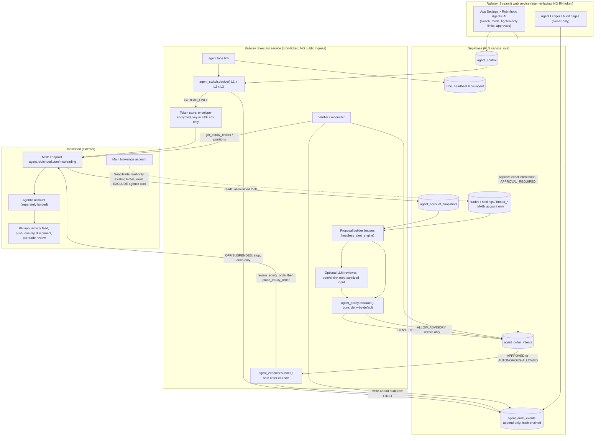

# Robinhood Agentic AI Trading — Secure Architecture Design

**Status: PARKED 2026-10-04, same day as the design below was approved-in-spirit but
before any Phase 0 validation was run. Owner's reason: Robinhood Agentic Trading
requires opening and funding a brand-new, separate "Agentic account" (§1.8/§15) —
not something to commit capital to just to unblock an architecture exercise. Nothing
built, nothing lost: the design and its Phase-0 question list below stay valid and
ready to resume. Trigger to revisit: the owner actually opens/funds a Robinhood
Agentic account (for any reason), or an explicit re-ask — not elapsed time alone.
Do not re-propose a build from this doc without one of those two.**

Below this line is the full design as produced 2026-10-03, unchanged — it was not
invalidated, only paused before Phase 0 (the Robinhood-side validation spike) could run.

**Design-time status, preserved for context: ARCHITECTURE DESIGN ONLY, 2026-10-03.
Nothing built. Verdict: PROCEED for Phases 0-2 (governance, control plane, kill switch,
read-only connection). Phases 3-4 (advisory shadow, then approval-required with tiny
caps) are conditional on Phase 0's validation results. RECONSIDER Autonomous mode — not
designed to a build-ready spec, not to be built until the pre-registered evidence gate in
§8.6 is met.** Produced by a `planner` (Opus 5.5) design pass per CLAUDE.md's "design of
money-moving logic → planner" rule, fed a live codebase survey (Explore agent,
2026-10-03) and a live fetch of Robinhood's own support/newsroom pages (2026-10-03) — see
Sources at the bottom. Memory: `project_robinhood_agentic_trading` (supersedes the
Robinhood-MCP paragraph of `project_today_pnl_scope`, which was researched 2026-06-24 and
is partially superseded by what's confirmed below).

**Why RECONSIDER on Autonomous, not just "later":**
1. **No measured edge that would justify unattended trading.** This repo's own evidence:
   A2 (composite-vs-forward-alpha) is "MIXED," not clean; W6 found 52% of real closed
   losing round trips got no protective signal at all, from either exit mechanism; A4
   found the real median holding period (~7 days) is far shorter than the deterioration
   ladder's weeks-scale design assumption.
2. **The account is already in a stressed state.** `project_q3_2026_return_review`:
   leverage hit 3.73x and `call_distance_pct` was **-2.37%** on 2026-09-30 under the
   existing flat `MARGIN_MAINTENANCE_RATE` assumption — i.e. past the modeled call
   trigger, on real data, three days ago.
3. **One of the two possible connection architectures cannot satisfy the "AI
   decision-making separate from execution" principle at all** (the LLM would hold
   `place_equity_order` directly) — and which architecture is even available depends on
   an unvalidated fact about Robinhood's own OAuth model (§2.2, §15).

Withholding Autonomous is the safety-first answer, not a lack of ambition.

All module/table/constant/env-var names below are **PROPOSED** — none exist in the repo
today. Every claim about *existing* code was verified against the live repo on 2026-10-03
(either by the originating Explore survey or spot-checked directly); every claim about
Robinhood's actual product is sourced to a live fetch today and is marked **Needs
Validation** where Robinhood's own pages left the answer ambiguous.

---

## 1. Current-state architecture observations

**1.1 No execution boundary exists today, and that is an asset.** An exhaustive
case-insensitive grep of the whole repo (excluding `.venv`) for
`place_order|submit_order|execute_trade|placeOrder|order_execute|create_order|send_order`
returned zero hits anywhere, including inside `stock_analyzer/snaptrade_client.py` (which
only wraps SnapTrade's read endpoints — Personal API key tier, no per-user
registration/secret). No DB table resembles an order/intent table. Every existing advisor
(`risk_advisor.py`, `exit_advisor.py`, `watchlist_advisor.py`, `rebalancer.py`,
`headless_alert_engine.py`) renders to a human and never constructs or dispatches a
broker order. This means the execution boundary can be designed clean and narrow from
scratch, rather than retrofitted onto something that already half-exists.

**1.2 Today's decision engine already runs headless.** Verified functions in
`stock_analyzer/headless_alert_engine.py`: `compute_protective_alerts()`,
`compute_morning_picks()`, `compute_watchlist_entries()`, `compute_eod()`. The cron
already produces BUY and protective decisions without Streamlit — a future proposal
source should reuse these, not invent a second decider.

**1.3 Cross-surface coordination lives in `st.session_state`, which a headless executor
cannot read.** Keys like `_reduce_calls` are per-browser-session. The established cron
pattern (confirmed by the F-235 Phase 2 "System Proprioception" audit) is "recompute
live from pure functions," never "read a browser-session cache." A new executor must
recompute through the same pure functions a cron lane would use, or read a persisted
cron output — never assume a browser session's caches are populated.

**1.4 Write authority is effectively all-or-nothing today.** `SUPABASE_KEY` is
service-role, and RLS is `FOR ALL TO service_role` (CLAUDE.md Hard Rule #2). Any process
holding that key — the web app or any of the 7 cron lanes — can write any table.
Confirmed: `db._READONLY = False` at `stock_analyzer/db.py:1066`, and `db.py:1049-1059`
documents that cron never calls `set_readonly()`. **Consequence: any guardrail stored
only in Supabase can in principle be changed by any compromised component** — "the agent
cannot modify its own guardrails" cannot rest on DB-stored limits alone (see §8.2's
tighten-only design).

**1.5 Web auth is a shared password, with a fail-open fallback.** Verified in `app.py`
(~2939-2988): `_auth_role` is `"owner"` or `"viewer"` from `_check_password()`. When no
password role is set, the fallback owner-email-allowlist check **fails OPEN to full
access** — acceptable today under the "this is a private deployment" justification, but
that justification does not extend to authority over real trade execution.

**1.6 Broker sync merges accounts — a concrete crossover risk for the new Agentic
account.** `broker_sync.normalize_positions()` sums the same ticker across every account
SnapTrade has linked. If the new Robinhood Agentic account ever becomes visible to the
existing SnapTrade connection (F-244), its positions and transactions could silently
merge into the main-book drift comparison and flow into `trades` via
`snaptrade_pending_imports` — corrupting holdings, concentration gates, `daily_pnl`, and
F-250 reconciliation. **This must be resolved (account-scope filtering) before the
agentic account is even opened** — see Phase 0b.

**1.7 Reusable precedents already in this codebase (use these, don't invent parallel
mechanisms):**
- **Idempotent writes** — `trades.idempotency_key` and `trades.broker_txn_id` unique
  indexes, recognized by `save_trade` (`db.py:2107-2126`).
- **Dead-man's switch** — `db.save_cron_heartbeat()` + `system_health._LANES` +
  `check_cron_liveness()`.
- **Decision-audit shape** — `gate_ledger.build_suppression_rows()` +
  `db.save_gate_suppressions()`: per-gate-id decision with its reason, surfaced on
  "🛑 The Road Not Taken."
- **Frozen context at write time** — `decision_context.build_snapshot()`,
  `SCHEMA_VERSION`-stamped.
- **Offline sentinel** — `util.get_or_offline()`, the `None`-on-failure convention.
- **Time** — `market_time.now_et()`/`today_et()`, `data.is_trading_day()`, NYSE
  calendar constants.
- **Review enforcement** — `_GATE_FILES` in `.claude/hooks/pre_tool_checks.py`.
- **"AI narrates, never originates"** — the existing redline from F-225 Portfolio Q&A
  (`docs/plans/portfolio-qa.md`, `docs/requirements.md`), which the owner has already
  declined to cross once.

**1.8 Robinhood facts that most shape this design** (full detail in §15): execution is
confined to a separate, separately-funded Robinhood Agentic account — the single best
blast-radius limiter available, enforced by Robinhood itself, not by this app. Robinhood
publishes no rate limits or dollar caps of its own. Robinhood explicitly disclaims
responsibility for agent-caused losses — **DRISHTA's own audit ledger becomes the
owner's primary record of intent**, not a nice-to-have.

---

## 2. Recommended target architecture

### 2.1 Core principle, made structural

**The LLM never holds a credential or a tool that can move money.** Exactly one process
can call Robinhood order tools: a new, separately-deployed **Executor** Railway service.
Inside it, exactly one code path can submit an order, and that path re-runs the
deterministic Policy Engine immediately before the call. The LLM (if used at all)
produces only a structured, schema-validated proposal-review output (veto or shrink) — a
data input to deterministic code, never a caller of anything.

### 2.2 Two possible connection architectures — Robinhood validation decides which

**Variant H — headless executor (REQUIRED for any execution-bearing mode).** The DRISHTA
Executor is itself the OAuth/MCP client of `agent.robinhood.com/mcp/trading`; the token
never leaves the Executor service. Requires Robinhood OAuth to allow a custom MCP client
to obtain a refreshable token usable unattended. Robinhood's newsroom post implies
unattended operation exists; this app's own 2026-06-24 research found interactive-only
auth with no documented long-lived token. **This conflict is Needs Validation, Phase 0,
blocking.**

**Variant I — interactive agent session** (e.g. Claude Code/Desktop connected straight to
Robinhood). Here the LLM holds `place_equity_order` directly; the policy engine can only
*advise* the LLM, and prompt injection or hallucination bypasses it trivially. **Only
acceptable for READ_ONLY/ADVISORY. Never for APPROVAL_REQUIRED or AUTONOMOUS.** If
Variant H proves impossible, execution modes are simply not built — the fallback is
"Approval Required" carried out by the human in the Robinhood app, i.e. today's
workflow, unchanged.

A **Variant P** (a DRISHTA-hosted MCP proxy wrapping Robinhood's tools behind the policy
engine, with the owner's own Claude client connecting only to the proxy) is possible but
still requires the proxy to be the Robinhood OAuth client (same Phase-0 validation as H),
and adds a new internet-facing server. Not recommended unless the owner specifically
wants a conversational front end to the agent.

### 2.3 Layered permission model — effective permission is the MINIMUM across all layers

| Layer | Where it lives | Who can raise it | Who can lower it |
|---|---|---|---|
| L0 Robinhood connection | Robinhood itself (OAuth grant, one-tap disconnect, optional per-trade review) | Owner, in the Robinhood app only | Owner, in the Robinhood app — survives total DRISHTA compromise |
| L1 Deploy-time ceiling | Executor env vars (`AGENT_MAX_MODE`, `AGENT_EXECUTION_ENABLED`) | Owner via Railway + redeploy | Same, or delete/pause the Executor service |
| L2 Runtime switch/mode | Supabase `agent_control` single row | Owner in App Settings, with step-up | Owner, any automatic breaker, or the emergency path |
| L3 Circuit breakers | Executor-computed, persisted to `agent_control.suspended_*` | Human re-arm only | Automatic |
| L4 Per-order policy | Pure `stock_analyzer/agent_policy.py` + `constants.py` hard caps | Code change + mandatory Opus review | Owner-tunable tightening in `agent_control.limits` (clamped, never loosens below L4) |

**Effective mode = min(L1, L2, L3).** A compromised web process or a leaked
`SUPABASE_KEY` can at most move L2 up to the L1 ceiling — never past it, and never past
L4's code-enforced caps.

### 2.4 Proposal source — deterministic first, LLM tightening-only

- **P1 (the only originator in any execution-bearing mode):** the deterministic engine —
  `compute_watchlist_entries()` ENTER_NOW / `compute_morning_picks()` for entries;
  `compute_protective_alerts()` / `exit_advisor` for exits on agent-held positions.
- **P2 (optional):** an LLM "red team" may **veto or shrink** a proposal, never add one
  or enlarge it — the monotone-safety property, mirroring the F-234 Phase 3
  tightening-only precedent.
- **P3 (LLM-originated trades):** crosses the "AI narrates, never originates" redline.
  **Not designed here.** Needs an explicit, separate owner policy reversal (Decision #1).

---

## 3. Architecture / data-flow diagram



Text form of the order path:

```
tick -> switch(L1 and L2 and L3) -> read snapshot -> deterministic proposal -> [LLM shrink/veto]
     -> policy.evaluate (deny-by-default) -> intent row (state machine)
     -> [approval binds intent hash] -> submit(): re-switch + re-evaluate + write-ahead audit
     -> review_equity_order -> place_equity_order (no auto-retry) -> verify vs RH order/positions
     -> audit + breaker update
```

---

## 4. Component responsibilities

All modules below are new and PROPOSED. Each must be added to `_GATE_FILES` in the same
commit that creates it.

| Component | Responsibility | Must NOT |
|---|---|---|
| `stock_analyzer/agent_switch.py` (pure) | `decide(env_ceiling, db_row, breaker_state, now) -> EffectiveState`; mode lattice `OFF < READ_ONLY < ADVISORY < APPROVAL_REQUIRED < AUTONOMOUS`; any `None`/exception -> OFF | Do I/O |
| `stock_analyzer/agent_policy.py` (pure) | `evaluate(intent, ctx) -> PolicyDecision{allow, checks:[{id, result, observed, limit}]}`. ALLOW only if every check PASSes | Import `anthropic`, the MCP transport, or `db` |
| `stock_analyzer/agent_proposals.py` (pure) | Map `headless_alert_engine` outputs + agentic-account state to typed `OrderIntent`s; carry `source_rule_id` + a decision-context-style snapshot | Originate from LLM output |
| `stock_analyzer/agent_llm_review.py` | Sanitized-input LLM call; output schema-validated `{intent_id, action: keep|shrink|veto, qty_le, reason}`; post-validator enforces `qty_out <= qty_in`, `set_out subset-of set_in` | Import the executor or transport; see tokens/account ids |
| `stock_analyzer/agent_executor.py` | **Sole importer of the MCP transport.** Tool allow-list; token-bucket rate limiter; timeouts; circuit breaker; `submit(intent_id)`; `cancel_open_agent_orders()`; reads | Accept an order not loaded from `agent_order_intents` by id |
| `stock_analyzer/agent_ledger.py` | Audit event construction, hash chaining, redaction | — |
| `stock_analyzer/agent_reconcile.py` (pure) | Diff intents vs RH orders/fills/positions; classify filled/partial/rejected/unknown/orphan | — |
| `cron_runner.py` new lane `agent` | Orchestration only (switch -> read -> propose -> evaluate -> submit -> verify -> heartbeat) | Hold decision logic |
| `db.py` additions | Loaders return `None` on failure; writers honour `is_readonly()`; CAS state transitions | Collapse failures to `[]`/`{}` |
| `system_health.py` | New check (8) "Agent trading integrity"; add `agent` to `_LANES` | Gate anything |
| `app.py` | App Settings section, approvals, Agent Ledger page — render-only, calls the pure functions above | Compare thresholds; hold the token |
| `notify.py` | Mode-change, breaker, every-submission, and daily hash-anchor emails | — |

---

## 5. Robinhood ON/OFF and operating-mode design

### 5.1 State — proposed `agent_control` (single row, upsert on id)

`master_on bool`, `mode text`, `suspended bool` / `suspended_reason text` /
`suspended_at timestamptz`, `limits jsonb` (tighten-only), `epoch int` (bumped on every
change; intents carry the epoch they were created under), `changed_by text` /
`changed_at timestamptz` / `step_up_at timestamptz`. Every change also writes an
`agent_audit_events` row.

### 5.2 Effective-state decision (`agent_switch.decide`)

| Inputs | Effective |
|---|---|
| `AGENT_EXECUTION_ENABLED` env absent/false | Mode clamped to <= ADVISORY; no submit possible |
| `agent_control` unreadable (`None`) | **OFF** (fail-closed) |
| `master_on = false` | OFF |
| `suspended = true` | min(mode, ADVISORY); cancels permitted per §12 |
| Otherwise | min(db mode, `AGENT_MAX_MODE` env) |

### 5.3 OFF semantics — a true backend kill

1. **No MCP calls.** The executor tick returns before the token is even loaded —
   test-enforced with a mock transport asserting zero calls.
2. **No background agent jobs.** The `agent` lane still writes its heartbeat as
   `status="off"` (liveness stays observable) and does nothing else.
3. **Token is not used or decrypted.**
4. **Pending intents are invalidated.** Every intent in `PROPOSED`/`APPROVED` moves to
   `INVALIDATED_OFF` via one CAS update keyed on epoch — an approval made under an old
   epoch can never submit.
5. **Existing app functionality is untouched** — nothing in today's engine imports agent
   modules (import-isolation test).

**Already-open orders on ON->OFF (recommended, owner to confirm as Decision #4):** one
bounded drain — cancel every open order whose RH id is in our ledger (never touch orders
we didn't place), verify via `get_equity_orders`, record each outcome, email + red banner
if any cancel fails ("N agent orders may still be live — cancel in the Robinhood app"),
then go fully dark. **Positions are never liquidated** — liquidation is itself a trade
decision. A disclosure banner states agent-held positions are now unmanaged.

**Emergency OFF paths** (lowering never needs step-up): the App Settings button; an
automatic breaker; deleting/pausing the Railway Executor service; Robinhood's own
one-tap disconnect (L0 — always works, even under total DRISHTA compromise).

### 5.4 Modes

| Mode | MCP tools reachable | Intents | Submission |
|---|---|---|---|
| READ_ONLY | Read allow-list only | None | Never |
| ADVISORY | Read | Created + policy-evaluated, stored `ADVISORY_ONLY` (shadow ledger — the evidence base for later promotion) | Never |
| APPROVAL_REQUIRED | Read + `review_equity_order` + `place`/`cancel` | `PROPOSED` -> owner approves the exact hash | Only approved, unexpired, re-evaluated ALLOW |
| AUTONOMOUS | Same | Policy ALLOW -> submit | No per-trade approval, within L4; L3 breakers armed |

### 5.5 Escalation rules — raising is hard, lowering is free

**Step-up for any raise**: re-enter the owner password inside the dialog; only
`auth_role == "owner"` can raise or approve. **The owner-email fail-open fallback can
never grant agent authority** — if `APP_PASSWORD` is unset, the whole section renders
disabled. READ_ONLY->ADVISORY needs step-up only; ->APPROVAL_REQUIRED needs step-up + L1
ceiling + Phase 4 shipped; ->AUTONOMOUS needs step-up + L1 ceiling + a typed confirmation
+ `agent_policy.autonomy_eligible(evidence)` returning true (§8.6) + a cooling-off delay
(`AGENT_AUTONOMY_ARM_DELAY_HOURS`, owner value) with an abort-window email. An expiry
(`AGENT_AUTONOMY_MAX_DAYS`, owner value) auto-demotes back to APPROVAL_REQUIRED unless
re-armed — autonomy is never a permanent forgotten state.

---

## 6. Authentication and secrets-management model

1. **Token custody.** Robinhood OAuth tokens live only in the Executor service.
   Envelope-encrypt at rest in a proposed `agent_oauth_tokens` row, with the KEK
   (`AGENT_TOKEN_KEK`) existing only in the Executor's own env — a Supabase dump, or the
   web process's `SUPABASE_KEY`, yields ciphertext only. (Confirm Railway per-service
   variable scoping actually isolates the web service from Executor vars — low-risk
   Needs Validation.)
2. **No Robinhood secret in the web service, ever.** The web service shows
   connection-status read from the DB only. The one-time OAuth consent flow hands its
   result to the Executor, not the web process (exact mechanics depend on Robinhood's
   redirect-vs-device-code flow — Needs Validation).
3. **Short-lived tokens, just-in-time refresh** inside `submit()`/read calls, never on an
   idle timer. Failed refresh -> `token_expired` state -> no reads, no submits, email.
   Never silently fall back.
4. **Scope separation if Robinhood offers it** (Needs Validation): a read-scope token
   for READ_ONLY/ADVISORY, trade-scope token decrypted only when effective mode >=
   APPROVAL_REQUIRED. If scopes are monolithic, the tool allow-list (§7) is the
   remaining control.
5. **Never in code, prompts, logs, or telemetry.** `agent_ledger.redact()` wraps all
   executor logging/exception strings; token-shaped strings, `Authorization` headers,
   account numbers masked to last 4 chars; tested with a canary-token injection. The LLM
   prompt builder takes only a typed, whitelisted DTO (§9) — no token-store access.
6. **Rotation/revocation.** Owner can revoke via Robinhood one-tap disconnect; a 401 /
   invalid-grant -> `token_revoked` -> suspend, require a fresh owner-initiated connect.
7. **Existing secrets unchanged** for the web service (same dual-source pattern). The
   Executor reads only its own vars plus `SUPABASE_URL`/`SUPABASE_KEY`/`RESEND_*`, and
   `ANTHROPIC_API_KEY` only if the optional LLM reviewer (P2) is enabled.

---

## 7. Agent permission and authorization model

- **Tool allow-list in code** (`agent_executor._ALLOWED_TOOLS`, frozenset keyed by
  effective mode). Read tier: `get_accounts`, `get_portfolio`, `get_equity_positions`,
  `get_equity_orders`, `get_equity_quotes`. Order tier: `review_equity_order`,
  `place_equity_order`, `cancel_equity_order`. Explicitly never called: watchlist
  mutation, `search`, `get_popular_lists`, and any tool not in the frozenset —
  deny-by-default even if Robinhood adds new tools later. **Every tool name/schema here
  is Needs Validation** (per-tool confidence in the source research was mixed) — Phase 0
  must capture the live `tools/list` response and pin it as a test fixture; any schema
  drift (renamed tool, changed params) is a hard stop + suspend, never best-effort.
- **The LLM has zero Robinhood tools.** The optional P2 reviewer is a plain completion
  call with JSON-schema output — no MCP, no function-calling into the executor.
- **Authorization for each order requires ALL of:** effective mode >= the needed mode;
  an intent loaded by id in a submittable state; for APPROVAL_REQUIRED, an approval
  whose `intent_hash` (sha256 over ticker/side/qty/order-type/limit/TIF/account-scope/
  epoch) matches the recomputed hash and is younger than `AGENT_APPROVAL_TTL_MIN`;
  `policy.evaluate()` re-run inside `submit()` at T-0 (closing the TOCTOU gap); a
  successful write-ahead audit row.
- **Recommended belt-and-braces:** keep Robinhood's own native per-trade review ON in
  APPROVAL_REQUIRED, so the owner approves twice — once in DRISHTA, once in Robinhood's
  device-bound app (a stronger authenticator than DRISHTA's shared password). Whether
  this works for a custom-MCP-client order is Needs Validation. In AUTONOMOUS, Robinhood
  review is necessarily waived — exactly why AUTONOMOUS carries the heaviest L3/L4
  gating.

---

## 8. Deterministic policy/risk-engine design

### 8.1 Contract

`agent_policy.evaluate(intent, ctx) -> PolicyDecision` is pure. Every `ctx` field is
typed `X | None`. **Any `None` input to a check -> that check returns
`DENY_INPUT_UNAVAILABLE`** (never "skip check"). Any exception inside a check is caught
per-check -> `DENY_CHECK_ERROR`. ALLOW requires every registered check to PASS. Output
rows reuse the gate-ledger shape (`check_id`, observed, limit, result) so the same
"Road Not Taken"-style readout can show why an order was denied.

### 8.2 Limit sourcing — how "the agent cannot change it" becomes literally true

Hard caps live in `stock_analyzer/constants.py` — deployed code, any change needs a
mandatory Opus review. Owner-tunable values in `agent_control.limits` can only
**tighten**: `effective = min(db_value, constant_cap)` (or `max` for floors). A missing
or invalid DB value falls back to the constant. **A DB-tampered loosening is therefore
ineffective by construction** — pin this with a test per limit. No component writes
`constants.py` at runtime; the LLM has no DB write path at all.

### 8.3 Checks — proposed constant NAMES (every VALUE is an owner decision, none chosen here)

**Universe/instrument:** equity-only; candidates must be in the engine's own qualified
set (ENTER_NOW / morning picks) AND in `TICKER_SECTORS` (no unclassified names — reuses
the macro-gate lesson); no options/crypto/futures regardless of what Robinhood adds;
no short sales (sell qty <= agent-held qty in the agentic account); **no adding to a
losing position** (evidence: Q3 review + F-286's "adding to a losing position ~2.4x
overrepresented in worst outcomes" — owner to confirm as a hard rule).

**Order shape:** limit orders only (no market orders), `AGENT_LIMIT_COLLAR_PCT` off the
cross-checked quote; day TIF only (supported TIFs are Needs Validation); fractional
shares — owner decision + Needs Validation.

**Size:** `AGENT_MAX_ORDER_VALUE_USD` (single order notional), `AGENT_MAX_POSITION_PCT`
(of agentic-account equity), `AGENT_MAX_DAILY_DEPLOYED_USD` (gross buys/ET day),
`AGENT_MAX_TRADES_PER_DAY` / `AGENT_MAX_ORDERS_PER_HOUR`, `AGENT_RISK_PCT_PER_TRADE`
(owner choice: reuse `RISK_PCT_PER_TRADE`=0.015 or a separate value; ATR stop sizing via
existing `risk.py`).

**Combined-book concentration:** agentic + main-account share of a ticker, as % of
combined equity, <= `SINGLE_NAME_CEILING` (15.0); sector <= `SECTOR_CEILING` (35.0).
Reusing these existing constants here is an owner policy choice (Decision #3) — without
it, the agent could pile into exactly the names the levered main account is already
concentrated in.

**Capital/margin:** no margin usage in the agentic account — order cost <= settled cash
(is the agentic account even cash-vs-margin by default? Needs Validation; recommend
requiring cash-only, or treat buying power as settled-cash-only in the policy regardless).
**Main-account stress breaker:** if the main account's existing `margin.call_distance()`
(today awareness-only) is below `AGENT_MAIN_ACCT_CALL_DISTANCE_SUSPEND_PCT`, or is
`None`/unknown, **no risk-increasing agent orders** — this makes an existing
awareness-only value decision-bearing for this surface specifically; name that
explicitly as a deliberate scope expansion, not an accidental one.
`AGENT_MAX_ACCOUNT_EQUITY_USD`: if agentic-account equity exceeds it (e.g. an unexpected
deposit), suspend.

**Loss/drawdown:** `AGENT_DAILY_LOSS_LIMIT_PCT` (realized+unrealized vs prior-close
equity), `AGENT_DRAWDOWN_SUSPEND_PCT` (from a persisted high-water mark),
`AGENT_CONSEC_LOSS_SUSPEND` (N consecutive losing closes). Breach -> L3 SUSPENDED (human
re-arm), never a soft warning.

**Timing:** trading day per `data.is_trading_day()`; inside regular session minus
`AGENT_NO_TRADE_OPEN_MIN`/`AGENT_NO_TRADE_CLOSE_MIN` (including `NYSE_EARLY_CLOSES`
days); beyond `MARKET_CALENDAR_LAST_YEAR` -> DENY, never guess past 2028; earnings
blackout (N days pre-earnings, owner value).

**Market-data integrity:** Robinhood quote age <= `AGENT_QUOTE_MAX_AGE_SEC`; Robinhood
quote vs the app's existing provider chain (Finnhub->yfinance->FMP) within
`AGENT_PRICE_XCHECK_TOL_PCT` — disagreement or either side missing -> DENY; exclude
tickers in the existing price-cross-check failure set (the `_xc_bad_prev_tickers`
concept, recomputed headless); halted/no-quote -> DENY.

**Behavioural:** same-ticker cooldown `AGENT_COOLDOWN_SAME_TICKER_MIN` (no
buy->sell->buy flips; reuses the F-278 rapid-reversal concept); minimum hold before a
non-protective sell (owner value — A4's ~7-day median and the Q3 finding "4-7 day
holds -$1,489" are directly relevant evidence); max new high-beta entries/week (owner
value; Q3 advice was "<=2/week").

**Coordination (no double-deciding):** never buy a ticker under an active protective
call (the `_reduce_calls` dimension, recomputed via `compute_protective_alerts()`
headless since session_state is unavailable); never buy into a sector the engine is
currently telling the main account to reduce; an agent BUY that the main account's
Rebalancer would call a TRIM -> DENY with reason "conflicts with main-account TRIM."

**Idempotency/duplicates:** intent uniqueness via `UNIQUE(proposal_key)` where
`proposal_key = sha256(source_rule_id, ticker, side, trading_date, epoch)` — reuses the
`trades.idempotency_key` precedent (unique index + constraint-violation recognition in
the writer); at most one non-terminal intent per (ticker, side).

**Exits on agent-held positions** reuse the existing exit_advisor/ATR stop logic. Owner
decision: may risk-REDUCING orders proceed while SUSPENDED (with approval)?

### 8.4 Intent state machine (CAS transitions only — `UPDATE ... WHERE state=<expected> AND epoch=<current>`)

```
PROPOSED -> (DENIED | ADVISORY_ONLY | AWAITING_APPROVAL)
AWAITING_APPROVAL -> (APPROVED | EXPIRED | REJECTED_BY_OWNER | INVALIDATED_OFF)
APPROVED/ALLOWED -> SUBMITTING (CAS; only one winner) -> (SUBMITTED | SUBMIT_FAILED_DEFINITE | OUTCOME_UNKNOWN)
SUBMITTED -> (FILLED | PARTIAL | CANCELLED | REJECTED_BY_BROKER | EXPIRED_DAY)
```

**`OUTCOME_UNKNOWN` is never retried.** It blocks every new order on that ticker and
suspends the lane until the reconciler resolves it from `get_equity_orders`.

### 8.5 Placement of logic

All comparisons live in `stock_analyzer/agent_policy.py` (new module, per the repo's
own "prefer a new module over growing a `_GATE_FILES` one" convention — but this one
still joins `_GATE_FILES` because it is a gate). `app.py` only renders
`PolicyDecision.checks` — render-only, per the `POLICY_DECISION_IN_RENDER` ratchet.

### 8.6 Autonomy eligibility — pre-registered BEFORE any data exists

Follows the gate-ledger precedent of pre-registering a retirement criterion before
seeing the number it will be judged against. Owner sets every value. Proposed shape:
>= `AGENT_AUTONOMY_MIN_APPROVED_ORDERS` real APPROVAL_REQUIRED orders over
>= `AGENT_AUTONOMY_MIN_WEEKS`, with **zero** `OUTCOME_UNKNOWN`/orphan orders and zero
audit-chain breaks; a kill-switch drill and a breaker drill executed and logged; the
ADVISORY shadow ledger's matured outcomes not worse than SPY over the window (reusing
the existing 8-call/5-distinct-ticker banding-floor precedent); an F-264 ENTER_NOW
measured base rate actually available (per CLAUDE.md, earliest ~Nov 2026).

**If the criterion is never met, Autonomous is never armed — that is a success
condition, not a failure.**

---

## 9. Trust boundaries and data flows

| Boundary | Crossing | Control |
|---|---|---|
| B1 Internet -> Streamlit web | Owner/viewer browsers | Password + HMAC cookie; agent features need explicit `auth_role=="owner"` + step-up; no RH token here |
| B2 Web -> Supabase | `agent_control` writes, approvals | Can only raise to the L1 ceiling; limits tighten-only; approvals bind hash+TTL |
| B3 Executor <-> Robinhood MCP | All RH traffic | Sole transport importer; allow-list; rate limiter; timeouts; breaker; schema pinning |
| B4 Executor -> LLM (Anthropic) | Optional P2 review | Sanitized DTO only; output schema-validated; tightening-only post-validator |
| B5 Executor -> Supabase | Intents, audit, snapshots | Write-ahead audit; CAS; `None`-on-failure loaders |
| B6 SnapTrade -> main-account tables | Existing F-244 | Must EXCLUDE the agentic account (Phase 0 blocker, §1.6) |
| B7 Executor -> Resend | Notifications | No tokens/account numbers; last-4 masking |

### Data protection matrix

| Data | Enters app? | Executor sees | LLM sees? | Logged? | Retention |
|---|---|---|---|---|---|
| OAuth tokens | Executor only, encrypted | Yes (in memory) | **Never** | **Never** | Until revoked |
| RH account numbers/ids | Executor + DB (masked display) | Yes | **Never** | Last-4 only | Audit lifetime |
| Agentic positions/orders/fills/balances | Yes (`agent_account_snapshots`, intents) | Yes | Percentages/weights only, no $ | Yes (audit) | Indefinite (owner's own legal/tax record) |
| Main-account holdings | Already in DB | Yes (combined-book checks) | Ticker + weight % only | Existing | Existing |
| Quotes | Yes | Yes | Rounded price context only | Summary only | 90 days raw |
| Engine scores/proposal rationale | Yes | Yes | Yes (the review input) | Yes | Indefinite |
| News/headlines/search text | Existing sentiment path | — | **Not in the trade-review prompt** — injection vector, reviewer judges structured fields only | — | — |
| Raw MCP responses | Parsed then discarded | Parsed into typed DTOs | **Never** (RH `search`/list text is an injection vector) | Hash only | — |
| LLM prompt/response | — | — | — | Structured output + sha256 of prompt; full prompt kept for `AGENT_LLM_TRANSCRIPT_RETENTION_DAYS` | Owner value |
| Owner identity/PII, password | — | — | **Never** | **Never** | — |

**Minimization rule:** the LLM DTO is a frozen dataclass whitelist; a test fails if a new
field is added without being listed in an `LLM_VISIBLE_FIELDS` tuple.

---

## 10. Threat model with mitigations

| # | Threat | Primary mitigations |
|---|---|---|
| T1 | Credential/token theft | Tokens only in Executor; envelope encryption, KEK in Executor env only; short TTL; redaction; no public ingress on Executor; RH one-tap revoke; RH activity push as detection |
| T2 | Excessive API permissions | Code allow-list by mode; separate read/trade grants if RH supports it (NV); order tools unreachable below APPROVAL_REQUIRED; new RH tools denied by default |
| T3 | Unauthorized trading (stolen web password) | Web holds no token; raises need step-up + L1 Railway ceiling; approvals bind hash/TTL/epoch; RH per-trade review ON in APPROVAL_REQUIRED; every submission emailed; L4 caps bound the worst case to the agentic account's funded balance |
| T4 | Prompt injection | LLM never originates; never sees raw RH/news text in review prompts; schema-validated output + tightening-only post-validator — worst case of a fully hijacked LLM is "a valid trade got vetoed" |
| T5 | Agent hallucination | Same monotone property; proposals come from the deterministic engine; ticker must be in the qualified set + `TICKER_SECTORS`; quote cross-check |
| T6 | Manipulated/stale market data | Two-source cross-check (RH vs provider chain); quote age; halt detection; limit-only + collar; DENY on any missing side |
| T7 | Duplicate/replayed transactions | Unique `proposal_key`; CAS ->SUBMITTING; no automatic retry of `place_equity_order`; `OUTCOME_UNKNOWN` blocks the ticker until reconciled; use RH client-order-id if supported (NV) |
| T8 | Compromised third-party API (RH MCP / Anthropic / SnapTrade / providers) | Schema pinning; response validation vs intent; circuit breaker; LLM can only shrink; provider disagreement -> DENY; verification compares RH-reported fills to intent, suspends on mismatch |
| T9 | Data leakage to LLM/external | DTO whitelist; no account ids/$ balances; Resend masking; Railway logs redacted |
| T10 | Session/account crossover | `account_scope` on every agent row; agentic data never written to `trades`/holdings; SnapTrade account filter (§1.6); test that agentic fills never reach `load_trades()`; combined-book checks read both explicitly, never silently merged |
| T11 | Sensitive data in logs | `redact()` on all executor log/exception paths; canary-token test |
| T12 | Dependency/supply chain | Executor has its own minimal pinned requirements (`--require-hashes`); MCP client lib pinned; no scraping libs in Executor (reads provider prices from DB or a dedicated minimal client) |
| T13 | Policy-engine bypass | Single submit call-site; `submit()` re-runs `evaluate()` internally; import-isolation test (only `agent_executor.py` imports the transport, nothing else references `place_equity_order`); a new `check_antipatterns.py` rule flags any other occurrence; all agent modules in `_GATE_FILES` |
| T14 | Kill-switch failure | Four independent layers (RH disconnect, Railway env/service, DB switch, breakers); DB-unreadable -> OFF; switch read fresh inside `submit()`, never cached per tick; monthly kill-drill logged; System Trust check (8) shows "last drill N days ago" |
| T15 | Unexpected autonomous behaviour | Evidence-gated arming; auto-expiry; breakers (loss/drawdown/frequency/consecutive-losses/equity tripwire); every order emailed; daily digest; anomaly -> SUSPENDED, never "warn and continue" |
| T16 | Tampering with the audit trail itself via the service-role key | Hash chain + daily head-hash emailed to the owner (off-system witness); RH activity feed as external ground truth; reconciler flags RH orders with no intent (`orphan_broker_order`) -> suspend |

---

## 11. Logging, monitoring, and audit approach

**`agent_audit_events` (append-only):** `id bigserial`, `ts`, `event_type`, `intent_id`,
`epoch`, `actor` (`executor|owner|breaker|llm`), `payload jsonb` (redacted), `prev_hash`,
`row_hash`. Event types: mode/switch changes, policy decisions (full check rows),
approvals, write-ahead "about to submit," RH responses (parsed, redacted), verification
outcomes, breaker trips, drills, token-refresh outcomes (never the token itself).
Service-role-only RLS means the DB role itself can't provide tamper evidence, so that
comes from the hash chain plus the daily emailed anchor instead.

**Decision context.** Each intent stores a `decision_context`-style frozen snapshot
(versioned `AGENT_CONTEXT_SCHEMA_VERSION`): regime, engine source rule, composite,
main-account leverage/call distance, agentic equity, policy version — the
`decision_context.build_snapshot` precedent, and CLAUDE.md DoD #8 (version anything
written to a history table). Each intent also stamps `AGENT_POLICY_VERSION` (bumped on
any cap change), the `COMPOSITE_WEIGHTS_VERSION` precedent.

**Heartbeat.** New `agent` lane via `db.save_cron_heartbeat()`, added to
`system_health._LANES`. Status values distinguish `off`/`ok`/`suspended`/`error` so a
dead lane is never mistaken for an OFF one.

**System Trust check (8), read-only**, reports: effective mode vs L1 ceiling;
suspended + reason; unresolved `OUTCOME_UNKNOWN` count (must be 0); orphan broker
orders; audit-chain verification result; token expiry horizon; days since last kill
drill; reconciliation age.

**Notifications (`notify.py`).** Every submission and fill (in addition to RH's own
push), every mode change, every breaker trip, a daily digest with the audit head hash.

**Never logged:** tokens, auth headers, full account numbers, full prompts beyond the
retention window, owner password.

---

## 12. Failure handling and kill-switch behaviour

Default for every safety-critical failure: **no new risk-increasing order until verified
safe; visible banner; audit event.**

| Failure | Behaviour |
|---|---|
| RH API failure / 5xx | Breaker opens after `AGENT_RH_BREAKER_FAILS` within a window; no submits; reads retried with backoff only; banner + email |
| Network timeout on a read | Bounded retry (`AGENT_RH_TIMEOUT_SEC`, `AGENT_RH_READ_RETRIES`); then `None` -> policy DENY |
| Network timeout on place | `OUTCOME_UNKNOWN`; **no retry**; suspend lane; reconciler resolves via `get_equity_orders`; owner email |
| LLM/agent failure | Owner decides: "LLM unavailable => DENY" (strict) vs "=> proceed without review." Recommend DENY in AUTONOMOUS, proceed in APPROVAL_REQUIRED (the human IS the reviewer there) |
| Stale/incomplete market data | DENY per check; no carry-forward of old quotes |
| Token expiration | Refresh once; failure -> `token_expired`, all RH activity stops, email |
| Policy-engine failure (exception) | Per-check DENY; whole-evaluate exception -> DENY + suspend |
| DB failure | `agent_control` unreadable -> OFF; intent CAS fails -> no submit; snapshot write failure -> no proposals |
| Audit-logging failure | Write-ahead: "about to submit" write fails -> no submit; post-submit write fails -> suspend + reconcile from RH |
| Partial fill | Remaining qty rests until day-expiry, then cancelled; never topped up; position sized from actual fills |
| Duplicate request | Unique key / CAS loser is a no-op with an audit event |
| Abnormal frequency | Hourly/daily count breach -> SUSPENDED |
| Risk threshold breach | Pre-trade -> DENY; portfolio-level (loss/drawdown/equity tripwire/main-account call distance) -> SUSPENDED |
| Unexpected drawdown | SUSPENDED; risk-reducing exits only, per owner's Decision #4 policy |
| RH order with no DRISHTA intent | `orphan_broker_order` -> SUSPENDED (possible token misuse) |
| Executor not running (cron missed) | Nothing executes — the safe direction is inherent to the cron-tick design; heartbeat goes stale -> System Trust red |

**Why cron-ticked rather than a long-running daemon:** no in-memory state to go stale;
the switch is re-read every run; no listening port; a crashed run cannot submit. Cost:
latency between approval and submit (next tick). Railway cron granularity is Needs
Validation.

---

## 13. Recommended implementation phases

Each phase ships, then pauses for live review (the `feedback_phased_ux_rollout_cadence`
precedent).

**Phase 0 — Validation and governance (no trading code).** Decision-bearing, stays with
lead/planner. Owner-run spike to confirm: OAuth mechanics (custom client allowed? token
TTL? refresh token? headless use? scopes?); the live `tools/list` and order schemas,
client-order-id support, supported order types/TIF, stop orders; agentic account type
(cash vs margin), fractional shares; whether RH per-trade review works for custom-client
orders; whether SnapTrade's Robinhood connection exposes the agentic account. Write this
doc's "owner answers" back in. Owner approves the top-5 decisions (bottom of this doc).
**Gate:** if Variant H is impossible, stop at a Phase-2-equivalent (read-only via an
interactive session) and record why.

**Phase 0b — Crossover fix** (if SnapTrade sees the agentic account). Account-scoped
filtering in `broker_sync`'s normalize/import paths so the agentic account is excluded
from main-book drift and imports. Files: `broker_sync.py`, `snaptrade_client.py`,
`cron_runner.py`. Mandatory Opus review (`_GATE_FILES` members). **Must ship before
funding the agentic account.**

**Phase 1 — Control plane, no Robinhood connection.** Decision-bearing:
`agent_switch.py`, `agent_control` DDL, L1 env ceiling, App Settings section
(OFF/READ_ONLY selectable only), audit ledger + hash chain, `agent` heartbeat lane,
System Trust (8) skeleton. Mechanical: DDL docstrings, UI wiring, docs sync.

**Phase 2 — READ_ONLY.** `agent_executor.py` with read allow-list only, token vault,
redaction, rate limiter/breaker. `agent_account_snapshots` + an Agent Account view with
reconciliation. Decision-bearing: executor + vault. Mechanical: the view.

**Phase 3 — ADVISORY (shadow).** `agent_policy.py` with all checks (owner-set constant
values), `agent_proposals.py`, intents stored `ADVISORY_ONLY`. Optional P2 LLM reviewer.
Shadow outcomes graded with the existing Recommendation Outcomes / track-record
machinery — this starts the evidence clock for §8.6. Decision-bearing throughout.

**Phase 4 — APPROVAL_REQUIRED, minimal caps.** Submit path, `review_equity_order`
preview shown in the approval card, verification, partial-fill handling, OFF drain,
emergency paths, kill drill. RH per-trade review ON. Agentic account funded with an
owner-chosen small amount, tripwired by `AGENT_MAX_ACCOUNT_EQUITY_USD`.

**Phase 5 — AUTONOMOUS. Not designed to a build-ready spec today.** Requires §8.6 met, a
fresh `planner` pass, and Opus review. Suggested ordering: 5a autonomous
risk-REDUCING exits on agent-opened positions only; 5b autonomous entries.

**Not planned (explicitly out of scope unless separately re-raised):** LLM-originated
proposals (P3), options/crypto, margin in the agentic account, liquidation-on-kill.

---

## 14. Architecture decisions to document (and where)

| Decision | Where |
|---|---|
| Variant H required for execution; LLM never holds order tools | this doc's ADR section + `docs/architecture.md` new "Agent execution boundary" section |
| Layered L0-L4 permission model; DB tighten-only; env ceiling | this doc + `docs/architecture.md` |
| Deterministic-only origination; LLM tightening-only | this doc + `docs/requirements.md` §2A operating policy (extends "narrates, never originates") |
| All `AGENT_*` caps and their values | `stock_analyzer/constants.py` + `docs/architecture.md` constants table (`check_constants_documented.py` enforces) |
| OFF drain / open-order policy | this doc + `docs/requirements.md` new F-ID (next free id at build time) |
| Account-scope separation (agentic data never in `trades`) | this doc + `docs/architecture.md` db schema + `db.py` DDL docstrings |
| Autonomy eligibility criterion (pre-registered) | this doc, written before Phase 3 data exists; a CLAUDE.md "What's queued" entry with its trigger (DoD #6) |
| Audit retention / hash-anchor scheme | this doc + `docs/architecture.md` |
| New `_GATE_FILES` members | `.claude/hooks/pre_tool_checks.py` + the CLAUDE.md enumeration, same commit (itself needs Opus review per the M4 precedent) |
| User-facing App Settings section, approval card, Agent Ledger page | `docs/requirements.md` F-IDs + in-app User Guide + `docs/user-manual.md` |
| Memory | `project_robinhood_agentic_trading` (supersedes the agentic paragraph of `project_today_pnl_scope`) |

---

## 15. Assumptions, open questions, Needs Validation

**Needs Validation (Robinhood) — blocking for Phase 2+ unless noted:**
1. Can a custom (non-Claude/ChatGPT) MCP client complete OAuth? Redirect vs device flow?
2. Token TTL, refresh-token existence/rotation, whether unattended use is actually
   permitted — this is the direct conflict between this app's 2026-06-24 research
   ("interactive-only, no long-lived token") and Robinhood's 2026-10-03 newsroom post
   (markets unattended operation as a real capability). Resolve by direct test, not by
   picking whichever source is more convenient.
3. Read vs trade scope separation.
4. Exact tool names and schemas (confidence was mixed across sources even today).
5. Does `place_equity_order` accept a client idempotency key? What does it return on a
   duplicate/timeout?
6. Supported order types (limit? stop? stop-limit?), TIF, extended hours, fractional
   shares.
7. Agentic account type: cash vs margin; settlement treatment.
8. Does RH per-trade review apply to custom-client orders, and what does the API return
   while a review is pending?
9. Does the connection grant read access to the MAIN account too? This app's 2026-06-24
   memory says "READ access to ALL accounts" — a data-minimization concern, and a
   possible future alternative to SnapTrade, out of scope for this design.
10. Options/crypto availability: the official newsroom post says equities-only at
    launch; one third-party aggregator claimed otherwise. The design is allow-list-only
    either way, so this mostly affects what's even reachable, not the design's safety.
11. Any RH-side rate limits (none published as of this research).

**Needs Validation (infra/repo):** Railway per-service variable isolation; minimum cron
interval; whether SnapTrade's Robinhood link surfaces the agentic account (§1.6).

**Assumptions:** single owner, one agentic account; US equities only; the owner accepts
Robinhood's disclaimer that DRISHTA's own ledger — not Robinhood — is the owner's record
of intent.

**Open questions for the owner:** the top 5 below, plus every `AGENT_*` value, the P2
LLM-failure behaviour, and the funding source — funding from the already-levered main
account reduces main-account equity, moving it closer to a call.

---

## USER DECISIONS NEEDED — top 5, approve before any implementation starts

1. **Who originates trades?** Recommended: the deterministic engine only, LLM
   tightening-only (veto/shrink) — keeps the existing "AI narrates, never originates"
   redline intact. The alternative (an LLM proposing trades) is an explicit reversal of
   that redline, and would let prompt injection/hallucination *create* orders rather
   than only block them.

2. **Execution requires Variant H** (the headless DRISHTA Executor as the sole Robinhood
   client). If Phase 0 shows Robinhood's auth can't support this, do you accept that
   execution modes simply aren't built — rather than letting an interactive LLM session
   hold `place_equity_order` directly?

3. **Combined-book risk basis and the main-account stress breaker.** Should agent buys
   be bounded by `SINGLE_NAME_CEILING`/`SECTOR_CEILING` across main+agentic combined?
   Should agent risk-increasing orders halt whenever the main account's call distance is
   below a threshold you set, or is unknown? **Given 3.73x leverage and -2.37% call
   distance on 9/30, this is the decision with the most money behind it.**

4. **Open-order and SUSPENDED policy.** On OFF: cancel all agent-placed open orders and
   leave positions untouched (recommended), or leave protective sells/stops resting?
   While SUSPENDED: are risk-reducing exits of agent positions allowed (with approval),
   or is everything frozen?

5. **Autonomy gate and capital cap.** Approve the *shape* of the pre-registered autonomy
   criterion (§8.6) and set its values now, before any data exists. Set the
   agentic-account funding amount, plus `AGENT_MAX_ACCOUNT_EQUITY_USD`,
   `AGENT_MAX_ORDER_VALUE_USD`, `AGENT_MAX_DAILY_DEPLOYED_USD`,
   `AGENT_DAILY_LOSS_LIMIT_PCT`, `AGENT_DRAWDOWN_SUSPEND_PCT`. Deliberately not picked
   here. Accept that "never armed" is a valid, successful outcome of this gate.

---

## Sources

Verified via live fetch 2026-10-03:
- https://robinhood.com/us/en/support/articles/agentic-trading-overview/
- https://robinhood.com/us/en/newsroom/robinhood-is-now-open-to-agents/

Prior internal research: memory `project_today_pnl_scope` (2026-06-24 Robinhood
MCP/Agentic Trading analysis — partially superseded by the above); memory
`project_margin_maintenance_blindness`, `project_q3_2026_return_review`,
`project_deliberate_pause_pre_mid_oct` (account leverage/risk context);
`docs/plans/portfolio-qa.md` (the "AI narrates, never originates" redline).
